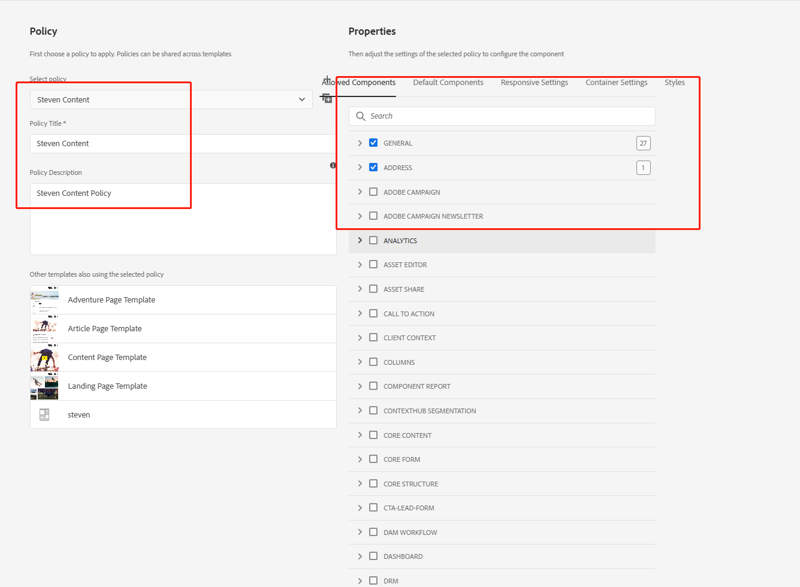

[TOC]

# 自定义模板和页面
后续章节都是基于AEM官方示例WKND来演示，示例可以从GitHub中获取，地址[https://github.com/adobe/aem-guides-wknd](https://github.com/adobe/aem-guides-wknd)，也可以访问我的代码库[https://github.com/stevenzhaoj/AEM-Practice](https://github.com/stevenzhaoj/AEM-Practice)，欢迎大家Fork和提交PR来一起交流。


## repo安装
在开始之前，需要在IDEA中安装repo工具，Eclipse也有对应的AEM插件可以使用，有需要的可以自行百度，这里只讲IDEA中的使用方法。可以参考[官网文档](https://github.com/Adobe-Marketing-Cloud/tools/tree/master/repo#installation)，也可以按照我下面的步骤安装

### cygwin安装
从[cygwin官网](https://www.cygwin.com/)中下载安装包


下载后安装到默认位置


打开界面需要继续安装几个Package（zip, unzip, curl, rsync），搜索框输入要安装的包名，如zip，找到红色框中的zip，在New这一列中选择最新版本即可。

**注意：选择一个后不要点下一页，继续搜索其他包并选中版本后在点击下一页**


点击下一页后会进入安装阶段，直到安装完成


下一步在[官方文档](https://github.com/Adobe-Marketing-Cloud/tools/tree/master/repo#installation)中下载repo文件，并将repo文件放到C:\cygwin64\bin目录下

PS：用编辑器打开repo文件会发现如下配置信息
```shell
server="http://localhost:4502"
credentials="admin:admin"
force=false
quiet=false
packmgr="/crx/packmgr/service/.json"
packageGroup="tmp/repo"
```
配置中的server与author实例的地址一致，credentials与启动author实例时设置的账号密码一致，如果在[01 AEM安装及Author实例的启动](https://blog.csdn.net/stiven46/article/details/129052376)中使用的端口和账号密码不是上述信息则需要修改repo文件

### IDEA中安装repo工具
打开IDEA左上角的File->Settings->Tools->External Tools，点击+号新增工具集repo，在点+号新增工具项


Program： C:\cygwin64\bin\bash.exe
Arguments： -l C:\cygwin64\bin\repo put -f \$FilePath\$
Working directory：C:\cygwin64\bin

也可以按照官方文档中的描述设置环境变量，简化路径。到此，repo工具就已经安装完成了。

## 在WKND中自定义模板和页面

### 部署WKND示例到author实例
在[https://github.com/stevenzhaoj/AEM-Practice](https://github.com/stevenzhaoj/AEM-Practice)下载代码后，需要配置一些环境变量，如JDK、Maven、Nodejs、Npm

WKND Version | AEM as a Cloud Service | AEM 6.5   | Java SE | Maven
-------------|------------------------|-----------|---------|---------
Latest (main branch)| Continual              | **6.5.13.0+** |  8, 11  | 3.3.9+
[v1.1.0](https://github.com/adobe/aem-guides-wknd/releases/tag/aem-guides-wknd-1.1.0) | Continual | 6.5.10+ | 8, 11 | 3.3.9+
[v1.0.0](https://github.com/adobe/aem-guides-wknd/releases/tag/aem-guides-wknd-1.0.0) | Continual | 6.5.4+ | 8, 11 | 3.3.9+

Maven、JDK、Npm的安装请自行百度。在maven安装时需要修改maven的配置文件，需要从adobe的官方库中下载所需依赖
```xml
<?xml version="1.0" encoding="UTF-8"?>
<settings xmlns="https://maven.apache.org/SETTINGS/1.0.0" 
          xmlns:xsi="https://www.w3.org/2001/XMLSchema-instance" 
          xsi:schemaLocation="https://maven.apache.org/SETTINGS/1.0.0
          https://maven.apache.org/xsd/settings-1.0.0.xsd">
	<localRepository>D:\workspace\aem-repository</localRepository>
    <profiles>
        <!-- ====================================================== -->
        <!-- A D O B E   P U B L I C   P R O F I L E                -->
        <!-- ====================================================== -->
        <profile>
            <id>adobe-public</id>
            <activation>
                <activeByDefault>true</activeByDefault>
            </activation>
            <properties>
                <releaseRepository-Id>adobe-public-releases</releaseRepository-Id>
                <releaseRepository-Name>Adobe Public Releases</releaseRepository-Name>
                <releaseRepository-URL>https://repo.adobe.com/nexus/content/groups/public</releaseRepository-URL>
            </properties>
            <repositories>
                <repository>
                    <id>adobe-public-releases</id>
                    <name>Adobe Public Repository</name>
                    <url>https://repo.adobe.com/nexus/content/groups/public</url>
                    <releases>
                        <enabled>true</enabled>
                        <updatePolicy>never</updatePolicy>
                    </releases>
                    <snapshots>
                        <enabled>false</enabled>
                    </snapshots>
                </repository>
            </repositories>
            <pluginRepositories>
                <pluginRepository>
                    <id>adobe-public-releases</id>
                    <name>Adobe Public Repository</name>
                    <url>https://repo.adobe.com/nexus/content/groups/public</url>
                    <releases>
                        <enabled>true</enabled>
                        <updatePolicy>never</updatePolicy>
                    </releases>
                    <snapshots>
                        <enabled>false</enabled>
                    </snapshots>
                </pluginRepository>
            </pluginRepositories>
        </profile>
    </profiles>
    <activeProfiles>
        <activeProfile>adobe-public</activeProfile>
    </activeProfiles>
</settings>
```
安装完成后，进入WKND目录下，使用maven命令构建项目
```shell
clean install -PautoInstallSinglePackage
```

在编译过程中可能出现如下问题：
1. npm构建报错：node-sass@4.14.1 postinstall: node scripts/build.js
    解决办法：打开CMD，输入下面的命令，修改npm源
    ```shell
	npm config set sass_binary_site=https://npm.taobao.org/mirrors/node-sass
	```
2. Some Enforcer rules have failed
	解决办法：打开项目根目录下的pom.xml，注释掉dispatcher
	```xml
	    <modules>
	        <module>all</module>
	        <module>core</module>
	        <module>ui.frontend</module>
	        <module>ui.apps</module>
	        <module>ui.apps.structure</module>
	        <module>ui.config</module>
	        <module>ui.content</module>
	        <module>ui.content.sample</module>
        	<module>it.tests</module>
	<!--        <module>dispatcher</module>-->
       		<module>ui.tests</module>
    	</modules>
	```
	出现下面内容时表明已经构建成功


刷新http://localhost:4502，点击sites就可以看到WKND站点了


## 自定义模板
进入Tools页面，选择Templates


进入WKND Site目录


点击右上角create按钮，选择Empty Page


输入模板名称，点击Create按钮


## 模板编辑的三种模式

模板有三个角度进行编辑

- Structure模式，编辑模板的策略及模板的内容结构
- Initial Content模式，使用策略中配置的组件对页面的内容进行初始化
- Layout模式，对页面的大小及尺寸进行配置


### Structure模式

编辑模板策略，配置在此模板中可以使用的组件，如（标题、文本等）


可以使用WKND自带的策略，也可以新增自己的策略，左侧新增自定义策略，右侧勾选所需的组件，点击右上角Done按钮完成编辑



### Initial Content模式

进入初始化内容编辑模式，在每个页面都会出现固定的内容，点击Drag按钮选择需要的组件


新增了Image和Text组件，继续内容进行编辑，点击Image组件的扳手图标


选择图片，输入内容，点击Done保存


同样点击Text组件，并输入内容保存


### Layout模式

进入Layout模式进行页面的布局调整


通过对布局的调整讲组件位置进行摆放


自定义模板就编辑完成了，回到模板列表页面开启模板


## 使用自定义模板创建页面

回到站点，选中站点目录，打开properties页面，需要更改站点所允许的模板文件，WKND默认只允许自带的4个模板


选择Advanced页签，找到Templates Settings，点击add按钮新增我们刚才添加的自定义模板steven，路径为/conf/wknd/settings/wcm/templates/steven，点击Save&Close按钮


返回站点，选中任意目录，点击Create按钮创建页面


选中自定义模板，点击next，输入Title即页面名称


打开页面后，如下图，出现了我们在模板中定义的结构、内容、布局


还可以继续在此页面上添加特定的组件和内容，可以从左侧拖动组件到右侧编辑框内


编辑byline组件，放入图片，输入文字


点击View as Published按钮查看页面完成效果


这样自定义模板和页面就完成了，那么我们怎么把模板和页面保存在代码中呢？可以使用我们开头讲到的repo工具。

打开IDEA，找到目录ui.content/src/main/content/jcr_root/conf/wknd/settings/wcm/templates，在目录上右键使用repo的get工具


repo-get工具会从JCR中将我们定义的模板同步到代码中


initial目录为模板的初始化内容，policies为策略目录，structure为结构目录，.content.xml为各自的内容，就是我们在模板添加的结构、内容、布局。在这个模板和页面中我们用到的组件都是AEM自带和WKND编写好的基础组件，下一章我们会开始讲解如何通过代码实现自定义组件。
