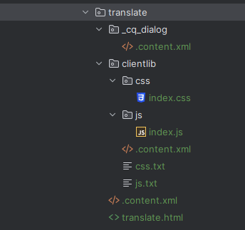
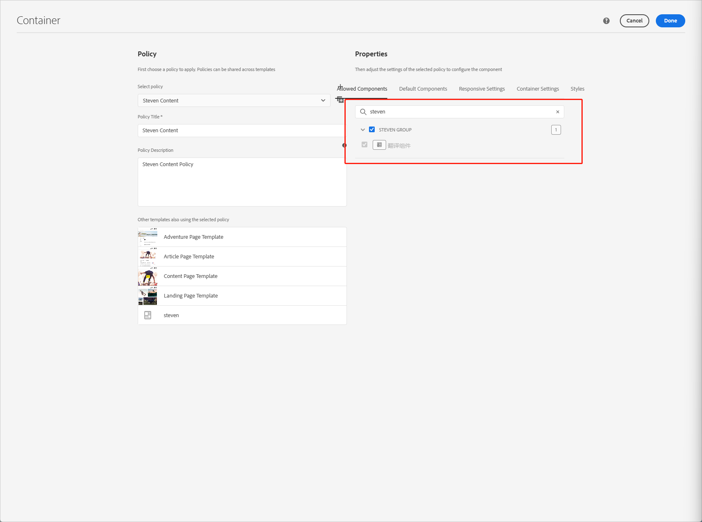
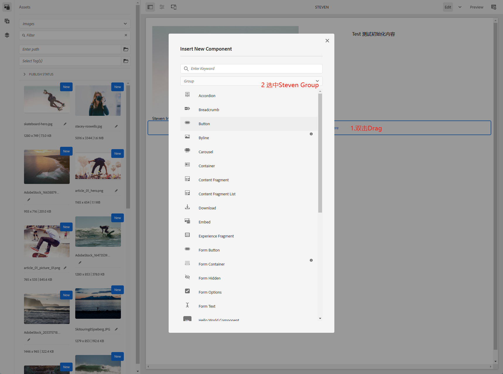
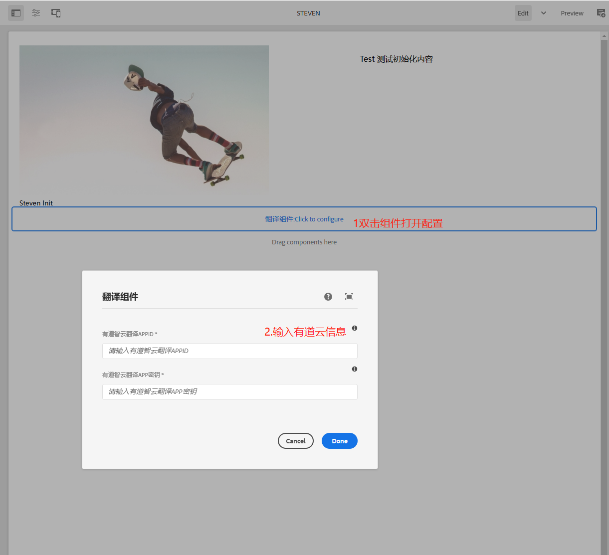
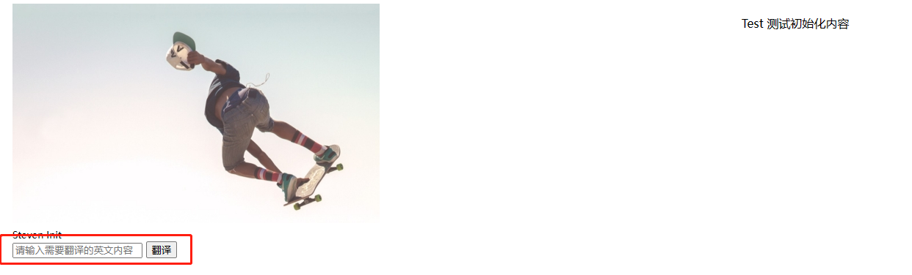
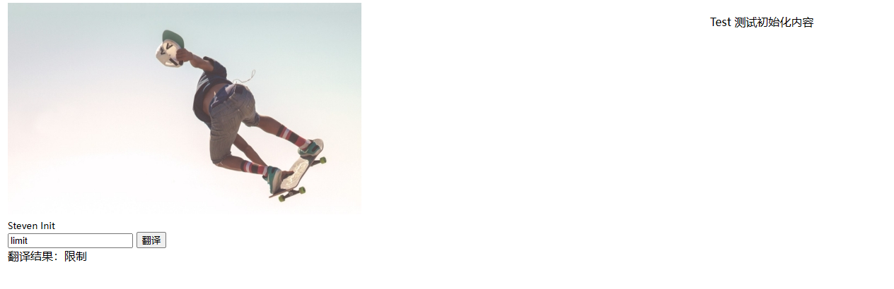
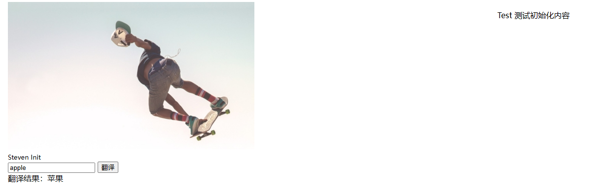
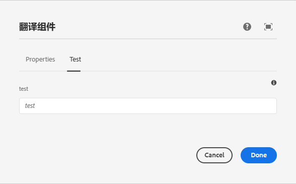
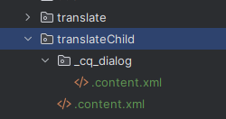
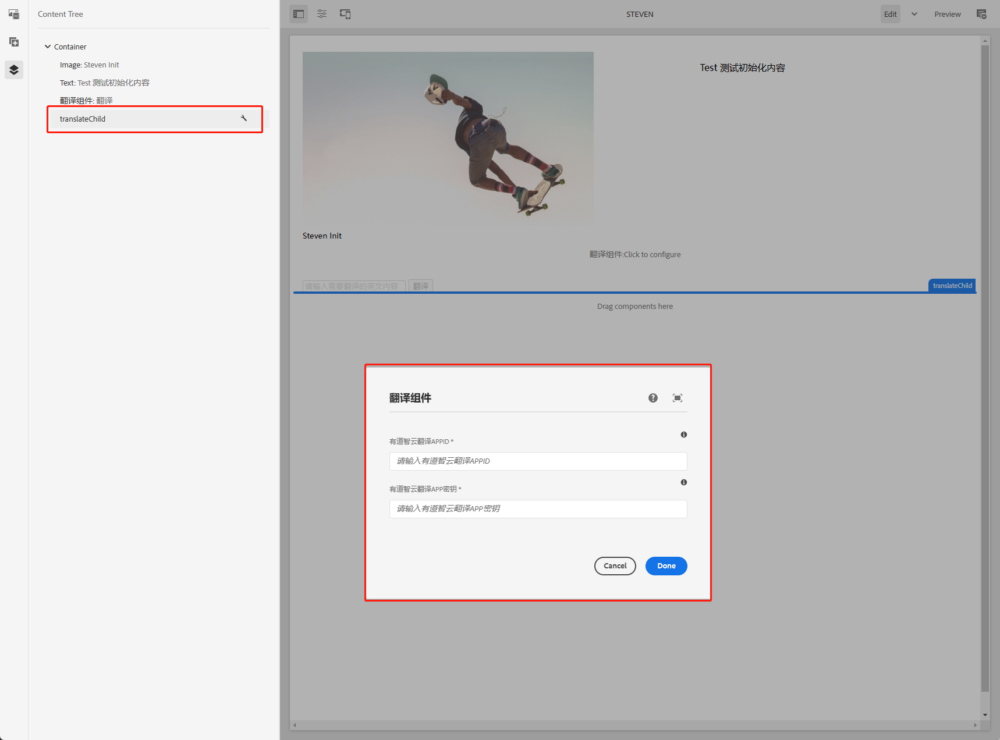

# 三、在AEM中实现自定义组件

我们在第二章中实现了自定义模板和页面，在文章的最后用到了repo工具从JCR（Java Content Repository）中拉取自定义的模板用来保存在代码中。那么什么是JCR？

在大型CMS项目开发中，经常会对接供应商的私有存储（数据库、文档、其他存储等），在开发过程中大大增加了系统的复杂性和可维护性，所以标准化内容仓库的需求非常迫切。JCR就应运而生。

Content Repository for Java Technology 规范是在 Java Community Process 中作为 JSR-170 开发的，它的目标是满足这些行业的需求。该规范在 javax.jcr 名称空间中提供了统一的 API ，允许以厂商中立的方式访问任何符合规范的仓库实现。

详情参考[IBM关于JCR的介绍](https://www.ibm.com/developerworks/cn/java/j-jcr/)

## 创建自定义组件

这一章我们实现一个翻译组件，通过调用[有道智云API](https://ai.youdao.com/)来进行翻译单词或句子，自己注册账号密码即可，也可以使用其他API，请自行查找使用。

进入WKDN的ui.apps/src/main/content/jcr_root/apps/wknd/components目录下创建translate目录，结构如下



_cq_dialog目录为对话框目录，双击组件后弹出的对话框，可在页面输入组件内容

clientlib目录为组件所需js和css目录

translate/.content.xml为组件配置信息

translate/translate.html为组件显示内容

### 创建组件对话框

打开_cq_dialog/.content.xml文件，进行对话框内容编辑

- jcr:root标签为结构标签也是根标签，content、items、tabs都为结构标签
- jcr:title为组件名称
- sling:resourceType为组件类型，AEM提供了丰富的基础组件类型可供使用，可以在[这里](https://www.adobe.io/experience-manager/reference-materials/6-5/granite-ui/api/jcr_root/libs/granite/ui/components/foundation/form/select/index.html?highlight=select)进行查看

```xml
<?xml version="1.0" encoding="UTF-8"?>
<jcr:root xmlns:sling="http://sling.apache.org/jcr/sling/1.0" xmlns:granite="http://www.adobe.com/jcr/granite/1.0" xmlns:cq="http://www.day.com/jcr/cq/1.0" xmlns:jcr="http://www.jcp.org/jcr/1.0" xmlns:nt="http://www.jcp.org/jcr/nt/1.0"
    jcr:primaryType="nt:unstructured"
    jcr:title="翻译组件"
    sling:resourceType="cq/gui/components/authoring/dialog">
    <content
        jcr:primaryType="nt:unstructured"
        sling:resourceType="granite/ui/components/coral/foundation/container">
        <items jcr:primaryType="nt:unstructured">
            <tabs
                jcr:primaryType="nt:unstructured"
                sling:resourceType="granite/ui/components/coral/foundation/tabs"
                maximized="{Boolean}false">
                <items jcr:primaryType="nt:unstructured">
                    <properties
                        jcr:primaryType="nt:unstructured"
                        jcr:title="Properties"
                        sling:resourceType="granite/ui/components/coral/foundation/container"
                        margin="{Boolean}true">
                        <items jcr:primaryType="nt:unstructured">
                            <columns
                                jcr:primaryType="nt:unstructured"
                                sling:resourceType="granite/ui/components/coral/foundation/fixedcolumns"
                                margin="{Boolean}true">
                                <items jcr:primaryType="nt:unstructured">
                                    <column
                                        jcr:primaryType="nt:unstructured"
                                        sling:resourceType="granite/ui/components/coral/foundation/container">
                                        <items jcr:primaryType="nt:unstructured">
                                            <appId
                                                jcr:primaryType="nt:unstructured"
                                                sling:resourceType="granite/ui/components/coral/foundation/form/textfield"
                                                fieldLabel="有道智云翻译APPID"
                                                fieldDescription="有道智云翻译APPID."
                                                emptyText="请输入有道智云翻译APPID"
                                                name="./appId"
                                                required="{Boolean}true"/>
                                            <appKey
                                                jcr:primaryType="nt:unstructured"
                                                sling:resourceType="granite/ui/components/coral/foundation/form/textfield"
                                                fieldLabel="有道智云翻译APP密钥"
                                                fieldDescription="有道智云翻译APP密钥."
                                                emptyText="请输入有道智云翻译APP密钥"
                                                name="./appKey"
                                                required="{Boolean}true"/>
                                        </items>
                                    </column>
                                </items>
                            </columns>
                        </items>
                    </properties>
                </items>
            </tabs>
        </items>
    </content>
</jcr:root>
```

### 创建组件配置

打开translate/.content.xml

- jcr:title 组件名称
- jcr:primaryType 配置类型，cq:Component表示组件
- componentGroup 组件所属组名，在模板和页面中可以通过组名进行快速搜索组件

```xml
<?xml version="1.0" encoding="UTF-8"?>
<jcr:root 
    xmlns:sling="http://sling.apache.org/jcr/sling/1.0"
    xmlns:jcr="http://www.jcp.org/jcr/1.0"
    jcr:primaryType="cq:Component"
    jcr:title="翻译组件"
    jcr:description="有道翻译组件"
    componentGroup="Steven Group" />
```

### 创建组件所需的js和css

#### 配置前端库

打开clientlib/.content.xml，steven.translate是我们给前端库起的名字，在html文件中会使用到

```xml
<?xml version="1.0" encoding="UTF-8"?>
<jcr:root xmlns:cq="http://www.day.com/jcr/cq/1.0" xmlns:jcr="http://www.jcp.org/jcr/1.0"
      jcr:primaryType="cq:ClientLibraryFolder"
      allowProxy="true"
      categories="[steven.translate]"/>
```

#### 创建js

打开clientlib/js/index.js

```javascript
(() => {
	// 页面加载时调用
    document.addEventListener('DOMContentLoaded', function () {

    });

    trans = function() {
        var query = $('#trans-content').val();
        var component = $('.cmp-translate');
        var appKey = component.attr('appId');
        var key = component.attr('appKey');
        var salt = (new Date).getTime();
        var curtime = Math.round(new Date().getTime()/1000);
        var to = 'zh-CHS';
        var from = 'en';
        var str1 = appKey + truncate(query) + salt + curtime + key;
        // 用户词表ID
        var vocabId =  '';
        var sign = CryptoJS.SHA256(str1).toString(CryptoJS.enc.Hex);
        $.ajax({
            url: 'http://openapi.youdao.com/api',
            type: 'post',
            dataType: 'jsonp',
            data: {
                q: query,
                appKey: appKey,
                salt: salt,
                from: from,
                to: to,
                sign: sign,
                signType: "v3",
                curtime: curtime,
                vocabId: vocabId,
            },
            success: function (data) {
                var translation = data.translation[0]
                $('#result').html('翻译结果：' + translation);
            }
        });
    }

    const truncate = (q)=> {
              var len = q.length;
              if(len<=20) return q;
              return q.substring(0, 10) + len + q.substring(len-10, len);
          }

})();
```

打开clientlib/js.txt

```txt
#base=js
index.js
```

#### 创建css

打开clientlib/css/index.css

```css
.cmp-translate {
    margin-top: 20px;
}
```

打开clientlib/css.txt

```txt
#base=css
index.css
```

### 创建组件显示内容

打开translate/translate.html，使用HTL语法，HTML 模板语言 (HTL) 是适用于 HTML 的首选和推荐的服务器站点模板系统。是一个开源、不依赖于平台的规范，任何人都可以自由实施。 其规范保存在 GitHub 存储库中。详情参考[官方文档](https://experienceleague.adobe.com/docs/experience-manager-htl/content/specification.html)

- sly标签为HTL使用的标签
- ${}可以访问到JCR中的数据，component、properties为HTL中可直接访问的Java对象
- data-sly-unwrap="${!wcmmode.edit}" 表示在非编辑模式下不显示此行信息，意思就是如果我们是在编辑模式下查看组件显示内容，会显示"${component.title}:Click to configure"这句话，否则不显示
- 在HTML中如果需要引入前端js和css库，使用data-sly-use.clientLib和data-sly-call属性，data-sly-use.clientLib为固定语句，data-sly-cal中可以使用clientLib.all、clientLib.js、clientLib.css
  - clientLib.all全部引入js和css
  - clientLib.js只引入js
  - clientLib.css只引入css

```html
<div class="cq-placeholder cmp-title" data-emptytext="${component.title}:Click to configure" data-sly-unwrap="${!wcmmode.edit}"></div>
<script src="https://cdnjs.cloudflare.com/ajax/libs/jquery/3.5.1/jquery.min.js"></script>
<script src="https://cdn.bootcdn.net/ajax/libs/crypto-js/4.0.0/crypto-js.js"></script>

<sly data-sly-use.clientLib="${'/libs/granite/sightly/templates/clientlib.html'}"/>
<sly data-sly-call="${clientLib.all @ categories='steven.translate'}" />
<div class="cmp-translate" appId="${properties.appId}" appKey="${properties.appKey}">
    <input id="trans-content" type="text" placeholder="请输入需要翻译的英文内容" >
    <button onclick="trans()">翻译</button><br>
    <span id="result"></span>
</div>
```

### 在页面中使用组件

要想在页面中使用自定义组件，需要现在模板中选中Translate组件，搜索组名Steven Group



打开第二章中创建的页面steven，使用Translate组件





点击按钮 View as Published查看页面



输入需要翻译的内容





手动创建自定义组件就开发完成了

## 从其他组件继承

我们给Translate组件新增一个Tab，与properties标签同级，继承Translate组件，并且继承组件不显示Test页

```xml
<test jcr:primaryType="nt:unstructured"
      jcr:title="Test"
      sling:resourceType="granite/ui/components/coral/foundation/container"
      margin="{Boolean}true">
    <items jcr:primaryType="nt:unstructured">
        <columns
                 jcr:primaryType="nt:unstructured"
                 sling:resourceType="granite/ui/components/coral/foundation/fixedcolumns"
                 margin="{Boolean}true">
            <items jcr:primaryType="nt:unstructured">
                <column
                        jcr:primaryType="nt:unstructured"
                        sling:resourceType="granite/ui/components/coral/foundation/container">
                    <items jcr:primaryType="nt:unstructured">
                        <test
                              jcr:primaryType="nt:unstructured"
                              sling:resourceType="granite/ui/components/coral/foundation/form/textfield"
                              fieldLabel="test"
                              fieldDescription="test."
                              emptyText="test"
                              name="./test"/>
                    </items>
                </column>
            </items>
        </columns>
    </items>
</test>
```

在页面中可以看到多了一个Test页



### 继承组件

复制代码，删除不需要的代码



修改对话框中的test节点

```xml
<test jcr:primaryType="nt:unstructured"
      sling:hideResource="{Boolean}true">
</test>
```

修改组件配置信息，使用jcr:resourceSuperType节点指定父组件位置

```xml
<?xml version="1.0" encoding="UTF-8"?>
<jcr:root 
    xmlns:sling="http://sling.apache.org/jcr/sling/1.0"
    xmlns:jcr="http://www.jcp.org/jcr/1.0"
    jcr:primaryType="cq:Component"
    jcr:title="translateChild"
    jcr:description="translateChild"
    jcr:resourceSuperType="wknd/components/translate"
    componentGroup="Steven Group" />
```

### 实现效果



这样自定义组件就开发完了，下一章会继续讲解如何使用SlingModel来开发组件