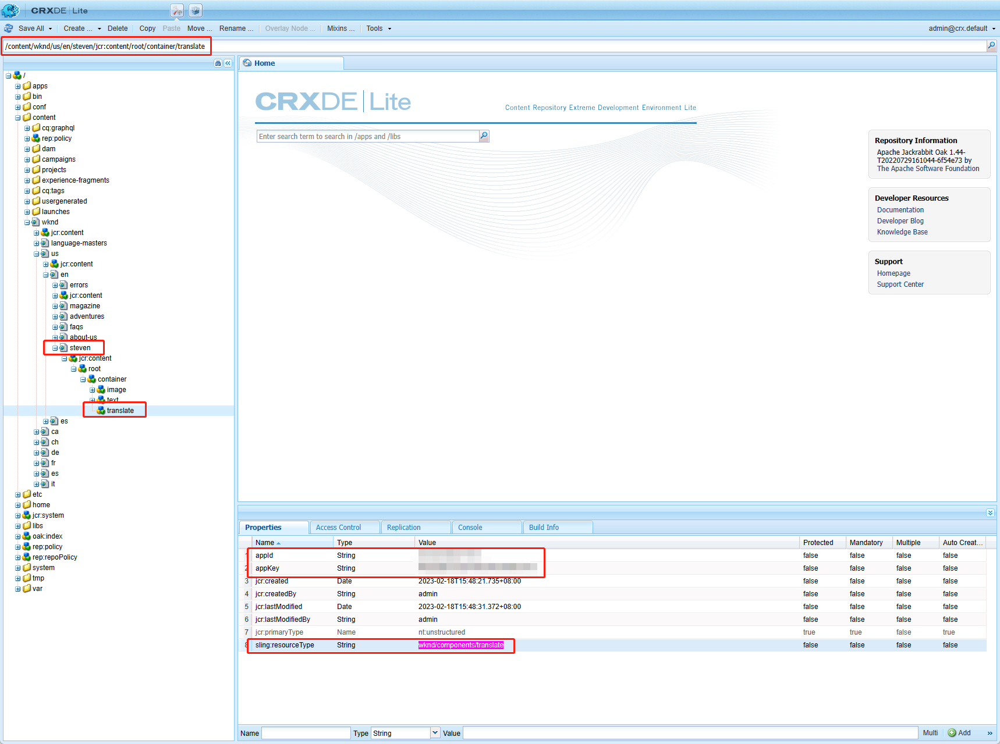
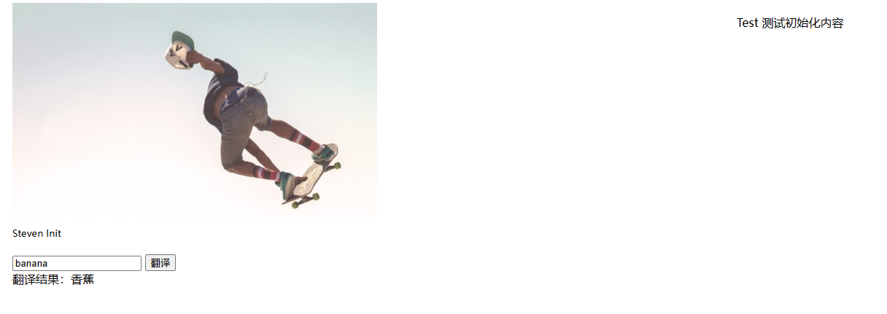
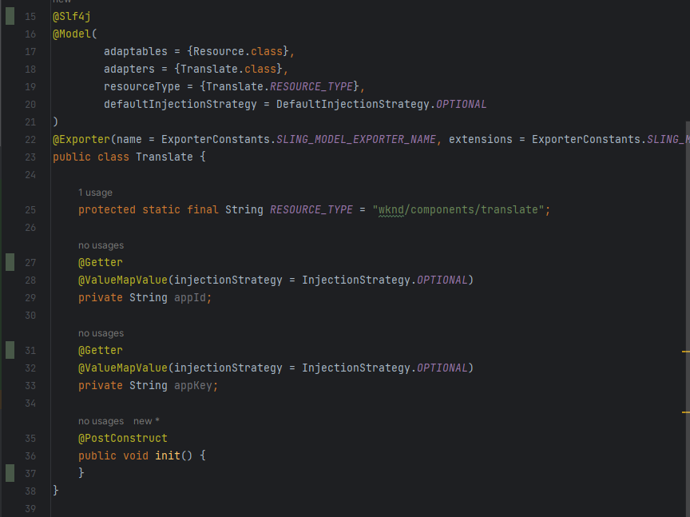

# 四、使用SlingModel实现自定义组件

在这一章中使用SlingModel来实现自定义组件，并且编写对应的Unit Test类。

## 创建SlingModel

在com.adobe.aem.guides.wknd.core.models目录下创建Translate.java

```java
package com.adobe.aem.guides.wknd.core.models;

import com.adobe.cq.export.json.ExporterConstants;
import lombok.Getter;
import lombok.extern.slf4j.Slf4j;
import org.apache.sling.api.resource.Resource;
import org.apache.sling.models.annotations.DefaultInjectionStrategy;
import org.apache.sling.models.annotations.Exporter;
import org.apache.sling.models.annotations.Model;
import org.apache.sling.models.annotations.injectorspecific.InjectionStrategy;
import org.apache.sling.models.annotations.injectorspecific.ValueMapValue;

import javax.annotation.PostConstruct;

@Slf4j
@Model(
        adaptables = {Resource.class},
        adapters = {Translate.class},
        resourceType = {Translate.RESOURCE_TYPE},
        defaultInjectionStrategy = DefaultInjectionStrategy.OPTIONAL
)
@Exporter(name = ExporterConstants.SLING_MODEL_EXPORTER_NAME, extensions = ExporterConstants.SLING_MODEL_EXTENSION)
public class Translate {

    protected static final String RESOURCE_TYPE = "wknd/components/translate";

    @Getter
    @ValueMapValue(injectionStrategy = InjectionStrategy.OPTIONAL)
    private String appId;

    @Getter
    @ValueMapValue(injectionStrategy = InjectionStrategy.OPTIONAL)
    private String appKey;

    @PostConstruct
    public void init() {
    }
}
```

- @Model声明这是一个SlingModel，组件的Java实体对象
  - adaptables按照Resource声明这是一个JCR中的Resource节点，可以直接使用Resource匹配的API
  - adapters属性表明在HTL中可以通过Translate类来适配这个SlingModel
  - resourceType声明组件地址
  - defaultInjectionStrategy默认注入策略为可选
- @Exporter声明这个SlingModel可以按json格式导出
- @PostConstruct在组件初始化的过程中，可以在init方法内添加操作
- @ValueMapValue是AEM的API在做好组件地址适配后，可以从组件对应的Resource中获取内容



上图中就是steven页面在JCR中的位置及它的属性和内容，可以看到从组件对话框中输入的appId和appKey，@ValueMapValue注解可以直接获取到组件中的内容。

## 修改HTL

在HTL中引入上面编写的SlingModel

```html
<div class="cq-placeholder cmp-title" data-emptytext="${component.title}:Click to configure" data-sly-unwrap="${!wcmmode.edit}"></div>
<script src="https://cdnjs.cloudflare.com/ajax/libs/jquery/3.5.1/jquery.min.js"></script>
<script src="https://cdn.bootcdn.net/ajax/libs/crypto-js/4.0.0/crypto-js.js"></script>

<sly data-sly-use.clientLib="${'/libs/granite/sightly/templates/clientlib.html'}"/>
<sly data-sly-call="${clientLib.all @ categories='steven.translate'}" />

<sly data-sly-use.model="com.adobe.aem.guides.wknd.core.models.Translate">
    <div class="cmp-translate" appId="${model.appId}" appKey="${model.appKey}">
        <input id="trans-content" type="text" placeholder="请输入需要翻译的英文内容" >
        <button onclick="trans()">翻译</button><br>
        <span id="result"></span>
    </div>
</sly>
```

使用sly标签和data-sly-use属性使用SlingModel，model为自定义名称，${model.appId}和${model.appKey}分别获取appId和appKey，在调用属性时一定要保证属性有get方法，${model.appId}时简化了get方法，本质还是调用的getAppId()方法。

## 查看效果



与直接使用HTL中的API是一致的。

## 编写Unit Test

功能完成后，还是需要编写Unit Test的，AEM也有内置的一些编写Unit Test的API。在test的com.adobe.aem.guides.wknd.core.models目录下创建TranslateTest类

```java
package com.adobe.aem.guides.wknd.core.models;

import io.wcm.testing.mock.aem.junit5.AemContext;
import io.wcm.testing.mock.aem.junit5.AemContextExtension;
import org.apache.sling.api.resource.Resource;
import org.apache.sling.models.factory.ModelFactory;
import org.junit.jupiter.api.BeforeEach;
import org.junit.jupiter.api.Test;
import org.junit.jupiter.api.extension.ExtendWith;

import static org.junit.jupiter.api.Assertions.*;

@ExtendWith({AemContextExtension.class})
class TranslateTest {

    private final AemContext ctx = new AemContext();
    private Translate translate;

    @BeforeEach
    void setUp() {
        ctx.addModelsForClasses(Translate.class);
        ctx.load().json("/com/adobe/aem/guides/wknd/core/models/TranslateTest.json", "/content");
        Resource resource = ctx.currentResource("/content/translate");
        translate = ctx.getService(ModelFactory.class).createModel(resource, Translate.class);
    }

    @Test
    void init() {
        assertEquals(translate.getAppId(), "appId");
        assertEquals(translate.getAppKey(), "appKey");
    }
}
```

- AemContextExtension类为AEM提供的Unit Test环境类，它提供了一系列可以使用的API
- AemContext是AEM的环境类，通过这个类可以很便捷的模拟AEM环境、模拟SlingModel

模拟组件时，是通过json文件来模拟的，AemContext会讲json文件模拟成JCR的数据结构，json中的数据与JCR中的数据是一致的。

```json
{
  "translate": {
    "appId": "appId",
    "appKey": "appKey",
    "jcr:primaryType": "nt:unstructured",
    "sling:resourceType": "wknd/components/translate"
  }
}
```

测试覆盖结果，绿色为覆盖的行数，红色是未覆盖



这样Unit Test就编写完成了

## 遇到的问题

1. component cannot be resolved to a type in aem

   在创建组件实体并将bundle推送至author实例后，刷新页面报错TranslateImpl component cannot be resolved to a type，这是因为在创建新的Java实体类后，bundle版本发生了变化，maven中的bnd插件检测到代码版本发生变化，解决方案有以下两种：

   - 修改package-info.java中的@Version("2.0.0")为2.0.1

   - 删除maven插件中的版本检测（推荐），在根目录pom.xml中找到biz.aQute.bnd节点，修改其中的exportcontents配置即可

     ```xml
     -exportcontents: ${removeall;${packages;};${packages;CONDITIONAL}}
     ```


通过使用SlingModel来实现组件和编写组件Unit Test就完成了，下一章会继续讲解AEM中自带API的使用方法。