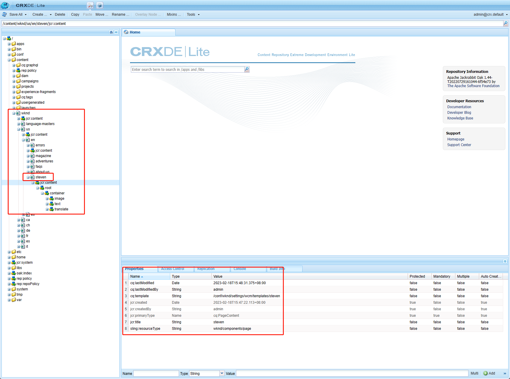
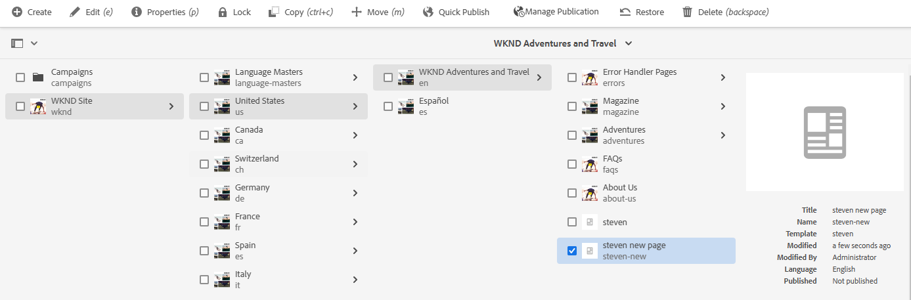
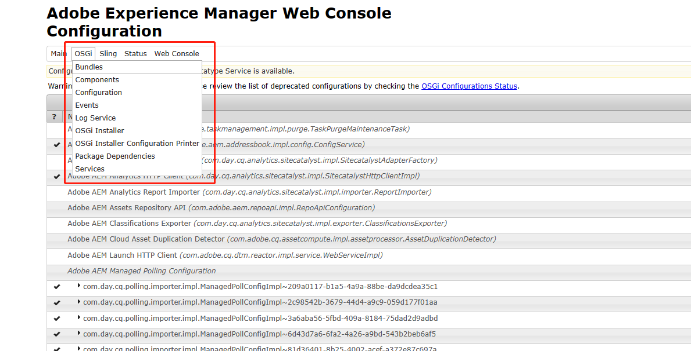

# 五、AEM中常用的API

AEM中集成了非常多的开源软件，同时也对这些开源软件做了一系列的封装，以便提供好用的API供开发者使用。其中以下面四种为主：

| 名称  | 优先级 | 说明                                         |
| :---- | :----- | -------------------------------------------- |
| AEM   | 最高   | AEM中的抽象概念，如页面、资产、工作流等      |
| Sling | 高     | 基于资源的抽象概念，如资源、数据、HTTP请求等 |
| JCR   | 中     | 具体数据内容的抽象概念，如节点、属性、会话等 |
| OSGI  | 低     | 主要针对服务的抽象，如配置、服务等           |

一般情况下，优先使用AEM的API，封装的功能较为强大和全面。下面就分别介绍这四种API的一些实例。以下面的代码为例

```java
package com.adobe.aem.guides.wknd.core.models;

import com.adobe.cq.export.json.ExporterConstants;
import com.day.cq.commons.inherit.InheritanceValueMap;
import com.day.cq.commons.jcr.JcrConstants;
import com.day.cq.wcm.api.Page;
import com.day.cq.wcm.api.PageManager;
import com.day.cq.wcm.api.WCMException;
import lombok.Getter;
import lombok.extern.slf4j.Slf4j;
import org.apache.sling.api.SlingHttpServletRequest;
import org.apache.sling.api.resource.PersistenceException;
import org.apache.sling.api.resource.Resource;
import org.apache.sling.api.resource.ResourceResolver;
import org.apache.sling.api.resource.ValueMap;
import org.apache.sling.models.annotations.DefaultInjectionStrategy;
import org.apache.sling.models.annotations.Exporter;
import org.apache.sling.models.annotations.Model;
import org.apache.sling.models.annotations.injectorspecific.InjectionStrategy;
import org.apache.sling.models.annotations.injectorspecific.ScriptVariable;
import org.apache.sling.models.annotations.injectorspecific.Self;
import org.apache.sling.models.annotations.injectorspecific.SlingObject;
import org.apache.sling.models.annotations.injectorspecific.ValueMapValue;

import javax.annotation.PostConstruct;
import javax.inject.Inject;

@Slf4j
@Model(
        adaptables = {SlingHttpServletRequest.class, Resource.class},
        adapters = {Translate.class},
        resourceType = {Translate.RESOURCE_TYPE},
        defaultInjectionStrategy = DefaultInjectionStrategy.OPTIONAL
)
@Exporter(name = ExporterConstants.SLING_MODEL_EXPORTER_NAME, extensions = ExporterConstants.SLING_MODEL_EXTENSION)
public class Translate {

    protected static final String RESOURCE_TYPE = "wknd/components/translate";

    @SlingObject
    private ResourceResolver resourceResolver;
    @SlingObject
    private Resource resource;
    @Self
    private SlingHttpServletRequest request;
    @ScriptVariable
    private ValueMap properties;
    @Inject
    private Page currentPage;
    @Inject
    private InheritanceValueMap pageProperties;

    @Getter
    @ValueMapValue(injectionStrategy = InjectionStrategy.OPTIONAL)
    private String appId;

    @Getter
    @ValueMapValue(injectionStrategy = InjectionStrategy.OPTIONAL)
    private String appKey;

    @PostConstruct
    public void init() throws WCMException, PersistenceException {
        // resourceResolver是资源转换类，可以通过此类获取对应的页面，也可以转换为其他API
        PageManager pageManager = resourceResolver.adaptTo(PageManager.class);
        // pageManager可以通过页面路径获取到对应的Page对象
        Page page = pageManager.getPage("/content/wknd/us/en/steven");
        // 也可以直接使用currentPage
        log.info("page title = {}", page.getTitle());
        // 所以从pageManager中通过路径获取到Page对象和currentPage对象，表示的是JCR中同一个页面节点
        log.info("current page title = {}", currentPage.getTitle());
        // 通过SlingHttpServletRequest也可以获取到当前页面的地址信息
        String path = request.getHeader("Referer");
        log.info("page request path : {}", path);
        // 获取到地址信息后，就可以拿到这个页面下所有的节点和数据内容，由于page和currentPage表示同一个页面节点，所以拿到的页面内容是一致的
        ValueMap pageVM = page.getProperties();
        ValueMap currentPageVM = currentPage.getProperties();
        log.info("title = {}", pageVM.get(JcrConstants.JCR_TITLE, String.class));
        log.info("title = {}", currentPageVM.get(JcrConstants.JCR_TITLE, String.class));
        // 也可以通过Sling API来创建页面和资源，通过模板来创建页面
        String templatePath = "/conf/wknd/settings/wcm/templates/steven";
        pageManager.create("/content/wknd/us/en", "steven-new", templatePath, "steven new page", true);
        resourceResolver.commit();
        // 获取组件属性及内容
        ValueMap valueMap = resource.getValueMap();
        log.info("appId from resource = {}", valueMap.get("appId", String.class));
        log.info("appId from properties = {}", properties.get("appId", String.class));
    }
}
```

## AEM API

AEM API 提供了特定于产品化用例的抽象概念和功能。详情可参考[AEM API Doc](https://developer.adobe.com/experience-manager/reference-materials/6-5/javadoc/index.html)

例如：AEM提供了PageManager和Page类来操作AEM页面节点，在之前的例子中steven.html作为一个页面我们可以通过以下方式获取到页面的资源和信息，在中init方法进行修改，查看日志结果，获取到的页面为steven

```java
// resourceResolver是资源转换类，可以通过此类获取对应的页面，也可以转换为其他API
PageManager pageManager = resourceResolver.adaptTo(PageManager.class);
// pageManager可以通过页面路径获取到对应的Page对象
Page page = pageManager.getPage("/content/wknd/us/en/steven");
// 也可以直接使用currentPage
log.info("page title = {}", page.getTitle());
// 所以从pageManager中通过路径获取到Page对象和currentPage对象，表示的是JCR中同一个页面节点
log.info("current page title = {}", currentPage.getTitle());
```

查看日志

```shell
20.02.2023 15:24:20.178 *INFO* [[0:0:0:0:0:0:0:1] [1676877860073] GET /content/wknd/us/en/steven.html HTTP/1.1] com.adobe.aem.guides.wknd.core.models.Translate page title = steven
20.02.2023 15:24:20.178 *INFO* [[0:0:0:0:0:0:0:1] [1676877860073] GET /content/wknd/us/en/steven.html HTTP/1.1] com.adobe.aem.guides.wknd.core.models.Translate current page title = steven
```

## Sling API

由于Sling和JCR标准本身是没有页面和站点之类的概念的，这些概念都是AEM自带的。所以需要访问页面就要用到SlingHttpServletRequest类，与我们在Java中用到的Http请求类是一样的。也可以通过SlingHttpServletRequest来获取当前页面的路径

```java
// 通过SlingHttpServletRequest也可以获取到当前页面的地址信息
String path = request.getHeader("Referer");
log.info("page request path : {}", path);
```

查看日志可以看到路径信息

```shell
20.02.2023 15:47:53.191 *INFO* [[0:0:0:0:0:0:0:1] [1676879273069] GET /content/wknd/us/en/steven.html HTTP/1.1] com.adobe.aem.guides.wknd.core.models.Translate page request path : http://localhost:4502/editor.html/content/wknd/us/en/steven.html
```

拿到页面信息后，我们就可以继续获取到页面下的所有节点、组件的信息和数据，打开http://localhost:4502/crx/de/index.jsp我们可以看到steven页面下的所有信息



每个节点的数据都会保存在节点名称下jcr:content节点中，通过page获取jcr:title即页面的标题

```java
// 获取到地址信息后，就可以拿到这个页面下所有的节点和数据内容，由于page和currentPage表示同一个页面节点，所以拿到的页面内容是一致的
ValueMap pageVM = page.getProperties();
ValueMap currentPageVM = currentPage.getProperties();
log.info("title = {}", pageVM.get(JcrConstants.JCR_TITLE, String.class));
log.info("title = {}", currentPageVM.get(JcrConstants.JCR_TITLE, String.class));
```

查看日志

```shell
20.02.2023 15:58:47.853 *INFO* [[0:0:0:0:0:0:0:1] [1676879927738] GET /content/wknd/us/en/steven.html HTTP/1.1] com.adobe.aem.guides.wknd.core.models.Translate title = steven
20.02.2023 15:58:47.853 *INFO* [[0:0:0:0:0:0:0:1] [1676879927738] GET /content/wknd/us/en/steven.html HTTP/1.1] com.adobe.aem.guides.wknd.core.models.Translate title = steven
```

也可以通过Sling API来创建页面和资源，通过模板来创建页面

```java
String templatePath = "/conf/wknd/settings/wcm/templates/steven";
pageManager.create("/content/wknd/us/en", "steven-new", templatePath, "steven new page", true);
resourceResolver.commit();
```

查看站点，和steven页面同级会生成一个新的页面steven-new



同理还可以使用resourceResolver类创建资源节点

## JCR API

JCR（Java Content Repository）是基于树形结构的非关系型数据存储库，本身含有大量的API，支持各种各样的CRUD。但是在AEM中还是更推荐AEM自身封装的高级API。常用的创建节点的API可以使用JcrUtil，常见的JCR常量也可以从JcrConstants.class中找到。

看到了JCR中的节点，如果我们要想获取组件的内容和数据，有两种方法，一种是遍历页面的所有子节点，找到sling:resourceType为对应组件路径的节点，另一种是使用AEM API快速获取。

```java
@ScriptVariable
private ValueMap properties;

// 获取组件属性及内容
ValueMap valueMap = resource.getValueMap();
log.info(valueMap.get("appId", String.class));
log.info(properties.get("appId", String.class));
```

查看日志

```shell
20.02.2023 16:24:21.466 *INFO* [[0:0:0:0:0:0:0:1] [1676881461351] GET /content/wknd/us/en/steven.html HTTP/1.1] com.adobe.aem.guides.wknd.core.models.Translate appId from resource = 2e4d3244dcd719a1
20.02.2023 16:24:21.466 *INFO* [[0:0:0:0:0:0:0:1] [1676881461351] GET /content/wknd/us/en/steven.html HTTP/1.1] com.adobe.aem.guides.wknd.core.models.Translate appId from properties = 2e4d3244dcd719a1
```

从Resource对象中获取的属性对象ValueMap中可以通过变量名获取到appId，也可以通过注解@ScriptVariable声明ValueMap来获取appId

## OSGI API

我们可以打开[Adobe Experience Manager Web Console - Configuration](http://localhost:4502/system/console/configMgr)来查看本地有哪些服务、Bundles、日志、状态等等信息。点击OSGi标签可以看到，OSGi管理Bundles、组件、配置信息、时间、日志、服务、依赖包，也是非常常用的一个配置信息界面。



在后续的章节中会讲到使用@Component注解编写一个OSGi的service和管理OSGi配置信息。AEM中常用的API就讲解完了，下一章会继续讲解如何实现自定义日志。

