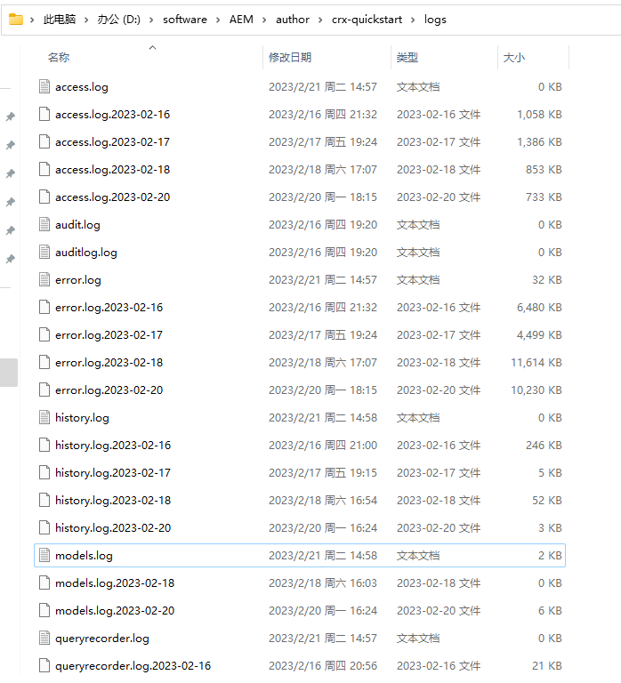

# 六、自定义日志

在上一章讲到了通过日志观察使用AEM API的结果。在AEM中默认提供了日志的配置信息及自定义配置。

## 在config manager页面配置日志

我们可以直接访问地址[Adobe Experience Manager Web Console - Configuration](http://localhost:4502/system/console/configMgr)进入config console页面，也可以通过AEM网站中的快捷入口，先进入CRXDE Lite


点击上面的工具栏Tools按钮，选择Server Config


鼠标悬浮在Sling菜单上，选择Log Support选项进入日志页面


在日志管理界面可以看到系统默认的日志

- request.log -- 请求日志，会记录页面请求信息
- queryrecorder.log -- 查询记录日志
- audit.log 
- access.log -- 权限日志
- auditlog.log
- error.log -- 错误日志
- history.log -- 历史日志


其中的models.log是自定义日志，可以点击Add new Logger来添加自定义日志，可以配置以下三个参数

- 日志级别 -- INFO、WARN、ERROR、OFF
- 日志文件名称 -- 自定义文件名称即可
- 需要输出的日志路径 -- 可以选择某个类比如之前开发的翻译组件类com.adobe.aem.guides.wknd.core.models.Translate，也可以选择到某个目录，则会记录这个目录下所有类的日志（开发过程比较常用）


这样自定义日志就配置好了，刷新[页面](http://localhost:4502/editor.html/content/wknd/us/en/steven.html)，然后找到日志存放目录



来看下效果

```shell
21.02.2023 14:58:22.001 *INFO* [[0:0:0:0:0:0:0:1] [1676962700945] GET /content/wknd/us/en/steven.html HTTP/1.1] com.adobe.aem.guides.wknd.core.models.Translate page title = steven
21.02.2023 14:58:22.002 *INFO* [[0:0:0:0:0:0:0:1] [1676962700945] GET /content/wknd/us/en/steven.html HTTP/1.1] com.adobe.aem.guides.wknd.core.models.Translate current page title = steven
21.02.2023 14:58:22.002 *INFO* [[0:0:0:0:0:0:0:1] [1676962700945] GET /content/wknd/us/en/steven.html HTTP/1.1] com.adobe.aem.guides.wknd.core.models.Translate page request path : http://localhost:4502/editor.html/content/wknd/us/en/steven.html
21.02.2023 14:58:22.002 *INFO* [[0:0:0:0:0:0:0:1] [1676962700945] GET /content/wknd/us/en/steven.html HTTP/1.1] com.adobe.aem.guides.wknd.core.models.Translate title = steven
21.02.2023 14:58:22.002 *INFO* [[0:0:0:0:0:0:0:1] [1676962700945] GET /content/wknd/us/en/steven.html HTTP/1.1] com.adobe.aem.guides.wknd.core.models.Translate title = steven
21.02.2023 14:58:22.029 *INFO* [[0:0:0:0:0:0:0:1] [1676962700945] GET /content/wknd/us/en/steven.html HTTP/1.1] com.adobe.aem.guides.wknd.core.models.Translate appId from resource = 2e4d3244dcd719a1
21.02.2023 14:58:22.030 *INFO* [[0:0:0:0:0:0:0:1] [1676962700945] GET /content/wknd/us/en/steven.html HTTP/1.1] com.adobe.aem.guides.wknd.core.models.Translate appId from properties = 2e4d3244dcd719a1
```

这样自定义日志就配置完成了，下一章我们继续讲解OSGi的用法。