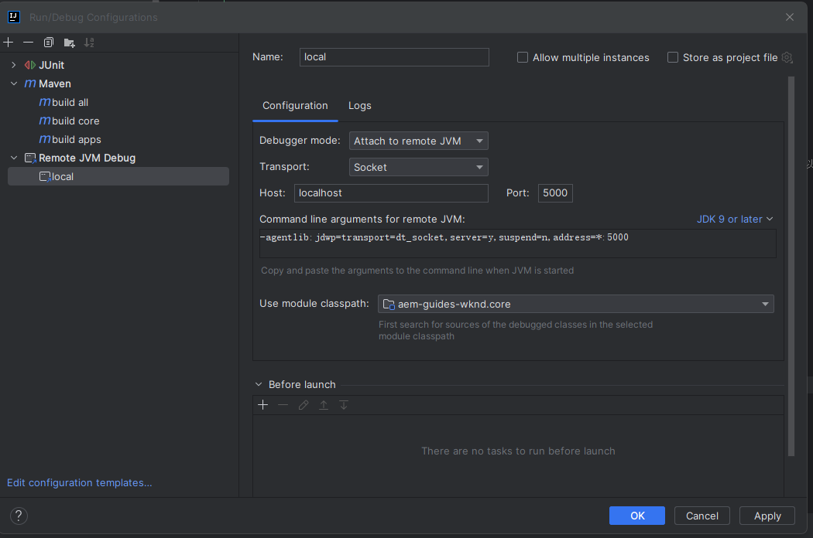
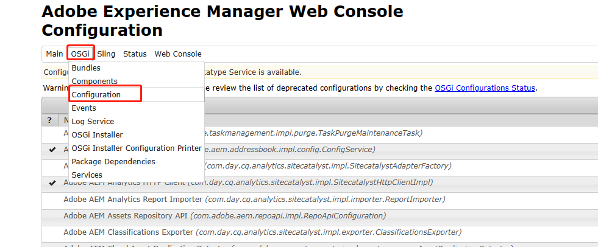
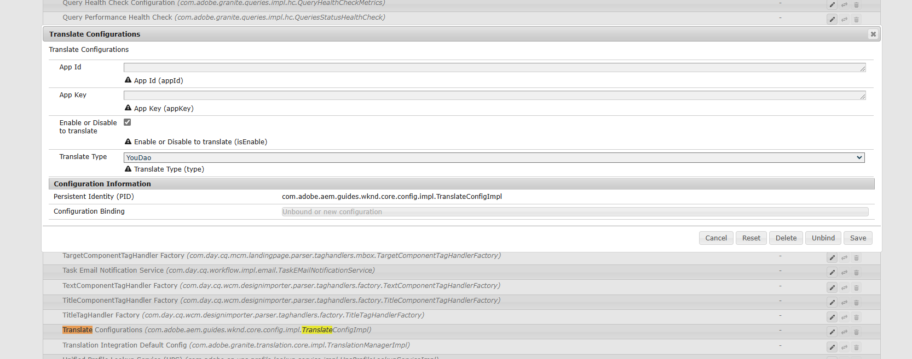
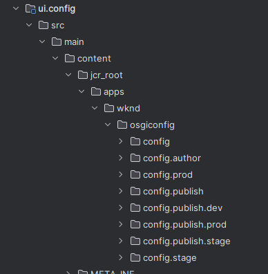
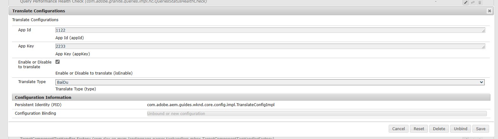

# 七、OSGi Service & Configuration

在上一章中讲解了如何使用自定义日志来排查在开发过程中遇到的问题，除了自定义日志外，还可以使用debug模式进行问题排查

## 开启debug模式

在启动author实例时，使用下面的命令开启debug模式

```shell
java -Xdebug -Xnoagent -Djava.compiler=NONE -Xrunjdwp:transport=dt_socket,address=5000,server=y,suspend=n -jar aem-author-p4502.jar
```

出现下列日志表示开启成功，需要注意AEM实例不论以什么方式启动最低需要1G的内存

```shell
Listening for transport dt_socket at address: 5000
Loading quickstart properties: default
Loading quickstart properties: instance
Low-memory action set to fork
Using 64bit VM settings, min.heap=1024MB, min permgen=256MB, default fork arguments=[-Xmx1024m, -XX:MaxPermSize=256m]
The JVM reports a heap size of 12276 MB, meets our expectation of 1024 MB +/- 20
Setting properties from filename 'D:/software/AEM/author/aem-author-p4502.jar'
Option '-quickstart.server.port' set to '4502' from filename aem-author-p4502.jar
Verbose option not active, closing stdin and redirecting stdout and stderr
Redirecting stdout to D:\software\AEM\author\crx-quickstart\logs\stdout.log
Redirecting stderr to D:\software\AEM\author\crx-quickstart\logs\stderr.log
Press CTRL-C to shutdown the Quickstart server...
WARNING: An illegal reflective access operation has occurred
WARNING: Illegal reflective access by org.apache.sling.commons.threads.impl.ThreadLocalCleaner (launchpad:resources/install/15/org.apache.sling.commons.threads-3.2.22.jar) to field java.lang.Thread.threadLocals
WARNING: Please consider reporting this to the maintainers of org.apache.sling.commons.threads.impl.ThreadLocalCleaner
WARNING: Use --illegal-access=warn to enable warnings of further illegal reflective access operations
WARNING: All illegal access operations will be denied in a future release
```

在IDEA中配置，Port需要与命令行中的address端口一致，自定义即可



配置完成后，在IDEA中运行remote debug 连接author实例，在需要debug的地方打断点，进入组件页面就可以进入debug模式

## OSGi Service

### 单实现类

编写Service接口

```java
package com.adobe.aem.guides.wknd.core.service;

import org.apache.sling.api.resource.Resource;

public interface TranslateService {

    String getAppId(Resource resource);

    String getAppKey(Resource resource);
}
```

编写实现类

```java
package com.adobe.aem.guides.wknd.core.service.impl;

import com.adobe.aem.guides.wknd.core.service.TranslateService;
import lombok.extern.slf4j.Slf4j;
import org.apache.sling.api.resource.Resource;
import org.apache.sling.api.resource.ValueMap;
import org.osgi.service.component.ComponentContext;
import org.osgi.service.component.annotations.Activate;
import org.osgi.service.component.annotations.Component;
import org.osgi.service.component.annotations.Deactivate;
import org.osgi.service.component.annotations.Modified;

@Slf4j
@Component(service = TranslateService.class, immediate = true)
public class TranslateServiceImpl implements TranslateService {

    @Activate
    public void activate(ComponentContext componentContext) {
        log.info("============== TranslateService activate ==============");
    }

    @Deactivate
    public void deactivate(ComponentContext componentContext) {
        log.info("============== TranslateService deactivate ==============");
    }

    @Modified
    public void modified(ComponentContext componentContext) {
        log.info("============== TranslateService modified ==============");
    }

    @Override
    public String getAppId(Resource resource) {
        ValueMap valueMap = resource.getValueMap();
        // 查询appId属性，如果为null，则返回""
        return valueMap.get("appId", "");
    }

    @Override
    public String getAppKey(Resource resource) {
        ValueMap valueMap = resource.getValueMap();
        return valueMap.get("appKey", "");
    }
}
```

在SlingModel中注入Service

```java
@OSGiService
private TranslateService translateService;
```

修改init方法

```java
String appId1 = translateService.getAppId(resource);
        log.info("appId = {}, appId1 = {}", appId, appId1);
```

查看日志，获取到的数据是一致的

```shell
23.02.2023 13:42:09.958 *INFO* [[0:0:0:0:0:0:0:1] [1677130929778] GET /content/wknd/us/en/steven.html HTTP/1.1] com.adobe.aem.guides.wknd.core.models.Translate appId = 2e4d3244dcd719a1, appId1 = 2e4d3244dcd719a1
```

### 多实现类

如果有多个TranslateService的实现类时，会怎么加载呢？先给TranslateService接口增加一个新的方法

```java
String getName();
```

新增实现类TranslateServiceAImpl.class

```java
package com.adobe.aem.guides.wknd.core.service.impl;

import com.adobe.aem.guides.wknd.core.service.TranslateService;
import lombok.extern.slf4j.Slf4j;
import org.apache.sling.api.resource.Resource;
import org.apache.sling.api.resource.ValueMap;
import org.osgi.service.component.ComponentContext;
import org.osgi.service.component.annotations.Activate;
import org.osgi.service.component.annotations.Component;
import org.osgi.service.component.annotations.Deactivate;
import org.osgi.service.component.annotations.Modified;

@Slf4j
@Component(service = TranslateService.class, immediate = true)
public class TranslateServiceAImpl implements TranslateService {

    @Override
    public String getAppId(Resource resource) {
        ValueMap valueMap = resource.getValueMap();
        // 查询appId属性，如果为null，则返回""
        return valueMap.get("appId", "");
    }

    @Override
    public String getAppKey(Resource resource) {
        ValueMap valueMap = resource.getValueMap();
        return valueMap.get("appKey", "");
    }

    @Override
    public String getName() {
        return "TranslateServiceAImpl";
    }
}

```

在之前的TranslateServiceImpl类中新增方法

```java
@Override
public String getName() {
        return "TranslateServiceImpl";
        }
```

在Translate类中新增属性和get方法

```java
private String className;

public String getClassName() {
        return translateService.getName();
        }
```

在translate.html中展示类名

```html
<sly data-sly-use.model="com.adobe.aem.guides.wknd.core.models.Translate">
    <!-- 展示类名 -->
    <h1>类名: ${model.className}</h1>
    <div class="cmp-translate" appId="${model.appId}" appKey="${model.appKey}">
        <input id="trans-content" type="text" placeholder="请输入需要翻译的英文内容" >
        <button onclick="trans()">翻译</button><br>
        <span id="result"></span>
    </div>
</sly>
```

先看默认加载的方式


默认加载的是TranslateServiceAImpl类，也就是按照名称加载，因为A在前所以会先选取A类，那么如何注入TranslateServiceImpl类呢，AEM默认提供了以下方式

- @OSGiService，默认按照名称顺序注入第一个
- @OSGiService(filter = "(component.name=com.adobe.aem.guides.wknd.core.service.impl.TranslateServiceImpl)")，使用filter属性指定类名加载
- @Component(service = TranslateService.class, immediate = true, name = "service")在实现类的Component注解中，使用name属性指定名称，@OSGiService(filter = "(component.name=service)")在OSGiService注解中使用指定的名称即可


**注意：**@OSGiService注解是在SlingModel中注入OSGi Service使用，如果要在其他Servlet、Service、Scheduler、Filter中使用则需要使用注解@Reference，filter属性需要使用对应的target属性

## OSGi Configuration

在实际项目中，我们总会用到各种各样的配置文件用来存放一些信息，在AEM中我们可以使用OSGi来实现，并且OSGi Configuration提供的功能会更加强大。

创建配置类TranslateConfig接口，我们把翻译需要的appId和appKey放在配置文件中，并且扩展了两个新的选项，一个是是否开启翻译功能，另一个是选择哪个厂商提供的API

**注意：在配置接口中的声明是用@interface而不是interface**

```java
package com.adobe.aem.guides.wknd.core.config;

import org.osgi.service.metatype.annotations.AttributeDefinition;
import org.osgi.service.metatype.annotations.ObjectClassDefinition;
import org.osgi.service.metatype.annotations.Option;

/**
 * @ObjectClassDefinition 声明此类是一个OSGi配置信息类
 */
@ObjectClassDefinition(name = "Translate Configurations", description = "Translate Configurations")
public @interface TranslateConfig {

    /**
     * @AttributeDefinition 声明字段名称和描述
     */
    @AttributeDefinition(name = "App Id", description = "App Id")
    String appId() default "";

    @AttributeDefinition(name = "App Key", description = "App Key")
    String appKey() default "";

    @AttributeDefinition(name = "Enable or Disable to translate", description = "Enable or Disable to translate")
    boolean isEnable() default true;

    @AttributeDefinition(name = "Translate Type", description = "Translate Type", options = {
            @Option(label = "YouDao", value = "1"),
            @Option(label = "BaiDu", value = "2")
    })
    String type() default "1";
}
```

创建实现类TranslateConfigImpl

```java
package com.adobe.aem.guides.wknd.core.config.impl;

import com.adobe.aem.guides.wknd.core.config.TranslateConfig;
import lombok.Getter;
import org.osgi.service.component.annotations.Activate;
import org.osgi.service.component.annotations.Component;
import org.osgi.service.component.annotations.ConfigurationPolicy;
import org.osgi.service.component.annotations.Deactivate;
import org.osgi.service.component.annotations.Modified;
import org.osgi.service.metatype.annotations.Designate;

/**
 * @Component 配置实现类是一个Service
 * @Designate 声明这个实现类是基于OSGiConfiguration信息类的
 */
@Component(service = TranslateConfigImpl.class, immediate = true, configurationPolicy = ConfigurationPolicy.REQUIRE)
@Designate(ocd = TranslateConfig.class)
public class TranslateConfigImpl {

    @Getter
    private String appId;

    @Getter
    private String appKey;

    @Getter
    private boolean isEnable;

    @Getter
    private String type;

    @Activate
    @Modified
    protected void activate(final TranslateConfig translateConfig) {
        appId = translateConfig.appId();
        appKey = translateConfig.appKey();
        isEnable = translateConfig.isEnable();
        type = translateConfig.type();
    }

    @Deactivate
    protected void deactivate() {
        appId = null;
        appKey = null;
        isEnable = true;
        type = null;
    }
}
```

构建代码后，打开[Adobe Experience Manager Web Console - Configuration](http://localhost:4502/system/console/configMgr)，在页面中选择Configuration



搜索Translate，点击选项就可以看到我们在代码中编写的配置信息，修改内容，appId=6666，appKey=6666，type=BaiDu



将OSGi Configuration集成到Translate中

```java
@OSGiService
private TranslateConfigImpl translateConfig;


appId = translateConfig.getAppId();
log.info("app id = {}", appId);
appKey = translateConfig.getAppKey();
log.info("app key = {}", appId);
isEnable = translateConfig.isEnable();
log.info("isEnable = {}", isEnable);
type = translateConfig.getType();
log.info("type = {}", type);
```

查看日志，显示正常

```shell
23.02.2023 16:23:48.372 *INFO* [[0:0:0:0:0:0:0:1] [1677140628336] GET /content/wknd/us/en/steven.html HTTP/1.1] com.adobe.aem.guides.wknd.core.models.Translate app id = 6666
23.02.2023 16:23:48.372 *INFO* [[0:0:0:0:0:0:0:1] [1677140628336] GET /content/wknd/us/en/steven.html HTTP/1.1] com.adobe.aem.guides.wknd.core.models.Translate app key = 6666
23.02.2023 16:23:48.372 *INFO* [[0:0:0:0:0:0:0:1] [1677140628336] GET /content/wknd/us/en/steven.html HTTP/1.1] com.adobe.aem.guides.wknd.core.models.Translate isEnable = true
23.02.2023 16:23:48.372 *INFO* [[0:0:0:0:0:0:0:1] [1677140628336] GET /content/wknd/us/en/steven.html HTTP/1.1] com.adobe.aem.guides.wknd.core.models.Translate type = 2
```

这样我们就可以将组件对话框中的appId和appKey删掉，从配置文件中获取，也可以对翻译组件进行扩展。

在实际项目部署过程中，AEM都基于AEM cloud service部署，cloud环境是不提供管理页面来进行维护的，我们就需要把配置信息放在代码中进行维护。

我们打开目录ui.config/src/main/content/jcr_root/apps/wknd/osgiconfig会发现下面有多个配置文件夹，结构如下：



- config: 通用配置信息，存放不修改并且所有环境都会用到的配置，在下面的目录如果存在相同的配置则会被下面的配置覆盖
- config.author： 存放在只在author环境使用的配置
- config.prod：存放只在prod环境使用的配置
- config.publish：存在只在publish实例使用的配置，下面相同前缀的publish实例，只是环境不同
- config.stage：存在只在stage环境使用的配置

目前我们只在author实例做组件，实际中也需要在publish实例中存在配置文件，在config.author目录下新建配置文件com.adobe.aem.guides.wknd.core.config.impl.TranslateConfigImpl.cfg.json，文件名前缀与配置类保持一致，.cfg.json为固定格式

```json
{
  "appId":"1122",
  "appKey":"2233",
  "isEnable": true,
  "type": "2"
}
```

push新增的配置文件，可以看到配置文件已被修改



打开日志查看，数据也是一致的

```shell
23.02.2023 20:08:51.828 *INFO* [[0:0:0:0:0:0:0:1] [1677154131791] GET /content/wknd/us/en/steven.html HTTP/1.1] com.adobe.aem.guides.wknd.core.models.Translate app id = 1122
23.02.2023 20:08:51.828 *INFO* [[0:0:0:0:0:0:0:1] [1677154131791] GET /content/wknd/us/en/steven.html HTTP/1.1] com.adobe.aem.guides.wknd.core.models.Translate app key = 2233
23.02.2023 20:08:51.828 *INFO* [[0:0:0:0:0:0:0:1] [1677154131791] GET /content/wknd/us/en/steven.html HTTP/1.1] com.adobe.aem.guides.wknd.core.models.Translate isEnable = true
23.02.2023 20:08:51.828 *INFO* [[0:0:0:0:0:0:0:1] [1677154131791] GET /content/wknd/us/en/steven.html HTTP/1.1] com.adobe.aem.guides.wknd.core.models.Translate type = 2
```

这样我们就可以通过代码来对不同的环境和实例进行不同的配置。

OSGi Service和OSGi Configuration就讲解完了，下一章我们继续讲解Sling Servlet的使用。