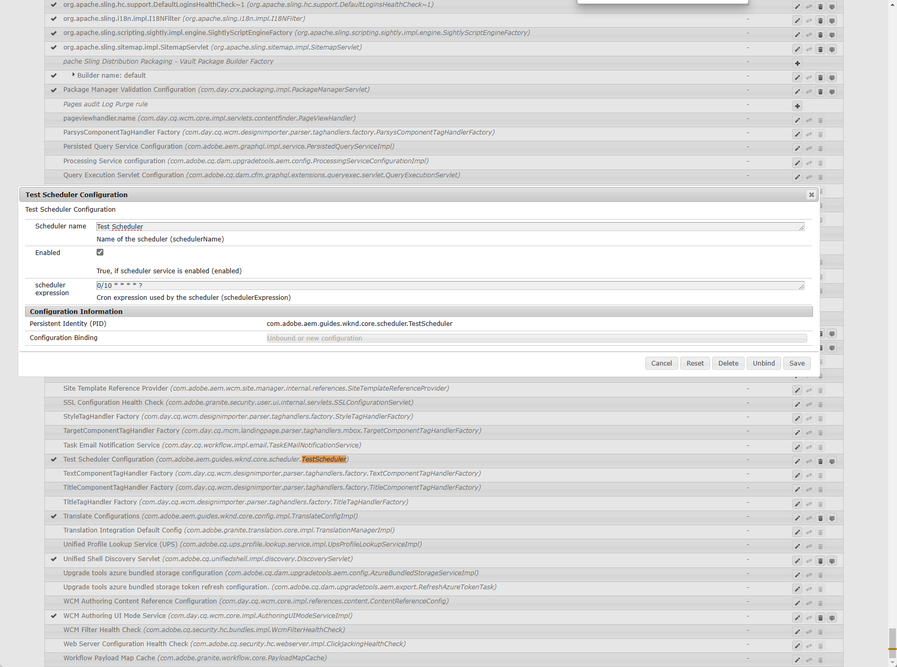
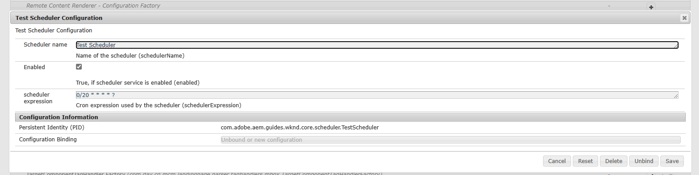

# 九、Sling Scheduler

通常我们在项目中会用到各种各样的定时任务，方便后端服务自动获取一些数据或执行某些业务，这一章我们讲如何在AEM中使用SlingScheduler开发定时任务。

## 编写配置类

在开发定时任务时，需要指定定时任务的名称、状态、cron表达式。创建配置类TestSchedulerConfig.class，配置类中用到的注解在之前的文章中已经讲到，不再赘述。

```java
package com.adobe.aem.guides.wknd.core.config;

import org.osgi.service.metatype.annotations.AttributeDefinition;
import org.osgi.service.metatype.annotations.AttributeType;
import org.osgi.service.metatype.annotations.ObjectClassDefinition;

@ObjectClassDefinition(name = "Test Scheduler Configuration", description = "Test Scheduler Configuration")
public @interface TestSchedulerConfig {

    @AttributeDefinition(
            name = "Scheduler name",
            description = "Name of the scheduler",
            type = AttributeType.STRING)
    public String schedulerName() default "Test Scheduler Configuration";

    @AttributeDefinition(
            name = "Enabled",
            description = "True, if scheduler service is enabled",
            type = AttributeType.BOOLEAN)
    public boolean enabled() default true;

    @AttributeDefinition(
            name = "scheduler expression",
            description = "Cron expression used by the scheduler",
            type = AttributeType.STRING)
    public String schedulerExpression() default "0/10 * * * * ?";
}
```

## 编写SlingScheduler类

有了配置类后，需要将它使用在定时任务TestScheduler.class类中

- @Designate：将上面的配置类引入定时任务类中，也可以使用这个注解在其他类中引入需要的配置类
- @Component：声明这是一个AEM组件，组件的类型是实现Runnable接口的
- Scheduler：这个类是AEM中用来实现定时任务调度的主要对象
- activate方法：在定时任务类启动时，将配置信息放入Scheduler对象中类构建定时任务
- deactivate方法：在这个定时任务类注销时，会将这个定时任务对象从Scheduler对象中移除
- modified方法：修改配置类数据或下面的配置文件后调用

```java
package com.adobe.aem.guides.wknd.core.scheduler;

import com.adobe.aem.guides.wknd.core.config.TestSchedulerConfig;
import lombok.extern.slf4j.Slf4j;
import org.apache.sling.commons.scheduler.ScheduleOptions;
import org.apache.sling.commons.scheduler.Scheduler;
import org.osgi.service.component.annotations.Activate;
import org.osgi.service.component.annotations.Component;
import org.osgi.service.component.annotations.Deactivate;
import org.osgi.service.component.annotations.Modified;
import org.osgi.service.component.annotations.Reference;
import org.osgi.service.metatype.annotations.Designate;

import java.time.LocalDateTime;

@Slf4j
@Designate(ocd = TestSchedulerConfig.class)
@Component(immediate = true, service = Runnable.class)
public class TestScheduler implements Runnable {

    private String schedulerName;
    private int schedulerId;

    @Reference
    private Scheduler scheduler;

    @Activate
    protected void activate(final TestSchedulerConfig config) {
        log.info("===== TestScheduler activate =====");
        schedulerName = config.schedulerName();
        schedulerId = config.schedulerName().hashCode();
        addScheduler(config);
    }

    @Deactivate
    protected void deactivate(TestSchedulerConfig config) {
        log.info("===== TestScheduler deactivate =====");
        removeScheduler(config);
    }

    private void removeScheduler(TestSchedulerConfig config) {
        scheduler.unschedule(config.schedulerName());
        scheduler.unschedule(String.valueOf(schedulerId));
    }

    private void addScheduler(TestSchedulerConfig config) {
        boolean isEnabled = config.enabled();
        if (isEnabled) {
            ScheduleOptions scheduleOptions = scheduler.EXPR(config.schedulerExpression());
            scheduleOptions.name(config.schedulerName());
            scheduleOptions.name(String.valueOf(schedulerId));
            scheduleOptions.canRunConcurrently(true);
            scheduler.schedule(this, scheduleOptions);
            log.info("Test Scheduler {} is added", schedulerId);
        } else {
            log.info("Test Scheduler {} is disabled", schedulerId);
        }
    }

    @Modified
    protected void modified(TestSchedulerConfig config) {
        log.info("===== TestScheduler modified =====");
        removeScheduler(config);
        schedulerId = config.schedulerName().hashCode();
        addScheduler(config);
    }

    @Override
    public void run() {
        log.info("TestScheduler running by : {}", LocalDateTime.now());
    }
}
```

## 编写配置文件

在src/main/content/jcr_root/apps/wknd/osgiconfig/config.author目录下创建com.adobe.aem.guides.wknd.core.scheduler.TestScheduler.cfg.json文件。

**注意：此处与之前OSGi Configuration不同，文件名与定时任务类名一致，才能导入定时任务类中，不能写成配置类的路径和名字**

```json
{
  "schedulerName" : "Test Scheduler",
  "enabled" : true,
  "schedulerExpression" : "0/10 * * * * ?"
}
```

## 查看实际效果

构建项目后，查看日志

- 第一部分显示定时任务已经加载完成
- 第二部分显示定时任务按照每5秒输出一次日志
- 第三部分显示，将配置文件修改并部署后，之前的定时任务会被移除，并生成新的定时任务按照每10秒输出一次日志

```shell
28.02.2023 16:17:17.281 *INFO* [Background Update aem-guides-wknd.core (583)] com.adobe.aem.guides.wknd.core.scheduler.TestScheduler ===== TestScheduler activate =====
28.02.2023 16:17:17.281 *INFO* [Background Update aem-guides-wknd.core (583)] com.adobe.aem.guides.wknd.core.scheduler.TestScheduler Test Scheduler -2034094941 is added
```

```shell
28.02.2023 16:33:41.917 *INFO* [Background Update aem-guides-wknd.core (583)] com.adobe.aem.guides.wknd.core.scheduler.TestScheduler ===== TestScheduler deactivate =====
28.02.2023 16:33:42.064 *INFO* [Background Update aem-guides-wknd.core (583)] com.adobe.aem.guides.wknd.core.scheduler.TestScheduler ===== TestScheduler activate =====
28.02.2023 16:33:42.064 *INFO* [Background Update aem-guides-wknd.core (583)] com.adobe.aem.guides.wknd.core.scheduler.TestScheduler Test Scheduler -2034094941 is added
28.02.2023 16:33:45.000 *INFO* [sling-default-5--2034094941] com.adobe.aem.guides.wknd.core.scheduler.TestScheduler TestScheduler running by : 2023-02-28T16:33:45.000912100
28.02.2023 16:33:50.000 *INFO* [sling-default-2--2034094941] com.adobe.aem.guides.wknd.core.scheduler.TestScheduler TestScheduler running by : 2023-02-28T16:33:50.000668300
28.02.2023 16:33:55.000 *INFO* [sling-default-3--2034094941] com.adobe.aem.guides.wknd.core.scheduler.TestScheduler TestScheduler running by : 2023-02-28T16:33:55.000427800
```

```shell
28.02.2023 16:38:25.931 *INFO* [Background Update aem-guides-wknd.core (583)] com.adobe.aem.guides.wknd.core.scheduler.TestScheduler ===== TestScheduler deactivate =====
28.02.2023 16:38:26.055 *INFO* [Background Update aem-guides-wknd.core (583)] com.adobe.aem.guides.wknd.core.scheduler.TestScheduler ===== TestScheduler activate =====
28.02.2023 16:38:26.056 *INFO* [Background Update aem-guides-wknd.core (583)] com.adobe.aem.guides.wknd.core.scheduler.TestScheduler Test Scheduler -2034094941 is added
28.02.2023 16:38:30.000 *INFO* [sling-default-8--2034094941] com.adobe.aem.guides.wknd.core.scheduler.TestScheduler TestScheduler running by : 2023-02-28T16:38:30.000616800
28.02.2023 16:38:40.000 *INFO* [sling-default-9--2034094941] com.adobe.aem.guides.wknd.core.scheduler.TestScheduler TestScheduler running by : 2023-02-28T16:38:40.000882900
28.02.2023 16:38:50.000 *INFO* [sling-default-7--2034094941] com.adobe.aem.guides.wknd.core.scheduler.TestScheduler TestScheduler running by : 2023-02-28T16:38:50.000945500
28.02.2023 16:39:00.000 *INFO* [sling-default-4--2034094941] com.adobe.aem.guides.wknd.core.scheduler.TestScheduler TestScheduler running by : 2023-02-28T16:39:00.000929400
```

## 在控制台中查看

打开[Adobe Experience Manager Web Console - Configuration](http://localhost:4502/system/console/configMgr)搜索TestScheduler



在代码中将配置文件修改为20秒一次

```json
{
  "schedulerName" : "Test Scheduler",
  "enabled" : true,
  "schedulerExpression" : "0/20 * * * * ?"
}
```

再次查看结果，表达式已经更改为20秒



查看日志显示20秒输出一次

```shell
28.02.2023 17:11:12.814 *INFO* [CM Event Dispatcher (Fire ConfigurationEvent: pid=com.adobe.aem.guides.wknd.core.scheduler.TestScheduler)] com.adobe.aem.guides.wknd.core.scheduler.TestScheduler ===== TestScheduler modified =====
28.02.2023 17:11:12.814 *INFO* [CM Event Dispatcher (Fire ConfigurationEvent: pid=com.adobe.aem.guides.wknd.core.scheduler.TestScheduler)] com.adobe.aem.guides.wknd.core.scheduler.TestScheduler Test Scheduler 435291821 is added
28.02.2023 17:11:20.000 *INFO* [sling-default-8-435291821] com.adobe.aem.guides.wknd.core.scheduler.TestScheduler TestScheduler running by : 2023-02-28T17:11:20.000302
28.02.2023 17:11:40.000 *INFO* [sling-default-5-435291821] com.adobe.aem.guides.wknd.core.scheduler.TestScheduler TestScheduler running by : 2023-02-28T17:11:40.000235800
28.02.2023 17:12:00.000 *INFO* [sling-default-4-435291821] com.adobe.aem.guides.wknd.core.scheduler.TestScheduler TestScheduler running by : 2023-02-28T17:12:00.000006400
```

