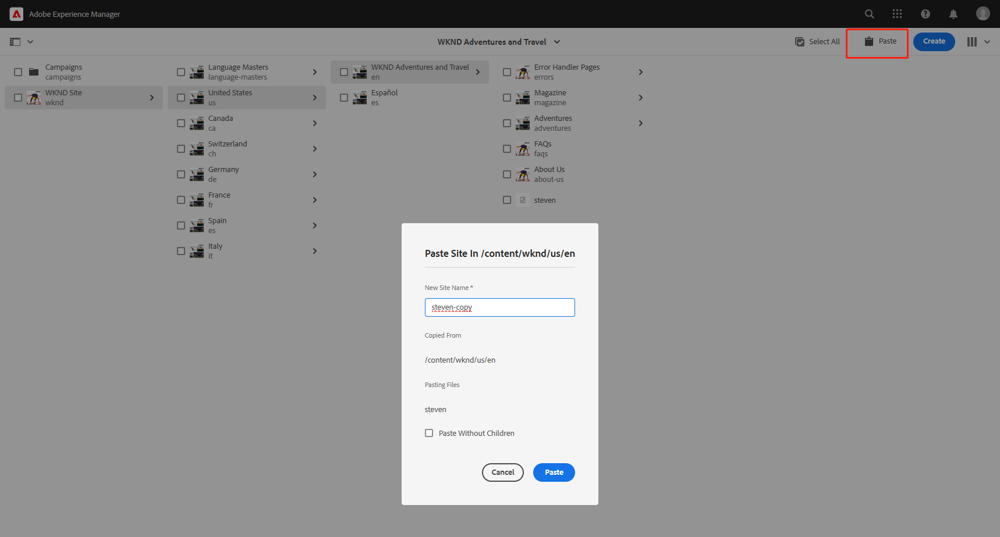

# 十、QueryBuilder的使用

在项目中会碰到查找某个组件并获取它的属性这样的需求，在AEM中可以采用以下三种常用的方法来获取其他特定组件。

1. 当JCR中的节点较少时，可以通过从根目录遍历获取所有子节点的信息并找到sling:resourceType为特定组件路径的节点，这种方式比较粗暴，需要遍历所有子节点，一般不推荐使用
2. 使用QueryBuilder来获取组件的位置和信息（推荐使用）
3. 使用JCR自带的查询来定位组件的位置和信息（后续会讲到）

在这一章中，主要讲解如何使用QueryBuilder来定位组件并获取组件的内容

## 使用Query Builder Debug

QueryBuilderDebug可以快速的定位到组件的位置，打开QueryBuilderDebug页面http://localhost:4502/libs/cq/search/content/querydebug.html，可以在空白框中输入查询语句就能定位到组件的位置


输入以下内容，path是需要查找的根路径，property是查询属性，这个属性的名字是sling:resourceType，property.value是属性的值，值为组件的路径

```
path=/content
property=sling:resourceType
property.value=wknd/components/translate
```

点击search按钮，可以看到右侧results有两个页面包含翻译组件，steven-copy是从steven复制出来的


如何复制一个页面呢，打开sites，找到要复制的页面，勾选后，点击copy按钮，再点击paste按钮，输入复制后的页面名称就完成了。




当结果内容较多时，不方便查看具体的页面内容，可以继续增加查询参数，先在jcr中修改部分属性以区别这两个页面，将steven-copy中的appId改为1111，appKey改为2222


在从QueryBuilderDebug页面中输入下面内容，如果还有更多的查询参数1和2的数值继续递增即可。

```
path=/content
property=sling:resourceType
property.value=wknd/components/translate
1_property=appId
1_property.value=1111
2_property=appKey
2_property.value=2222
```

就能看到只有steven-copy页面被查询出来


## 在代码中使用QueryBuilder

一般情况下，先在页面中查询组件信息，然后将查询写入代码中，打开translate组件，使用QueryBuilder查询组件

```java
import com.day.cq.search.PredicateGroup;
import com.day.cq.search.Query;
import com.day.cq.search.QueryBuilder;
import com.day.cq.search.result.Hit;
import com.day.cq.search.result.SearchResult;
import javax.jcr.Session;
```

```java
Map<String, String> map = new HashMap<>();
map.put("path", "/content/wknd");
map.put("property", "sling:resourceType");
map.put("property.value", "wknd/components/translate");
PredicateGroup predicateGroup = PredicateGroup.create(map);
QueryBuilder queryBuilder = resourceResolver.adaptTo(QueryBuilder.class);
Session session = resourceResolver.adaptTo(Session.class);
Query query = queryBuilder.createQuery(predicateGroup, session);
SearchResult result = query.getResult();
List<Hit> hits = result.getHits();
for (Hit hit : hits) {
    String path = hit.getPath();
    log.info("hit path : {}", path);
    Resource componentResource = resourceResolver.getResource(path);
    ValueMap valueMap = componentResource.getValueMap();
    String appId1 = valueMap.get("appId", String.class);
    String appKey1 = valueMap.get("appKey", String.class);
    log.info("appId1 = {}, appKey1 = {}", appId1, appKey1);
}
```

查看日志，可以从日志中看到查到了两个hit path，分别为steven和steven-copy页面下的translate组件位置

```shell
01.03.2023 14:59:57.952 *INFO* [[0:0:0:0:0:0:0:1] [1677653997886] GET /content/wknd/us/en/steven.html HTTP/1.1] com.adobe.aem.guides.wknd.core.models.Translate hit path : /content/wknd/us/en/steven/jcr:content/root/container/translate
01.03.2023 14:59:57.952 *INFO* [[0:0:0:0:0:0:0:1] [1677653997886] GET /content/wknd/us/en/steven.html HTTP/1.1] com.adobe.aem.guides.wknd.core.models.Translate appId1 = aaa, appKey1 = bbb
01.03.2023 14:59:57.952 *INFO* [[0:0:0:0:0:0:0:1] [1677653997886] GET /content/wknd/us/en/steven.html HTTP/1.1] com.adobe.aem.guides.wknd.core.models.Translate hit path : /content/wknd/us/en/steven-copy/jcr:content/root/container/translate
01.03.2023 14:59:57.952 *INFO* [[0:0:0:0:0:0:0:1] [1677653997886] GET /content/wknd/us/en/steven.html HTTP/1.1] com.adobe.aem.guides.wknd.core.models.Translate appId1 = 1111, appKey1 = 2222
```

再尝试使用多个参数查询

```java
Map<String, String> map = new HashMap<>();
map.put("path", "/content/wknd");
map.put("property", "sling:resourceType");
map.put("property.value", "wknd/components/translate");
map.put("1_property", "appId");
map.put("1_property.value", "1111");
PredicateGroup predicateGroup = PredicateGroup.create(map);
QueryBuilder queryBuilder = resourceResolver.adaptTo(QueryBuilder.class);
Session session = resourceResolver.adaptTo(Session.class);
Query query = queryBuilder.createQuery(predicateGroup, session);
SearchResult result = query.getResult();
List<Hit> hits = result.getHits();
for (Hit hit : hits) {
    String path = hit.getPath();
    log.info("hit path : {}", path);
    Resource componentResource = resourceResolver.getResource(path);
    ValueMap valueMap = componentResource.getValueMap();
    String appId1 = valueMap.get("appId", String.class);
    String appKey1 = valueMap.get("appKey", String.class);
    log.info("appId1 = {}, appKey1 = {}", appId1, appKey1);
}
```

查看日志，只查到了appId为1111的translate组件信息

```shell
01.03.2023 15:03:33.085 *INFO* [[0:0:0:0:0:0:0:1] [1677654212896] GET /content/wknd/us/en/steven.html HTTP/1.1] com.adobe.aem.guides.wknd.core.models.Translate hit path : /content/wknd/us/en/steven-copy/jcr:content/root/container/translate
01.03.2023 15:03:33.085 *INFO* [[0:0:0:0:0:0:0:1] [1677654212896] GET /content/wknd/us/en/steven.html HTTP/1.1] com.adobe.aem.guides.wknd.core.models.Translate appId1 = 1111, appKey1 = 2222
```

通过使用QueryBuilder可以快速准确的定位到组件被使用的位置并获取到组件的信息。