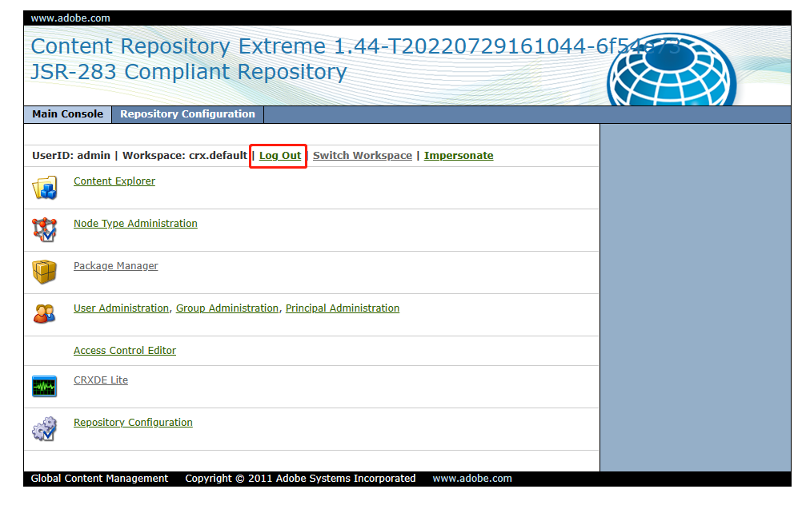
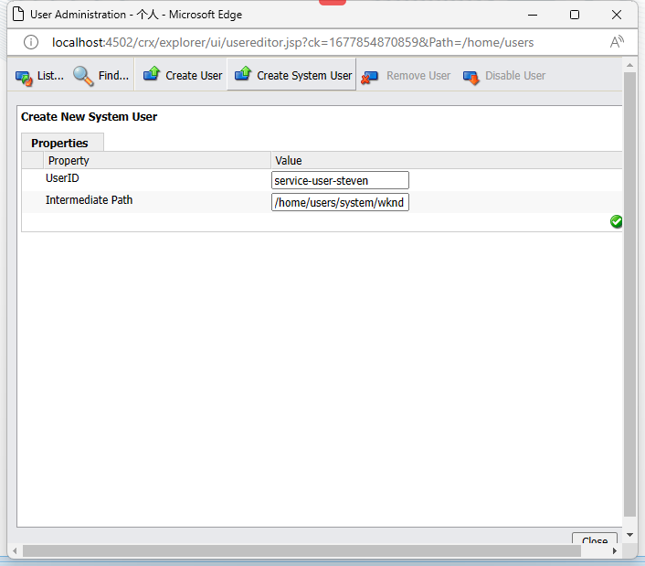
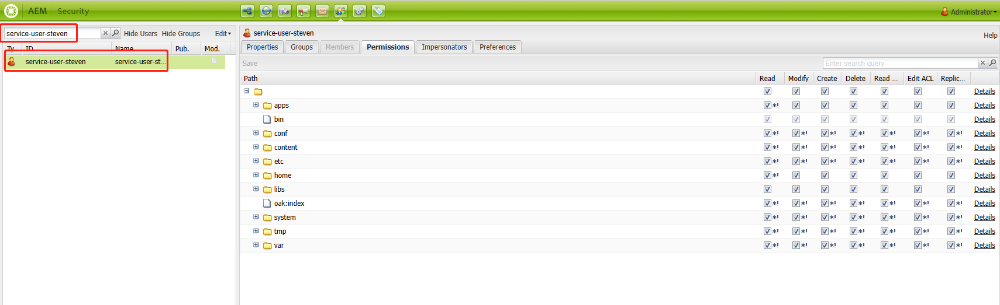
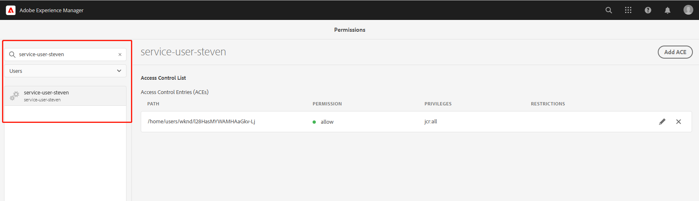
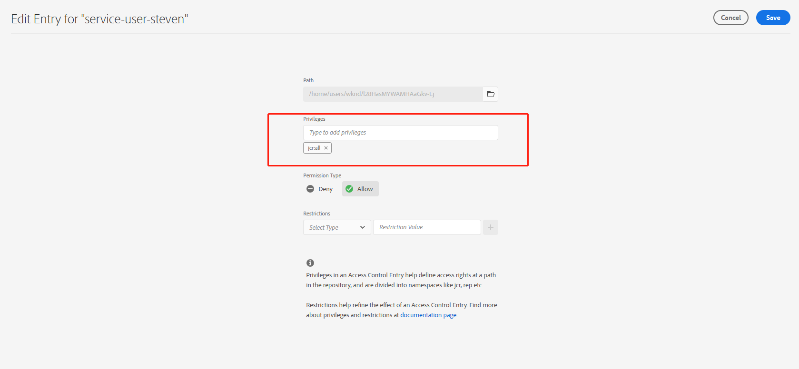
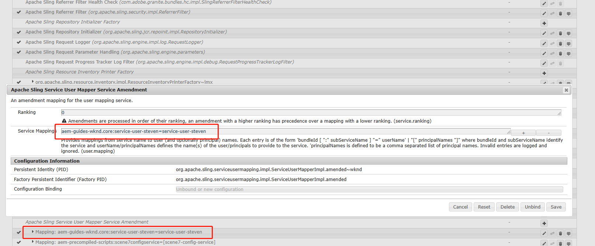

[TOC]

# 十一、System User

在AEM项目开发中，会用到一些后台服务比如，监听、定时任务等。在这些服务中由于不存在用户的登录信息也就是session，那么就需要用到系统服务用户。在这一章中主要讲解如何创建和维护系统用户。

## 创建用户

打开[内容管理界面](http://localhost:4502/crx/explorer/index.jsp)，如果红框处是Log In先点击登录



点击User Administration进入用户管理界面，点击CreateSystemUser按钮，输入用户信息，最后点击绿色的对号



然后打开[后台用户管理界面](http://localhost:4502/useradmin)，搜索刚才输入的UserId，配置权限，可以全部勾选



也可以进入[AEM前端用户管理界面](http://localhost:4502/security/permissions.html/principal/everyone)



编辑用户权限，输入jcr:all，保存



## 编写系统用户代码

创建系统用户枚举类SystemUserEnum.java

```java
package com.adobe.aem.guides.wknd.core.enums;

import org.apache.sling.api.resource.LoginException;
import org.apache.sling.api.resource.ResourceResolver;
import org.apache.sling.api.resource.ResourceResolverFactory;

import java.util.HashMap;

public enum SystemUserEnum {

    USER_STEVEN {
        @Override
        public ResourceResolver getResourceResolver(final ResourceResolverFactory resourceResolverFactory) throws LoginException {
            HashMap<String, Object> map = new HashMap<>();
            map.put(ResourceResolverFactory.SUBSERVICE, SERVICE_USER_STEVEN);
            return resourceResolverFactory.getServiceResourceResolver(map);
        }
    };

    public static final String SERVICE_USER_STEVEN = "service-user-steven";

    public abstract ResourceResolver getResourceResolver(final ResourceResolverFactory resourceResolverFactory) throws LoginException;
}
```

## 创建系统用户映射配置文件

在ui.config/src/main/content/jcr_root/apps/wknd/osgiconfig/config目录下创建org.apache.sling.serviceusermapping.impl.ServiceUserMapperImpl.amended-wknd.cfg.json文件，波浪号前的名称为固定名称，wknd是项目名称可自定义，cfg.json为固定后缀名

- aem-guides-wknd.core 是core包构建后的bundle名字
- 第一个service-user-steven是subServiceName 
- 第二个service-user-steven是用户名

```json
{
  "user.mapping": [
    "aem-guides-wknd.core:service-user-steven=service-user-steven"
 ]
}
```

构建项目后查看[配置界面](http://localhost:4502/system/console/configMgr)



出现用户信息后表明配置成功。
