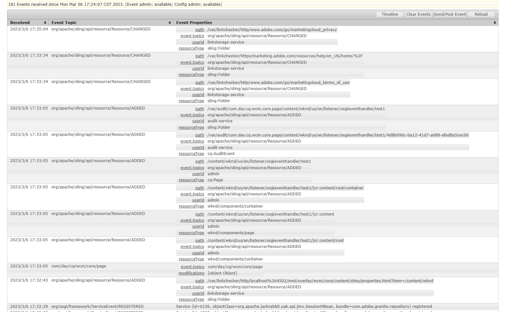
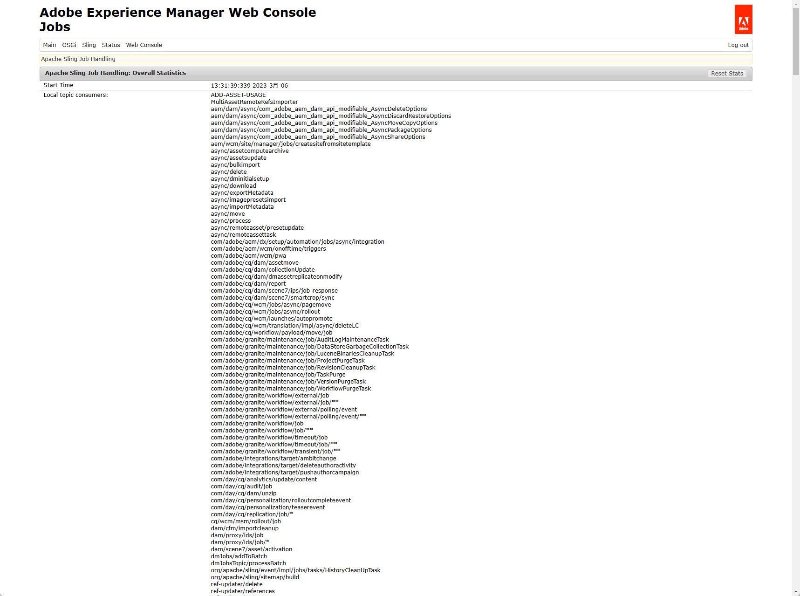
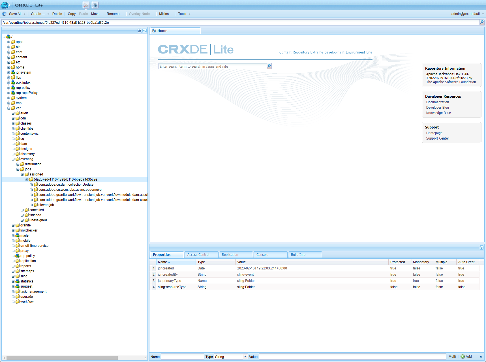

[TOC]

# 十一、Event Listener

在实际项目中，我们经常会用到监听器来实现某些后台操作的业务和逻辑。比如某商户在新增了某件商品后，对关注商户的普通用户发送推荐信息。AEM提供下面三种相应的监听器接口供使用。

- JCR APIS ：javax.jcr.observation.EventListener
- OSGi APIS : org.osgi.service.event.EventListener
- Sling APIS : org.apache.sling.api.resource.observation.ResourceChangeListener

## JCR Event Listener

JCR的事件监听处理可以监听到JCR的Resource级别，需要通过ObservationManager类来注册事件监听，在事件监听中需要具有对JCR的Resource进行操作（读写）的权限用户session。

编写JCREventListener类

```java
package com.adobe.aem.guides.wknd.core.listener;

import com.adobe.aem.guides.wknd.core.enums.SystemUserEnum;
import lombok.extern.slf4j.Slf4j;
import org.apache.sling.jcr.api.SlingRepository;
import org.osgi.service.component.ComponentContext;
import org.osgi.service.component.annotations.Activate;
import org.osgi.service.component.annotations.Component;
import org.osgi.service.component.annotations.Deactivate;
import org.osgi.service.component.annotations.Reference;

import javax.jcr.RepositoryException;
import javax.jcr.Session;
import javax.jcr.observation.Event;
import javax.jcr.observation.EventIterator;
import javax.jcr.observation.EventListener;
import java.util.Objects;

@Slf4j
@Component(immediate = true, service = EventListener.class)
public class JCREventListener implements EventListener {

    @Reference
    private SlingRepository slingRepository;
    private Session session;
    private String[] nodeTypes = {};

    @Activate
    public void activate(ComponentContext context) {
        log.info("JCREventListener activate");
        try {
            session = slingRepository.loginService(SystemUserEnum.SERVICE_USER_STEVEN, null);
            session.getWorkspace().getObservationManager().addEventListener(
                    this,                               // 指定EventHandler
                    Event.NODE_ADDED | Event.PROPERTY_ADDED,        // 监听事件类型，增加节点，增加属性
                    "/content/wknd/us/en/steven",                   // 监听路径
                    true,                                           // 是否监听路径下的子节点
                    null,                                           // UUID过滤器
                    null,                                           // 需要监听的节点类型，例如：cq:Page表示只监听页面
                    false                                           // 是否需要过滤当前用户的操作，一般为false，当前用户通常为ServiceUser
            );
        } catch (RepositoryException e) {
            log.error("Unable to register session : {}", e.getMessage(), e);
        }
    }

    @Deactivate
    public void deactivate() {
        if (Objects.nonNull(session)) {
            session.logout();
        }
    }

    @Override
    public void onEvent(EventIterator eventIterator) {
        while (eventIterator.hasNext()) {
            Event event = eventIterator.nextEvent();
            if (Objects.nonNull(event)) {
                try {
                    log.info("Event Type : {}, Event Path : {}", event.getType(), event.getPath());
                } catch (RepositoryException e) {
                    log.error("Unable to fetch event path");
                }
            }
        }
    }
}
```

在steven目录下创建test页面


查看日志，可以看到所有的节点信息都已经输出了（只贴出了部分日志）

```log
03.03.2023 22:46:18.911 *INFO* [sling-oak-observation-18] com.adobe.aem.guides.wknd.core.listener.JCREventListener Event Type : 1, Event Path : /content/wknd/us/en/steven/test
03.03.2023 22:46:18.911 *INFO* [sling-oak-observation-18] com.adobe.aem.guides.wknd.core.listener.JCREventListener Event Type : 4, Event Path : /content/wknd/us/en/steven/test/jcr:primaryType
03.03.2023 22:46:18.911 *INFO* [sling-oak-observation-18] com.adobe.aem.guides.wknd.core.listener.JCREventListener Event Type : 4, Event Path : /content/wknd/us/en/steven/test/jcr:createdBy
03.03.2023 22:46:18.911 *INFO* [sling-oak-observation-18] com.adobe.aem.guides.wknd.core.listener.JCREventListener Event Type : 4, Event Path : /content/wknd/us/en/steven/test/jcr:created
03.03.2023 22:46:18.911 *INFO* [sling-oak-observation-18] com.adobe.aem.guides.wknd.core.listener.JCREventListener Event Type : 1, Event Path : /content/wknd/us/en/steven/test/jcr:content
```


## OSGi EventHandler

OSGi中的EventHandler对象被注册到框架服务注册中心，并由一个Event对象触发。EventHandler可以检查接收到的Event对象，以确定其主题和属性。EventHandler对象必须和服务属性EventConstants.EVENT_TOPIC一起才能被注册，这个属性是事件处理程序监听的topic列表。EventHandler也可以使用EventConstants.EVENT_FILTER服务属性进行注册来过滤掉某些事件。

创建OSGiEventHandler.java类，EVENT_TOPIC表示监听的类型（新增，修改，删除），EVENT_FILTER表示监听的过滤器，可以自定义监听路径、监听属性等

```java
package com.adobe.aem.guides.wknd.core.listener;

import com.day.cq.replication.ReplicationAction;
import lombok.extern.slf4j.Slf4j;
import org.apache.sling.api.SlingConstants;
import org.apache.sling.api.resource.ResourceResolverFactory;
import org.osgi.framework.Constants;
import org.osgi.service.component.ComponentContext;
import org.osgi.service.component.annotations.Activate;
import org.osgi.service.component.annotations.Component;
import org.osgi.service.component.annotations.Deactivate;
import org.osgi.service.component.annotations.Reference;
import org.osgi.service.event.Event;
import org.osgi.service.event.EventConstants;
import org.osgi.service.event.EventHandler;

@Slf4j
@Component(service = EventHandler.class, immediate = true, property = {
        Constants.SERVICE_DESCRIPTION + "=",
        EventConstants.EVENT_TOPIC + "=org/apache/sling/api/resource/Resource/ADDED",
        EventConstants.EVENT_TOPIC + "=org/apache/sling/api/resource/Resource/CHANGED",
        EventConstants.EVENT_TOPIC + "=org/apache/sling/api/resource/Resource/REMOVED",
        EventConstants.EVENT_FILTER + "(&(path=/content/wknd/us/en/listener/osgieventhandler))"
})
public class OSGiEventHandler implements EventHandler {

    @Reference
    private ResourceResolverFactory resourceResolverFactory;

    @Activate
    public void activate(ComponentContext context) {
        log.info("OSGiEventHandler activate");
    }

    @Deactivate
    public void deactivate() {
        log.info("OSGiEventHandler deactivate");
    }

    @Override
    public void handleEvent(Event event) {
        log.info("Resource event topic is : {}, path is : {}", event.getTopic(), event.getProperty(SlingConstants.PROPERTY_PATH));
    }
}
```

创建测试页面，打开[事件记录页面](http://localhost:4502/system/console/events)，可以看到创建页面后触发的事件



查看日志，可以看到所有新增节点已经被监听

```shell
06.03.2023 17:33:05.089 *INFO* [pool-43-thread-1] com.adobe.aem.guides.wknd.core.listener.OSGiEventHandler Resource event topic is : org/apache/sling/api/resource/Resource/ADDED, path is : /content/wknd/us/en/listener/osgieventhandler/test1/jcr:content/root
06.03.2023 17:33:05.089 *INFO* [pool-43-thread-1] com.adobe.aem.guides.wknd.core.listener.OSGiEventHandler Resource event topic is : org/apache/sling/api/resource/Resource/ADDED, path is : /content/wknd/us/en/listener/osgieventhandler/test1/jcr:content
06.03.2023 17:33:05.089 *INFO* [pool-43-thread-1] com.adobe.aem.guides.wknd.core.listener.OSGiEventHandler Resource event topic is : org/apache/sling/api/resource/Resource/ADDED, path is : /content/wknd/us/en/listener/osgieventhandler/test1/jcr:content/root/container
06.03.2023 17:33:05.089 *INFO* [pool-43-thread-1] com.adobe.aem.guides.wknd.core.listener.OSGiEventHandler Resource event topic is : org/apache/sling/api/resource/Resource/ADDED, path is : /content/wknd/us/en/listener/osgieventhandler/test1
06.03.2023 17:33:05.095 *INFO* [pool-43-thread-1] com.adobe.aem.guides.wknd.core.listener.OSGiEventHandler Resource event topic is : org/apache/sling/api/resource/Resource/ADDED, path is : /var/audit/com.day.cq.wcm.core.page/content/wknd/us/en/listener/osgieventhandler/test1/4d8b096c-ba12-41d7-a089-efed8a5cec06
06.03.2023 17:33:05.095 *INFO* [pool-43-thread-1] com.adobe.aem.guides.wknd.core.listener.OSGiEventHandler Resource event topic is : org/apache/sling/api/resource/Resource/ADDED, path is : /var/audit/com.day.cq.wcm.core.page/content/wknd/us/en/listener/osgieventhandler/test1
```

## Sling ResourceChangeListener

Sling ResourceChangeListener是资源更改事件的侦听器。ResourceChangeListener对象被注册到框架服务注册中心，并在发生更改时被ResourceChange对象通知。ResourceChangeListener可以检查接收到的ResourceChange对象，以确定更改的类型、位置和其他属性。ResourceChangeListener必须使用服务属性PATHS注册，该属性的值是侦听器正在侦听的资源路径列表。ResourceChangeListener必须注册使用服务属性CHANGES进行注册，其值为监听器正在监听的事件类型列表。

创建ResourceEventHandler.java类

```java
package com.adobe.aem.guides.wknd.core.listener;

import lombok.extern.slf4j.Slf4j;
import org.apache.sling.api.resource.observation.ResourceChange;
import org.apache.sling.api.resource.observation.ResourceChangeListener;
import org.osgi.service.component.annotations.Component;

import java.util.List;


@Slf4j
@Component(immediate = true, service = ResourceChangeListener.class, property = {
        ResourceChangeListener.PATHS + "=/content/wknd/us/en/listener/resourcechangelistener",
        ResourceChangeListener.CHANGES + "=ADDED",
        ResourceChangeListener.CHANGES + "=CHANGED",
        ResourceChangeListener.CHANGES + "=REMOVED"
})
public class ResourceEventHandler  implements ResourceChangeListener {
    @Override
    public void onChange(List<ResourceChange> list) {
        for (ResourceChange resourceChange : list) {
            log.info("Event is {}, Resource is {}", resourceChange.getType(), resourceChange.getPath());
        }
    }
}
```

创建测试页面，查看日志，可以看到新增页面的所有节点被监听

```shell
06.03.2023 18:09:40.140 *INFO* [pool-44-thread-1] com.adobe.aem.guides.wknd.core.listener.OSGiEventHandler Resource event topic is : org/apache/sling/api/resource/Resource/ADDED, path is : /content/wknd/us/en/listener/resourcechangelistener/test/jcr:content/root/container
06.03.2023 18:09:40.140 *INFO* [pool-44-thread-1] com.adobe.aem.guides.wknd.core.listener.OSGiEventHandler Resource event topic is : org/apache/sling/api/resource/Resource/ADDED, path is : /content/wknd/us/en/listener/resourcechangelistener/test/jcr:content
06.03.2023 18:09:40.140 *INFO* [pool-44-thread-1] com.adobe.aem.guides.wknd.core.listener.OSGiEventHandler Resource event topic is : org/apache/sling/api/resource/Resource/ADDED, path is : /content/wknd/us/en/listener/resourcechangelistener/test
06.03.2023 18:09:40.140 *INFO* [sling-oak-observation-2] com.adobe.aem.guides.wknd.core.listener.ResourceEventHandler Event is ADDED, Resource is /content/wknd/us/en/listener/resourcechangelistener/test/jcr:content/root/container
06.03.2023 18:09:40.140 *INFO* [sling-oak-observation-2] com.adobe.aem.guides.wknd.core.listener.ResourceEventHandler Event is ADDED, Resource is /content/wknd/us/en/listener/resourcechangelistener/test/jcr:content
06.03.2023 18:09:40.140 *INFO* [pool-44-thread-1] com.adobe.aem.guides.wknd.core.listener.OSGiEventHandler Resource event topic is : org/apache/sling/api/resource/Resource/ADDED, path is : /content/wknd/us/en/listener/resourcechangelistener/test/jcr:content/root
06.03.2023 18:09:40.140 *INFO* [sling-oak-observation-2] com.adobe.aem.guides.wknd.core.listener.ResourceEventHandler Event is ADDED, Resource is /content/wknd/us/en/listener/resourcechangelistener/test
06.03.2023 18:09:40.140 *INFO* [sling-oak-observation-2] com.adobe.aem.guides.wknd.core.listener.ResourceEventHandler Event is ADDED, Resource is /content/wknd/us/en/listener/resourcechangelistener/test/jcr:content/root
06.03.2023 18:09:40.159 *INFO* [pool-44-thread-1] com.adobe.aem.guides.wknd.core.listener.OSGiEventHandler Resource event topic is : org/apache/sling/api/resource/Resource/ADDED, path is : /var/audit/com.day.cq.wcm.core.page/content/wknd/us/en/listener/resourcechangelistener/test/c2661d19-806e-48e5-af44-124267d5288e
06.03.2023 18:09:40.159 *INFO* [pool-44-thread-1] com.adobe.aem.guides.wknd.core.listener.OSGiEventHandler Resource event topic is : org/apache/sling/api/resource/Resource/ADDED, path is : /var/audit/com.day.cq.wcm.core.page/content/wknd/us/en/listener/resourcechangelistener/test
```

## JobManager & JobConsumer

在实际项目中，上面讲到的三种事件监听方式都存在一个共同的问题，当服务出现问题或监听后事件未执行，就会丢失这部分业务。为了确保监听事件的业务可以处理至少处理一次，我们使用JobManager和JobConsumer。

- JobManager允许创建新job，搜索job和获取有关当前状态的统计信息。

- JobConsumer消耗一个job，JobConsumer需要结合使用PROPERTY_TOPICS服务注册属性进行注册。

修改OSGiEventHandler.java类，引入JobManager生成Job

```java
package com.adobe.aem.guides.wknd.core.listener;

import lombok.extern.slf4j.Slf4j;
import org.apache.sling.api.SlingConstants;
import org.apache.sling.event.jobs.Job;
import org.apache.sling.event.jobs.JobManager;
import org.osgi.framework.Constants;
import org.osgi.service.component.ComponentContext;
import org.osgi.service.component.annotations.Activate;
import org.osgi.service.component.annotations.Component;
import org.osgi.service.component.annotations.Deactivate;
import org.osgi.service.component.annotations.Reference;
import org.osgi.service.event.Event;
import org.osgi.service.event.EventConstants;
import org.osgi.service.event.EventHandler;

import java.util.HashMap;
import java.util.Map;

@Slf4j
@Component(service = EventHandler.class, immediate = true, property = {
        Constants.SERVICE_DESCRIPTION + "=",
        EventConstants.EVENT_TOPIC + "=org/apache/sling/api/resource/Resource/ADDED",
        EventConstants.EVENT_TOPIC + "=org/apache/sling/api/resource/Resource/CHANGED",
        EventConstants.EVENT_TOPIC + "=org/apache/sling/api/resource/Resource/REMOVED",
        EventConstants.EVENT_FILTER + "(&(path=/content/wknd/us/en/listener/osgieventhandler))"
})
public class OSGiEventHandler implements EventHandler {

    public static final String JOB_TOPIC = "steven/job";

    @Reference
    private JobManager jobManager;

    @Activate
    public void activate(ComponentContext context) {
        log.info("OSGiEventHandler activate");
    }

    @Deactivate
    public void deactivate() {
        log.info("OSGiEventHandler deactivate");
    }

    @Override
    public void handleEvent(Event event) {
        log.info("Resource event topic is : {}, path is : {}", event.getTopic(), event.getProperty(SlingConstants.PROPERTY_PATH));
        // jobProperties可以传入任何想传入的信息
        Map<String, Object> jobProperties = new HashMap<>();
        jobProperties.put("event", event.getTopic());
        jobProperties.put("path", event.getProperty(SlingConstants.PROPERTY_PATH));
        Job job = jobManager.addJob(JOB_TOPIC, jobProperties);
    }
}
```

创建TestJobConsumer.java类

```java
package com.adobe.aem.guides.wknd.core.listener;

import lombok.extern.slf4j.Slf4j;
import org.apache.sling.event.jobs.Job;
import org.apache.sling.event.jobs.consumer.JobConsumer;
import org.osgi.service.component.annotations.Component;

import static com.adobe.aem.guides.wknd.core.listener.OSGiEventHandler.JOB_TOPIC;

@Slf4j
@Component(immediate = true, service = JobConsumer.class, property = {
        JobConsumer.PROPERTY_TOPICS + "=" + JOB_TOPIC
})
public class TestJobConsumer implements JobConsumer {

    @Override
    public JobResult process(Job job) {
        log.info("job topic is {}, path is {}", job.getProperty("event"), job.getProperty("path"));
        return JobResult.OK;
    }
}
```

创建测试页面，查看日志，JobConsumer可以接收到Job

```shell
06.03.2023 18:30:06.154 *INFO* [sling-threadpool-5581b55f-929d-47f4-b557-cddf9060f8be-(apache-sling-job-thread-pool)-29-<main queue>(steven/job)] com.adobe.aem.guides.wknd.core.listener.TestJobConsumer job topic is org/apache/sling/api/resource/Resource/ADDED, path is /var/eventing/jobs/unassigned/steven.job/2023/3/6/18/29
```

也可以在[Sling Job页面](http://localhost:4502/system/console/slingevent)查看Job信息，找到创建的JobTopic然后修改属性



还可以在[CRXDE](http://localhost:4502/crx/de/index.jsp)中查看Job执行情况



在JobConsumer类中返回了JobResult.OK，在JobResult中有下面四种常用的状态

- OK => 任务成功完成
- FAILED => 任务失败但可能会重试
- CANCEL => 任务永久失败，一定不会重试
- ASYNC => 任务将异步处理完成

在实际项目中，通常需要使用JobManager和JobConsumer配合Listener一起使用。
