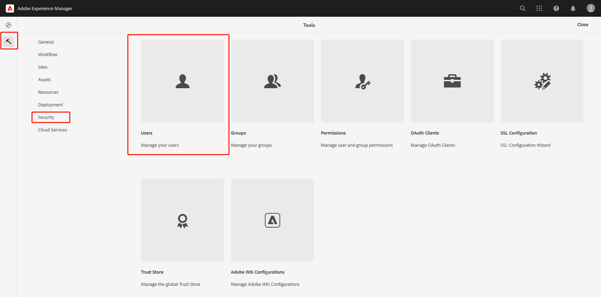
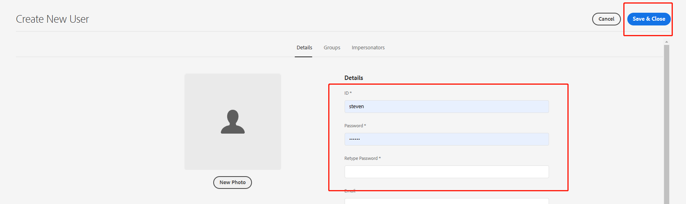
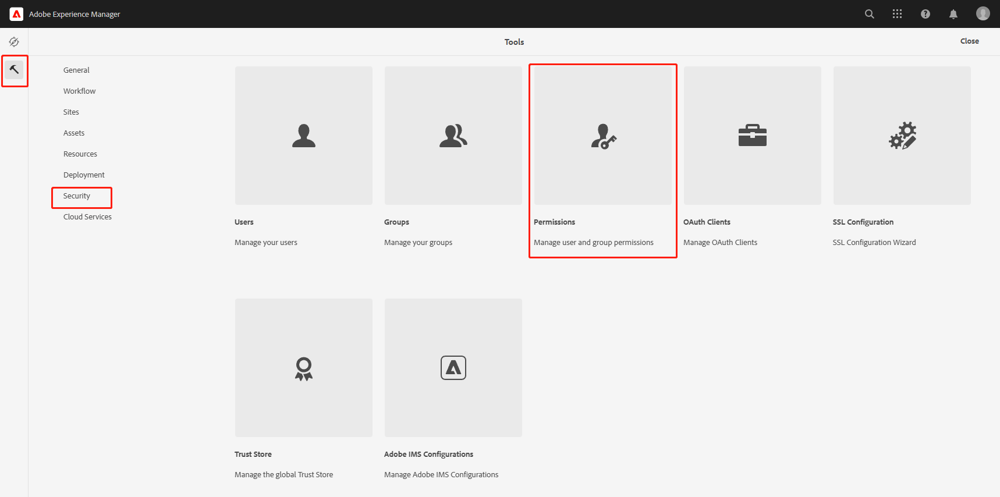
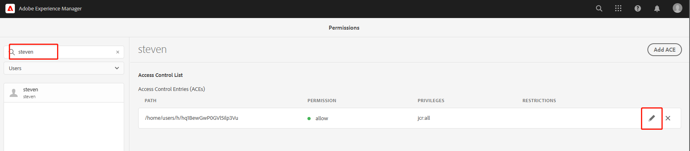
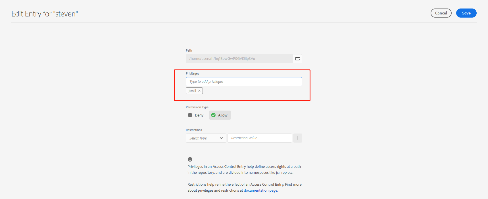

# 十一、Event Listener

在实际项目中，我们经常会用到监听器来实现某些后台操作的业务和逻辑。比如某商户在新增了某件商品后，对关注商户的普通用户发送推荐信息。AEM提供下面三种相应的监听器接口供使用。

- JCR APIS ：javax.jcr.observation.EventListener
- OSGi APIS : org.osgi.service.event.EventListener
- Sling APIS : org.apache.sling.api.resource.observation.ResourceChangeListener

## JCR Event Listener

JCR的事件监听处理可以监听到JCR的Resource级别，需要通过ObservationManager类来注册事件监听，在事件监听中需要具有对JCR的Resource进行操作（读写）的权限用户session。

### 创建用户

我们需要先创建一个ServiceUser，进入AEM后进入Users页面



点击Create按钮新增用户


输入ID和密码，点击Save按钮



### 用户设置权限



搜索用户steven，点击编辑按钮



在Privileges栏下设置用户权限，只读输入jcr:read, 可写入输入jcr:write，所有权限jcr:all



## 编写JCREventListener类

```java
package com.adobe.aem.guides.wknd.core.listener;

import lombok.extern.slf4j.Slf4j;
import org.apache.sling.jcr.api.SlingRepository;
import org.osgi.service.component.ComponentContext;
import org.osgi.service.component.annotations.Activate;
import org.osgi.service.component.annotations.Component;
import org.osgi.service.component.annotations.Deactivate;
import org.osgi.service.component.annotations.Reference;

import javax.jcr.RepositoryException;
import javax.jcr.Session;
import javax.jcr.observation.Event;
import javax.jcr.observation.EventIterator;
import javax.jcr.observation.EventListener;
import java.util.Objects;

@Slf4j
@Component(immediate = true, service = EventListener.class)
public class JCREventListener implements EventListener {

    @Reference
    private SlingRepository slingRepository;
    private Session session;
    private String[] nodeTypes = {};

    @Activate
    public void activate(ComponentContext context) {
        try {
            session = slingRepository.loginService("steven", null);
            session.getWorkspace().getObservationManager().addEventListener(
                    this,                               // 指定EventHandler
                    Event.NODE_ADDED | Event.PROPERTY_ADDED,        // 监听事件类型，增加节点，增加属性
                    "/content/wknd/us/en/steven",                   // 监听路径
                    true,                                           // 是否监听路径下的子节点
                    null,                                           // UUID过滤器
                    nodeTypes,                                      // 需要监听的节点类型，例如：cq:Page表示只监听页面
                    false                                           // 是否需要过滤当前用户的操作，一般为false，当前用户通常为ServiceUser
            );
        } catch (RepositoryException e) {
            log.error("Unable to register session : {}", e.getMessage(), e);
        } finally {
            if (Objects.nonNull(session) && session.isLive()) {
                session.logout();
            }
        }
    }

    @Deactivate
    public void deactivate() {
        if (Objects.nonNull(session)) {
            session.logout();
        }
    }

    @Override
    public void onEvent(EventIterator eventIterator) {
        while (eventIterator.hasNext()) {
            Event event = eventIterator.nextEvent();
            if (Objects.nonNull(event)) {
                try {
                    log.info("Event Type : {}, Event Path : {}", event.getType(), event.getPath());
                } catch (RepositoryException e) {
                    log.error("Unable to fetch event path");
                }
            }
        }
    }
}
```


OSGi中的EventHandler对象被注册到框架服务注册中心，并由一个Event对象触发。EventHandler可以检查接收到的Event对象，以确定其主题和属性。EventHandler对象必须和服务属性EventConstants.EVENT_TOPIC一起才能被注册，这个属性是事件处理程序监听的topic列表。EventHandler也可以使用EventConstants.EVENT_FILTER服务属性进行注册来过滤掉某些事件。

Sling ResourceChangeListener是资源更改事件的侦听器。ResourceChangeListener对象被注册到框架服务注册中心，并在发生更改时被ResourceChange对象通知。ResourceChangeListener可以检查接收到的ResourceChange对象，以确定更改的类型、位置和其他属性。ResourceChangeListener必须使用服务属性PATHS注册，该属性的值是侦听器正在侦听的资源路径列表。ResourceChangeListener必须注册使用服务属性CHANGES进行注册，其值为监听器正在监听的事件类型列表。

