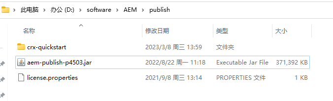
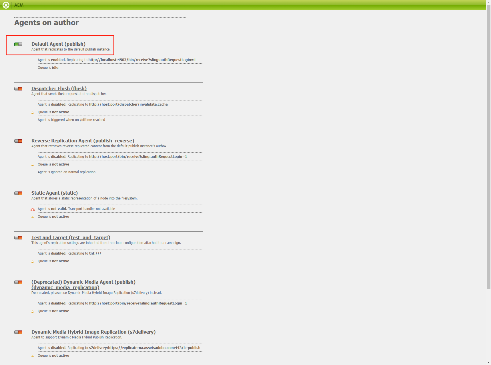
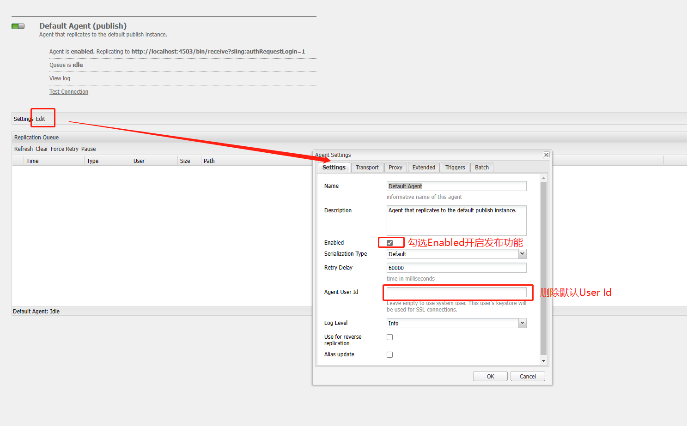
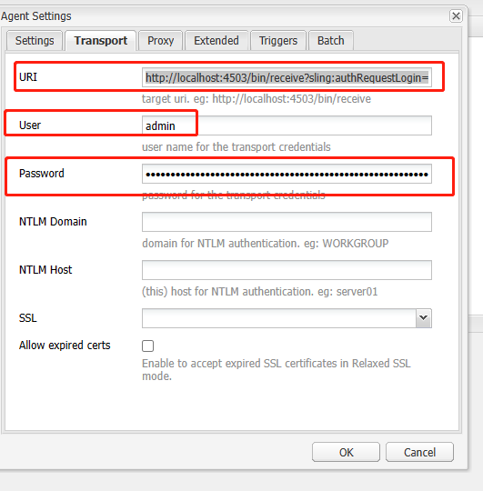
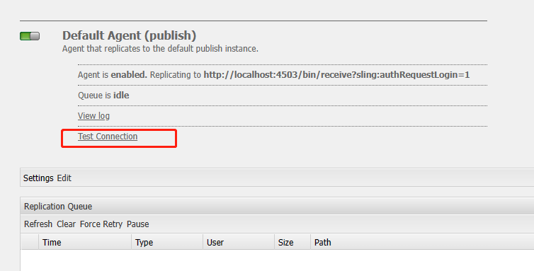
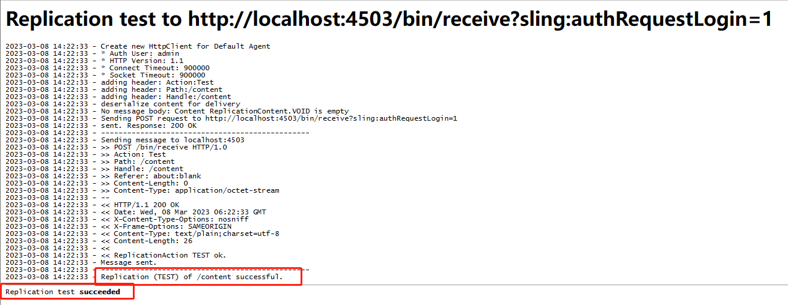
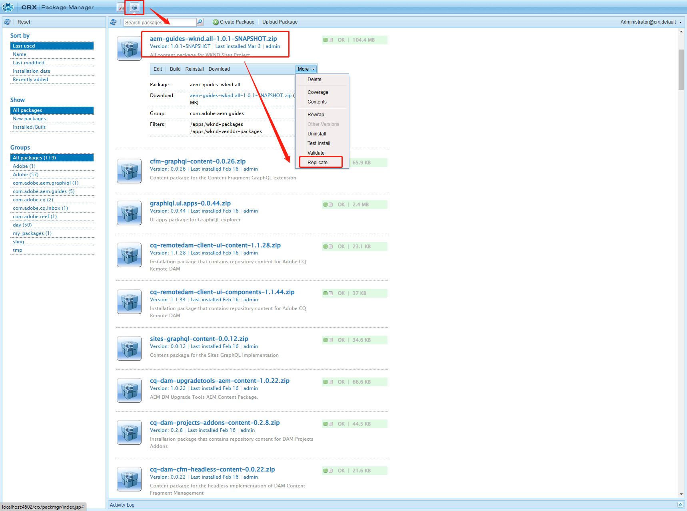
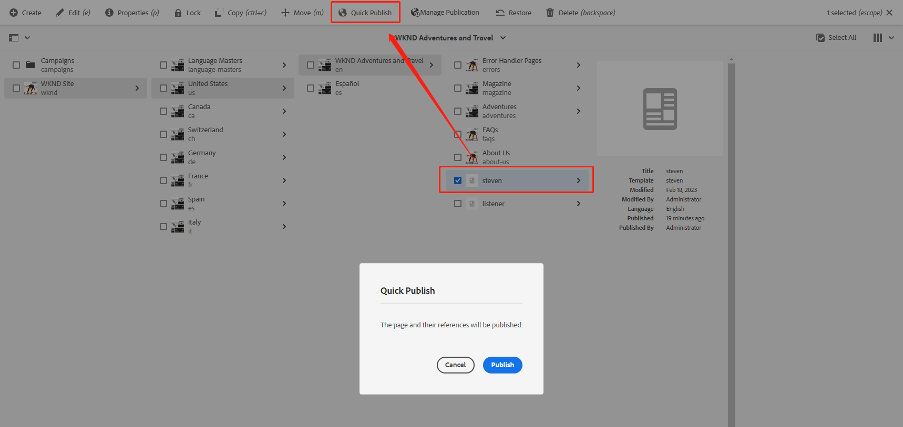
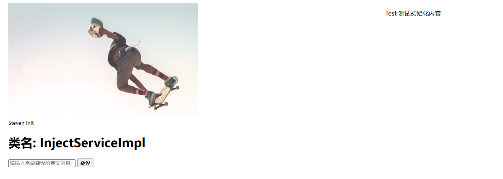

[TOC]

# 十三、安装Publish实例

后续的内容中会涉及到publish实例，包括页面、模板、资源的发布等，在这一章中讲解如何在本地配置和启动publish实例。

## 启动Publish实例

复制author文件夹，并改名为publish，再把aem-author-p4502.jar改为aem-publish-p4503.jar



在地址栏中输入CMD，打开命令框，输入启动命令

```shell
java -jar aem-publish-p4503.jar
```

## 配置Publish实例

打开[Replication页面](http://localhost:4502/etc/replication/agents.author.html)



点击Default Agent进入publish实例配置页面



点击Transport选项卡，在URI中输入http://localhost:4503/bin/receive?sling:authRequestLogin=1，User和Password分别输入Publish实例的账号密码，点击OK按钮保存。



publish实例的配置就完成了

## 测试Publish实例

点击Test Connection链接进行测试



跳转到测试页面，出现下列信息表示配置成功



## 发布页面

在发布页面之前需要先将author实例中的package同步到publish实例中，打开[CRXDE](http://localhost:4502/crx/de/index.jsp)，选择package管理页面，找到all*.zip，点击Replicate按钮将这个包同步到publish实例



完成后，将之前开发的页面steven发布到publish实例



打开发布实例的页面http://localhost:4503/content/wknd/us/en/steven.html，与author实例的页面一致



这样publish实例就配置完成了。