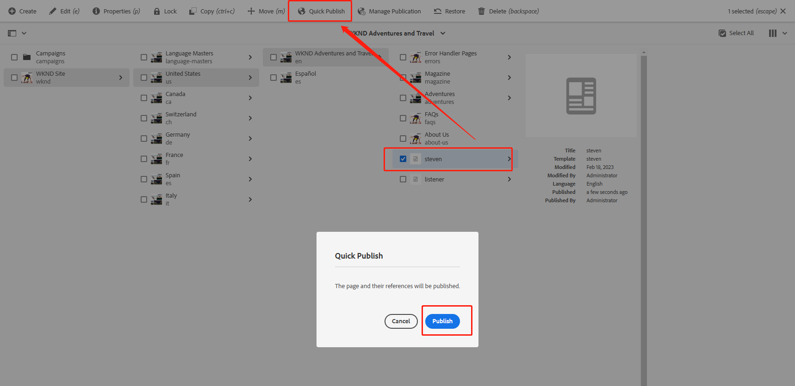

[TOC]

## 十四、常用的页面事件监听器

## ReplicationEventHandler

在实际项目开发中，会有这样的需求，在页面publish或激活时，同时进行某些操作。例如当页面被发布到publish实例时将页面信息传递给搜索引擎Solr，由Solr对该页面进行数据爬取，在项目中调用Solr接口进行全局搜索。这时就可以用到ReplicationEventHandler。

创建ReplicationEventHandler.java

```java
package com.adobe.aem.guides.wknd.core.listener;

import com.day.cq.replication.ReplicationAction;
import lombok.extern.slf4j.Slf4j;
import org.osgi.service.component.annotations.Component;
import org.osgi.service.event.Event;
import org.osgi.service.event.EventConstants;
import org.osgi.service.event.EventHandler;

@Slf4j
@Component(immediate = true, service = EventHandler.class, property = {
        EventConstants.EVENT_TOPIC + "=" + ReplicationAction.EVENT_TOPIC
})
public class ReplicationEventHandler implements EventHandler {
    @Override
    public void handleEvent(Event event) {
        log.info("ReplicationEventHandler Event Type : {}", event.getTopic());
        log.info("ReplicationEventHandler Event Path : {}", ReplicationAction.fromEvent(event).getPath());
    }
}
```

发布页面到publish实例



查看日志，可以看到监听到页面的发布，同样也可以监听到unpublish操作

```shell
08.03.2023 14:01:19.131 *INFO* [EventAdminAsyncThread #3] com.adobe.aem.guides.wknd.core.listener.ReplicationEventHandler ReplicationEventHandler Event Type : com/day/cq/replication
08.03.2023 14:01:19.131 *INFO* [EventAdminAsyncThread #3] com.adobe.aem.guides.wknd.core.listener.ReplicationEventHandler ReplicationEventHandler Event Path : /content/wknd/us/en/steven
```

## EventHandlingForPageActions

上面的ReplicationEventHandler类只是监听与Replication相关的操作，与页面相关的操作则需要使用PageEvent来监听。

创建PageEventHandler.java类

```java
package com.adobe.aem.guides.wknd.core.listener;

import com.day.cq.wcm.api.PageEvent;
import com.day.cq.wcm.api.PageModification;
import lombok.extern.slf4j.Slf4j;
import org.osgi.service.component.annotations.Component;
import org.osgi.service.event.Event;
import org.osgi.service.event.EventConstants;
import org.osgi.service.event.EventHandler;

import java.util.Iterator;

@Slf4j
@Component(immediate = true, service = EventHandler.class, property = {
        EventConstants.EVENT_TOPIC + "=" + PageEvent.EVENT_TOPIC
})
public class PageEventHandler implements EventHandler {
    @Override
    public void handleEvent(Event event) {
        Iterator<PageModification> modifications = PageEvent.fromEvent(event).getModifications();
        while (modifications.hasNext()) {
            PageModification modification = modifications.next();
            log.info("PageEventHandler Event Type : {}", modification.getType());
            log.info("PageEventHandler Event Path : {}", modification.getPath());
        }
    }
}
```

与ReplicationEventHandler的不同的地方是EVENT_TOPIC变为了PageEvent.EVENT_TOPIC，获取事件类型和页面path的方法也发生了变化。

创建页面，查看日志，可以看到页面创建的类型为PageCreated，路径为/content/wknd/us/en/listener/pageeventhandler/test

```shell
08.03.2023 17:19:42.101 *INFO* [EventAdminAsyncThread #6] com.adobe.aem.guides.wknd.core.listener.PageEventHandler PageEventHandler Event Type : PageCreated
08.03.2023 17:19:42.101 *INFO* [EventAdminAsyncThread #6] com.adobe.aem.guides.wknd.core.listener.PageEventHandler PageEventHandler Event Path : /content/wknd/us/en/listener/pageeventhandler/test
```

这样跟页面有关的监听就完成了。
