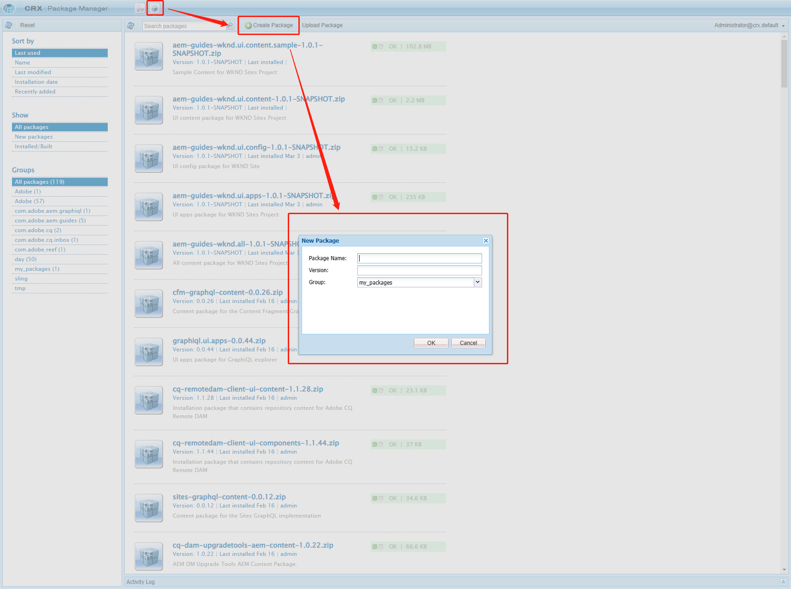
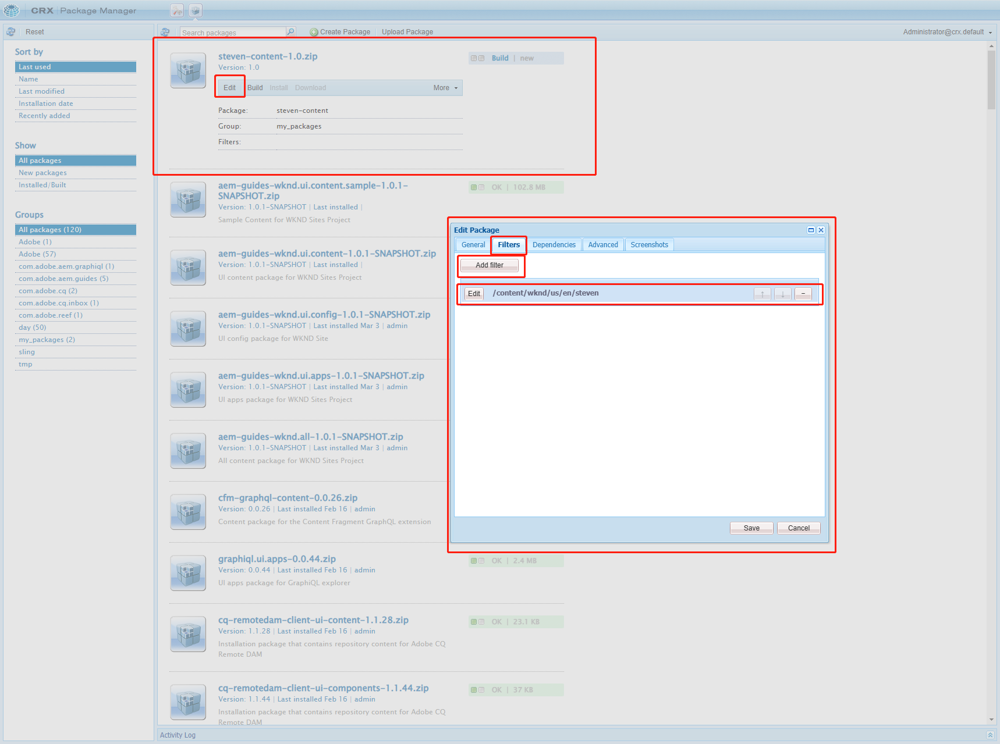
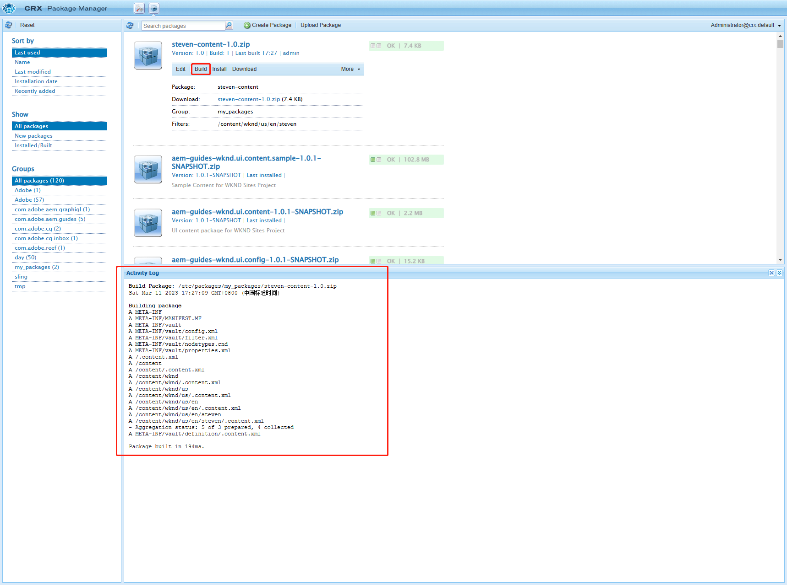
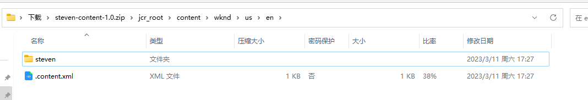
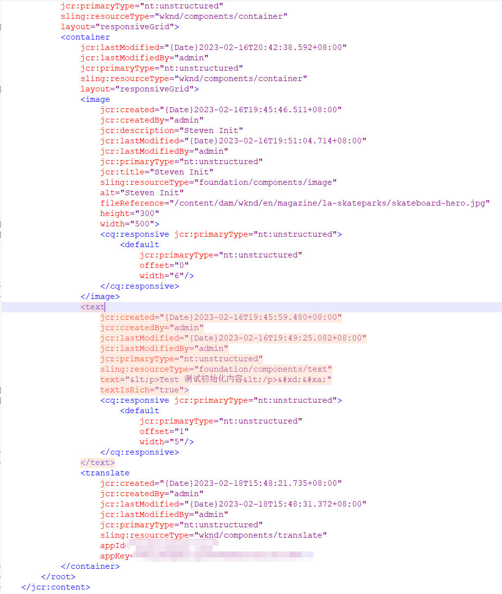
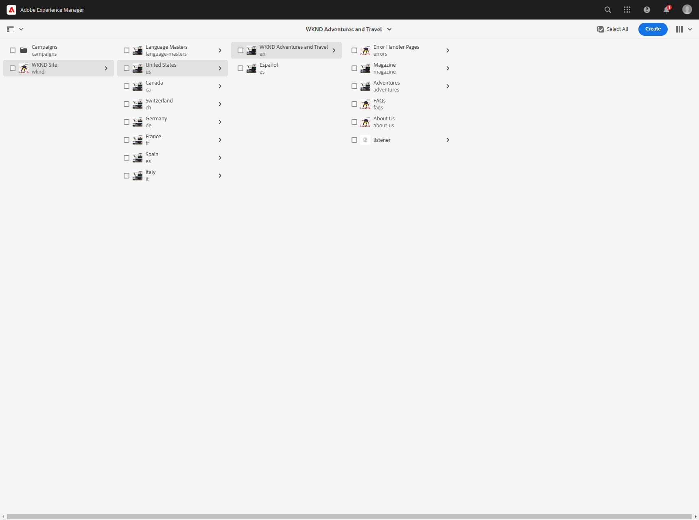
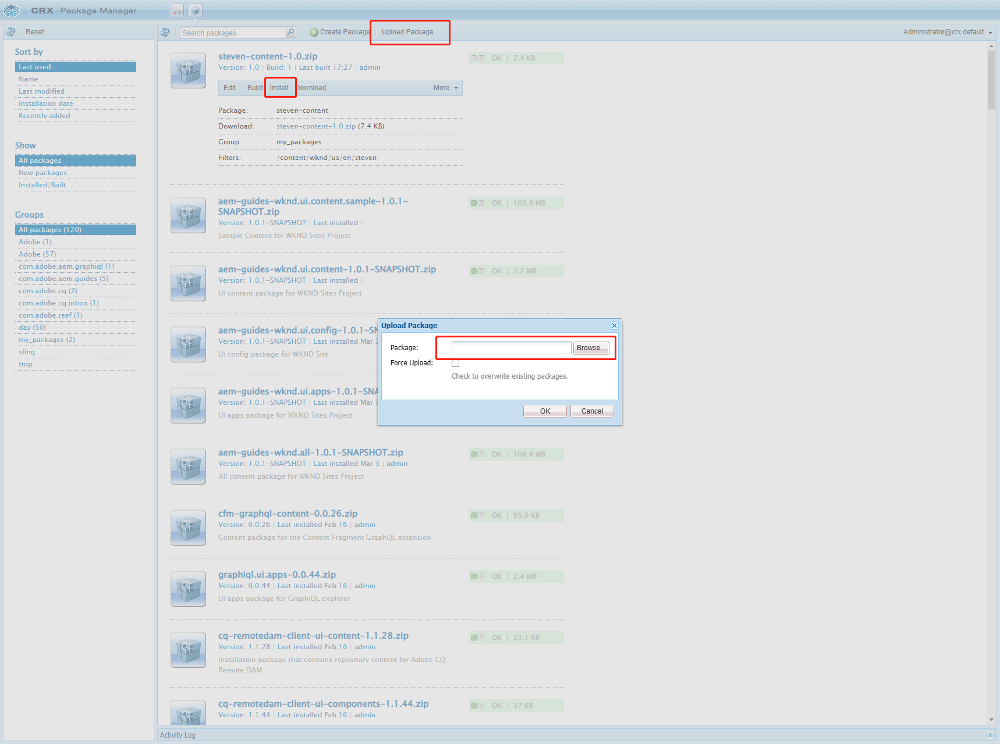
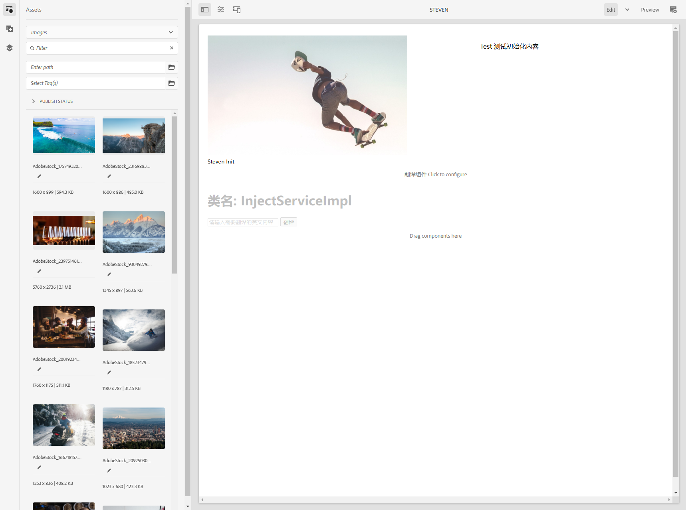

[TOC]

# 十五、Export&ImportPackages

在项目开发过程中，经常会需要在Dev、Stage、Prod环境进行功能的验证，也需要在这些环境中进行Bug的修复。之前讲过，可以通过Remote来连接本地Debug模式进行问题处理，那么在实际环境中，特别是在AdobeCloudService上是不能进行debug的。那就需要用到Packages来进行问题的复现和修复。

主要用到CRXDE页面http://localhost:4502/crx/de/index.jsp，地址前缀需要更换为对应环境的URL。

## Export Packages

打开Package管理界面，点击Create Package按钮，输入Package名称和版本，Group默认为my_packages，也可以创建自己的Group

创建完成后，可以看到已创建的包steven-content-1.0.zip，点击Edit按钮，选择Filters标签，点击AddFilter按钮，进行路径选择需要导出的包路径，点击save保存

保存后，点击Build按钮构建包，出现下面的日志内容表示构建成功，点击Dnowload按钮下载

下载完成后，把zip包解压出来，可以看到路径与选择的路径一致，打开.content.xml可以看到数据与JCR中的一致

TIPs：这里有个技巧，在编写Unit Test时，可以将本地的包导出，然后复制数据到*.json文件中，可以搜索XMl文件转换JSON可以方便的将数据转为json

## Import Packages

已经有了需要Debug的数据内容包后，就可以将包导入本地环境进行Debug测试。在安装前，可以先将本地的steven页面删除

点击Upload Package按钮，选择下载好的数据包上传，上传后点击Install按钮就可以将数据包安装的本地了

查看steven页面是否正常工作

页面工作正常，导入成功。