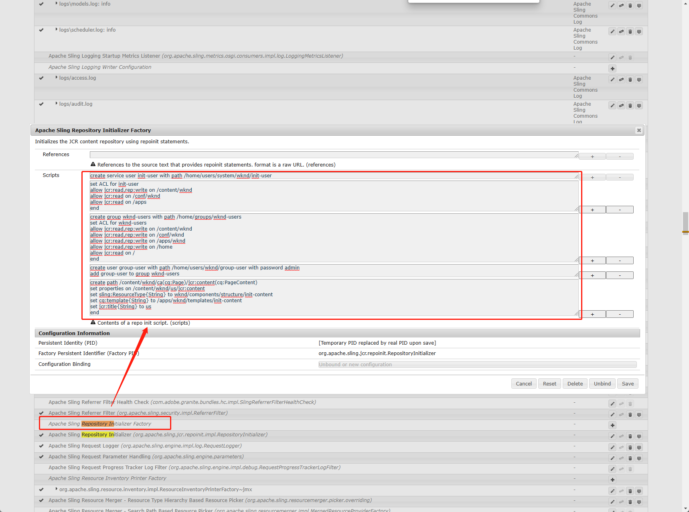
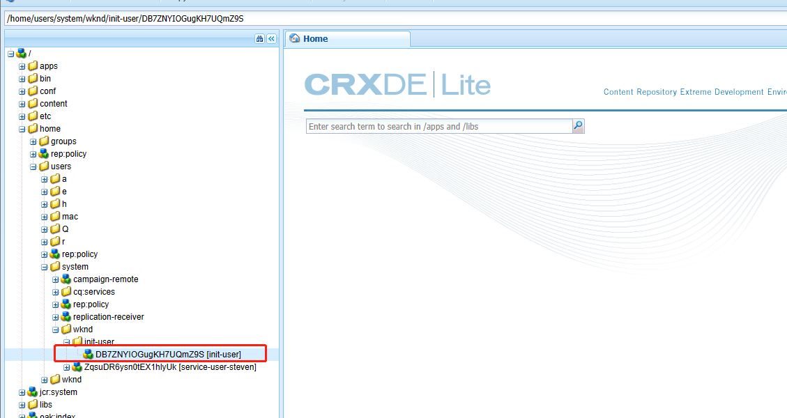
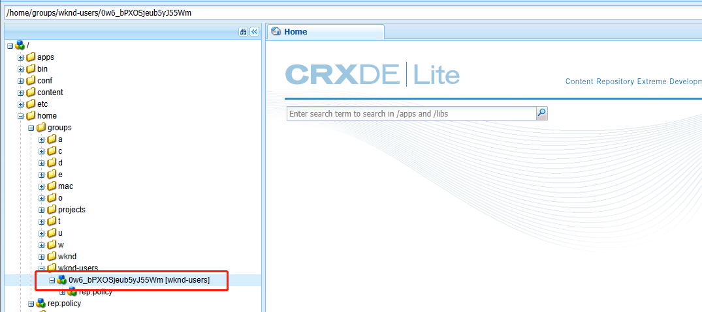
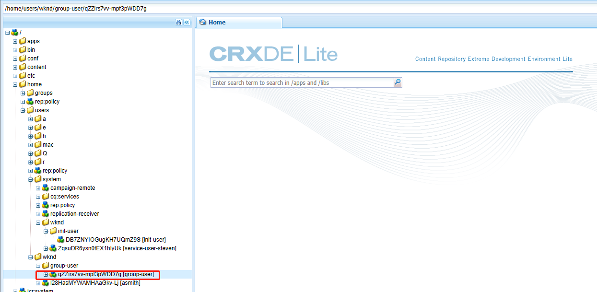
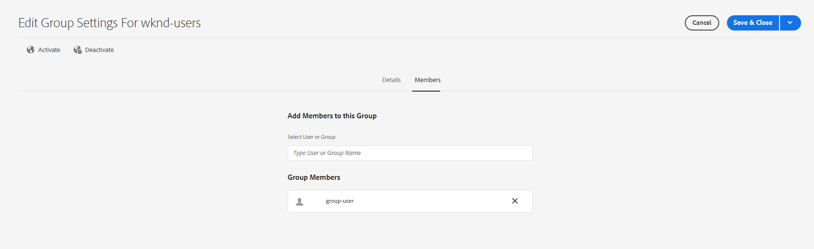
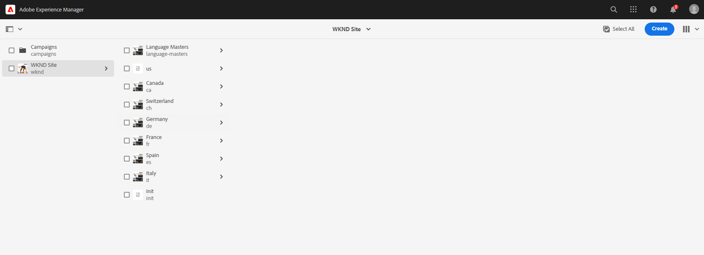

# 十六、Init Users & Groups & Pages

在AEM6.5中，提供了Repository初始化的功能。可以创建用户、组，为用户增加权限，也可以创建页面和节点。Repository Init功能时要给非常强大并且实用的功能。

打开[AEM系统配置页面](http://localhost:4502/system/console/configMgr)搜索repository init，找到Repository Initializer Factory



## 创建用户并增加权限

添加脚本

```shell
create service user init-user with path /home/users/system/wknd/init-user 
set ACL for init-user
allow jcr:read,rep:write on /content/wknd
allow jcr:read on /conf/wknd
allow jcr:read on /apps 
end 
```

保存并在CRXDE中查看/home/users/system/wknd/init-user目录



## 创建用户组并增加权限

添加脚本，点击保存

```shell
create group wknd-users with path /home/groups/wknd-users 
set ACL for wknd-users 
allow jcr:read,rep:write on /content/wknd
allow jcr:read,rep:write on /conf/wknd
allow jcr:read,rep:write on /apps/wknd
allow jcr:read,rep:write on /home 
allow jcr:read on / 
end 
```

查看/home/groups/wknd-users目录



## 创建用户并将用户添加到用户组

添加脚本点击保存

```shell
create user group-user with path /home/users/wknd/group-user with password admin
add group-user to group wknd-users
```

查看用户和用户组



打开[组信息](http://localhost:4502/libs/granite/security/content/v2/groupeditor.html/home/groups/wknd-users)查看用户group-user是否在组wknd-users中



## 创建页面节点并增加属性

添加脚本

```shell
create path /content/wknd/init(cq:Page)/jcr:content(cq:PageContent) 
set properties on /content/wknd/init/jcr:content 
set sling:ResourceType{String} to wknd/components/structure/init-content
set cq:template{String} to /apps/wknd/templates/init-content 
set jcr:title{String} to Init
end
```

查看站点页面，init页面被初始化



