[TOC]

# 17、JCR SQL2

之前在第十章中讲到了QueryBuilder的使用，可以对JCR中的资源进行搜索和查询。除了QueryBuilder还有另外的三种查询方式XPATH、JCR SQL、JCR SQL2。这章主要来讲如何使用JCR SQL2。

由于性能原因，AEM官方还是推荐使用QueryBuilder。那么在什么情况下可以考虑使用JCR SQL2呢？

- 如果AEM站点允许用户搜索图像或文档，则可以构建一个图像和文档搜索组件。
- 如果AEM网站有一个博客部分，可以创建一个博客文章搜索组件。
- 如果需要让第三方应用程序在AEM站点中查询和查找节点，可以构建一个安全的资源查询API。

当然，不止上面三种情况可以考虑使用JCR SQL2，具体情况还需要具体分析。

打开[CRXDE界面](http://localhost:4502/crx/de/index.jsp)找到Query按钮点击，页面上方就会出现Query的标签页

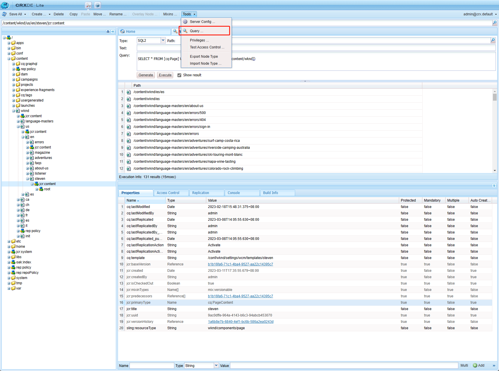

JCR SQL2的语法与关系型数据库的SQL语法大部分都是一样的。只是对于参数的使用有区别，下面介绍一些常用的用法

## SELECT 语句

SELECT语句用于查询与JCR节点的主类型匹配的所有JCR节点。FROM后面可以使用所有的节点类型，在节点的jcr:primaryType属性中可以找到

- [nt:base]  查询所有类型节点
- [cq:Page] 查询所有页面
- [dam:Asset] 查询所有资产（图片、文档等）

```sql
SELECT * FROM [nt:base] 
SELECT * FROM [cq:Page] 
SELECT * FROM [dam:Asset]
```

如果查询所有类型节点，会返回如下错误，一次不能查询超过100000个节点（可以通过修改配置来修改这个数量）。


查询所有页面节点


## NAME() 语句

查询具有特定节点名称的节点。

### 查询页面

```sql
SELECT * FROM [cq:Page] AS nodes WHERE NAME(nodes) = "steven"
```

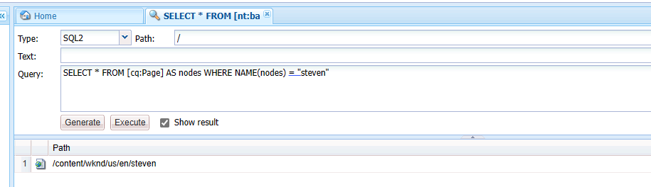

### 查询图片

```sql
SELECT * FROM [dam:Asset] AS nodes WHERE NAME(nodes) = "Notfound.jpg"
```

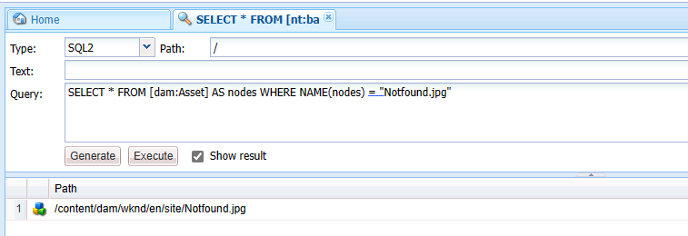

## ISDESCENDANTNODE 语句

查询文件路径下的节点。

### 查询路径下所有节点

```sql
select * FROM [nt:base] WHERE ISDESCENDANTNODE ([/content/wknd])
```

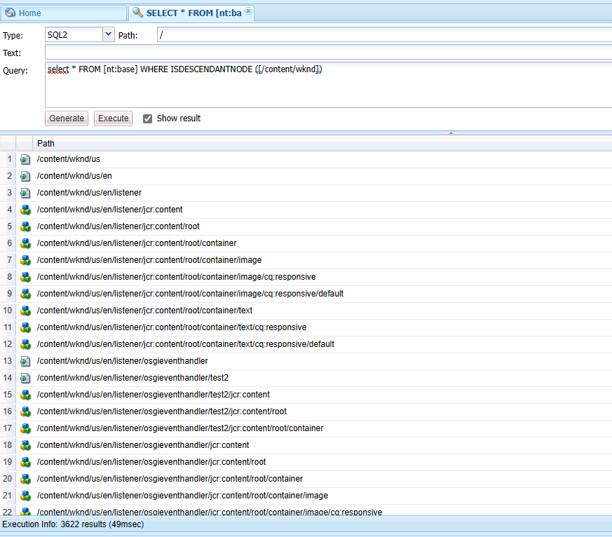

### 查询路径下所有页面节点

```sql
SELECT * FROM [cq:Page] WHERE ISDESCENDANTNODE ([/content/wknd])
```

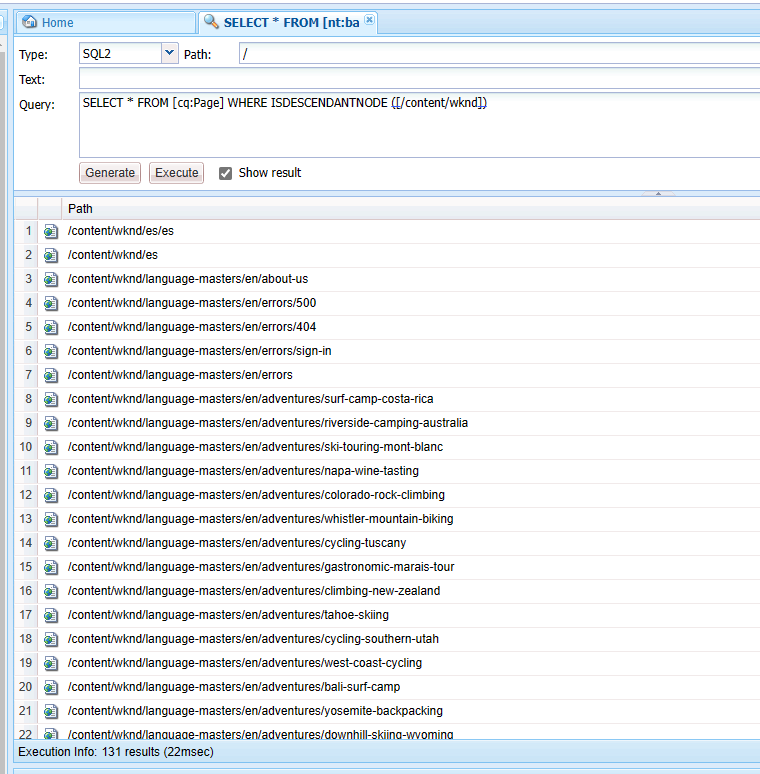

### 查询路径下所有资产节点

```sql
SELECT * FROM [dam:Asset] WHERE ISDESCENDANTNODE ([/content/dam/wknd])
```

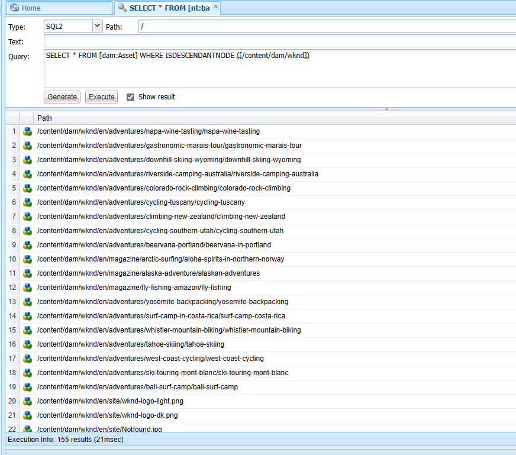

## CONTAINS 语句

查询属性包含值的节点。

### 查询所有页面节点属性中包含“steven”

```sql
select * from [cq:Page] where contains(*, 'steven')
```


## LIKE 操作符

LIKE操作符用于在节点属性中搜索指定的模式。与SQL中的LIKE用法一致。有一点不同的是在AEM的JCR SQL2中_和%拥有一样的功能,但\_只能通配一个字符。

### 前缀匹配

```sql
SELECT * FROM [cq:PageContent] AS nodes WHERE ISDESCENDANTNODE ([/content/wknd]) AND nodes.[jcr:title] LIKE "ste%"
```

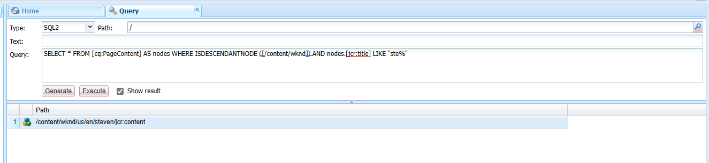

### 后缀匹配

```sql
SELECT * FROM [cq:PageContent] AS nodes WHERE ISDESCENDANTNODE ([/content/wknd]) AND nodes.[jcr:title] LIKE "%even"
```


### 前后缀都匹配

\_下划线只能匹配一个字符

```sql
SELECT * FROM [cq:PageContent] AS nodes WHERE ISDESCENDANTNODE ([/content/wknd]) AND nodes.[jcr:title] LIKE "_teve_"
```


## IS NOT NULL属性

用于验证属性的值不为空。

### 查询所有页面内容节点且节点中的jcr:title属性不为空

```sql
SELECT * FROM [cq:PageContent] AS nodes WHERE ISDESCENDANTNODE ([/content/wknd]) AND nodes.[jcr:title] IS NOT NULL
```

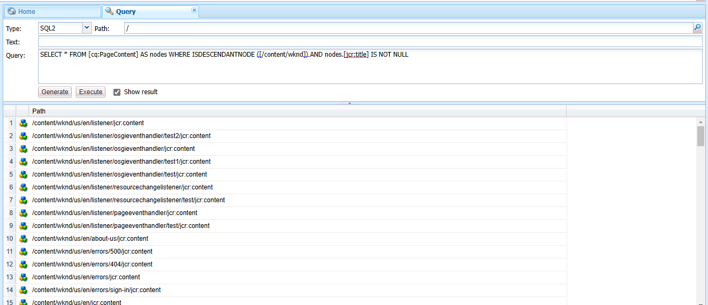

## ORDER BY关键字

用于按升序或降序对结果集进行排序。默认情况下，返回值按升序排序。用法与SQL语法基本一致。

### 查询所有页面内容节点并按创建时间降序排序

```sql
SELECT * FROM [cq:PageContent] AS nodes WHERE ISDESCENDANTNODE ([/content/wknd]) ORDER BY nodes.[jcr:created] DESC
```

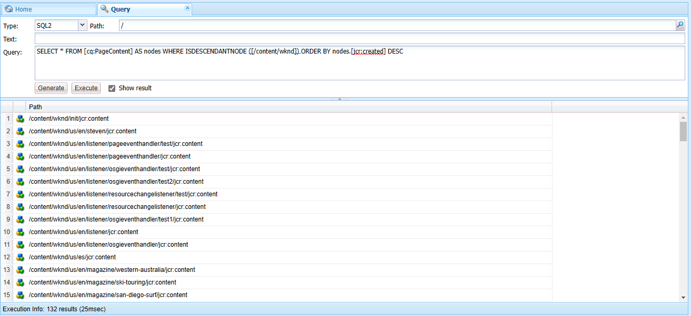

## CAST() 语句

将表达式从一种数据类型转换为另一种数据类型。

转换类型：String、Binary、Date、Long、Double、Decimal、Boolean、Name、Path、Reference、WeakReference、URI

### 查询2023年3月11号之后创建的页面节点

```sql
SELECT * FROM [cq:Page] AS nodes WHERE ISDESCENDANTNODE ([/content/wknd]) AND nodes.[jcr:created] > CAST("2023-03-11T00:00:00.000" AS DATE)
```

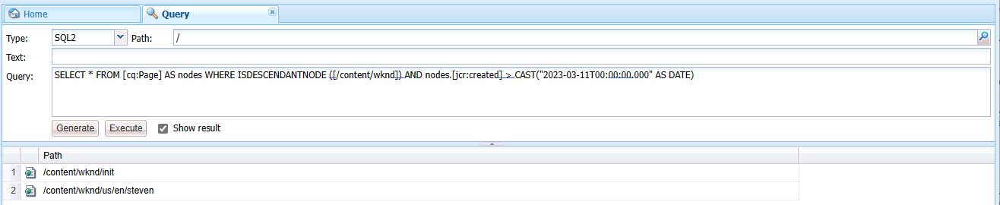

## 常用的一些查询语句

1. 找到所有[nt:unstructured]节点，在路径" /content/wknd "下，其中节点名= " root "

```sql
SELECT * FROM [nt:unstructured] AS node WHERE ISDESCENDANTNODE(node, "/content/wknd") AND NAME() = "root"
```

2. 在" /content/wknd "路径下找到所有组件([nt:unstructured]节点)，其中组件resourceType = " wknd/components/translate "

```sql
SELECT * FROM [nt:unstructured] AS node WHERE ISDESCENDANTNODE(node, "/content/wknd") AND [sling:resourceType] = "wknd/components/translate"
```

3. 在" /content/wknd"路径下找到所有组件([nt:unstructured]节点)，其中组件resourceType = " wknd/components/translate "，并且appId等于1122

   ```SQL
   SELECT * FROM [nt:unstructured] AS node WHERE ISDESCENDANTNODE(node, "/content/wknd") AND  sling:resourceType] = "wknd/components/translate" AND [appId] = "1122"
   ```

## JavaAPI的使用

编写一个通过页面名称搜索页面路径的API。

创建SearchService.java类

```java
package com.adobe.aem.guides.wknd.core.service;

import java.util.List;

public interface SearchService {

    List<String> searchPageByName(String pageName);
}
```

创建实现类SearchServiceImpl.java

```java
package com.adobe.aem.guides.wknd.core.service.impl;

import com.adobe.aem.guides.wknd.core.enums.SystemUserEnum;
import com.adobe.aem.guides.wknd.core.service.SearchService;
import lombok.extern.slf4j.Slf4j;
import org.apache.sling.api.resource.LoginException;
import org.apache.sling.api.resource.ResourceResolver;
import org.apache.sling.api.resource.ResourceResolverFactory;
import org.osgi.service.component.annotations.Component;
import org.osgi.service.component.annotations.Reference;

import javax.jcr.Node;
import javax.jcr.NodeIterator;
import javax.jcr.RepositoryException;
import javax.jcr.Session;
import javax.jcr.query.Query;
import javax.jcr.query.QueryResult;
import java.util.ArrayList;
import java.util.List;

@Slf4j
@Component(immediate = true, service = SearchService.class)
public class SearchServiceImpl implements SearchService {

    @Reference
    private ResourceResolverFactory resourceResolverFactory;

    @Override
    public List<String> searchPageByName(String pageName) {
        String sql = "SELECT * FROM [cq:Page] AS nodes WHERE NAME(nodes) = \"" + pageName + "\"";
        List<String> pages = new ArrayList<>();
        try {
            ResourceResolver resourceResolver = SystemUserEnum.USER_STEVEN.getResourceResolver(resourceResolverFactory);
            Session session = resourceResolver.adaptTo(Session.class);
            Query query = session.getWorkspace().getQueryManager().createQuery(sql, Query.JCR_SQL2);
            QueryResult queryResult = query.execute();
            NodeIterator nodes = queryResult.getNodes();
            while (nodes.hasNext()) {
                Node node = nodes.nextNode();
                pages.add(node.getPath());
                log.info("node name is {}", node.getName());
            }
        } catch (LoginException | RepositoryException e) {
            log.error(e.getMessage(), e);
        }
        return pages;
    }
}
```

创建Servlet类SearchServlet.java

```java
package com.adobe.aem.guides.wknd.core.servlet;

import com.adobe.aem.guides.wknd.core.service.SearchService;
import com.google.gson.Gson;
import com.google.gson.GsonBuilder;
import lombok.extern.slf4j.Slf4j;
import org.apache.sling.api.SlingHttpServletRequest;
import org.apache.sling.api.SlingHttpServletResponse;
import org.apache.sling.api.servlets.HttpConstants;
import org.apache.sling.api.servlets.SlingAllMethodsServlet;
import org.osgi.service.component.annotations.Component;
import org.osgi.service.component.annotations.Reference;

import javax.servlet.Servlet;

import java.io.IOException;
import java.io.PrintWriter;
import java.util.List;

import static org.osgi.framework.Constants.SERVICE_DESCRIPTION;

@Slf4j
@Component(service = Servlet.class, property = {
        SERVICE_DESCRIPTION + "= Search page by name",
        "sling.servlet.methods=" + HttpConstants.METHOD_GET,
        "sling.servlet.paths=" + "/bin/search"
})
public class SearchServlet extends SlingAllMethodsServlet {

    @Reference
    private SearchService searchService;

    @Override
    protected void doGet(final SlingHttpServletRequest request, final SlingHttpServletResponse response)
            throws IOException {
        String name = request.getParameter("name");
        log.info("name is : {}", name);
        List<String> strings = searchService.searchPageByName(name);
        response.setContentType("application/json;charset=utf-8");
        PrintWriter writer = response.getWriter();
        Gson gson = new GsonBuilder().setPrettyPrinting().create();
        writer.print(gson.toJson(strings));
        writer.close();
    }
}
```

调用接口，可以获取到路径列表

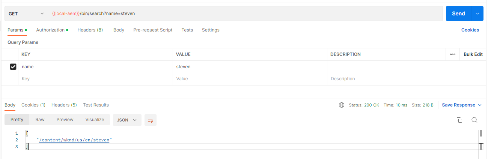

***END***