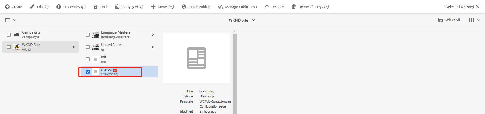

[TOC]

# 18、ContextAwareConfiguration

在项目开发中，经常会对不同的站点进行不同的配置，那么在AEM中有ContextAwareConfiguration（上下文配置）来进行这样的操作。

## 引入依赖

### 修改all/pom.xml文件

在embeddeds节点中添加如下配置，在构建项目时，将caconfig插件安装到AEM实例中

```xml
<embedded>
    <groupId>io.wcm</groupId>
    <artifactId>io.wcm.caconfig.extensions</artifactId>
    <target>/apps/wknd-packages/application/install</target>
</embedded>
```

在configuration节点中添加，将caconfig package安装到AEM实例中

```xml
<subPackages>
    <subPackage>
        <groupId>io.wcm</groupId>
        <artifactId>io.wcm.caconfig.editor.package</artifactId>
        <filter>true</filter>
    </subPackage>
</subPackages>
```

在dependencies节点中添加，引入caconfig所需包，主要是在页面中使用

```xml
<!-- WCM IO CA Config UI Editor Dependencies -->
<dependency>
    <groupId>io.wcm</groupId>
    <artifactId>io.wcm.caconfig.editor.package</artifactId>
    <version>1.8.2</version>
    <type>zip</type>
</dependency>
<dependency>
    <groupId>io.wcm</groupId>
    <artifactId>io.wcm.caconfig.extensions</artifactId>
    <version>1.8.2</version>
    <type>jar</type>
</dependency>
```

### 修改core/pom.xml

找到bnd-process插件，修改信息如下

- org.apache.sling.caconfig.bndplugin.ConfigurationClassScannerPlugin插件用来扫描caconfig类
- -exportcontents: com.adobe.aem.guides.wknd.core.models.* 如果需要在组件中使用后面添加的caconfig类，则需要将组件导出

```xml
<plugin>
    <groupId>biz.aQute.bnd</groupId>
    <artifactId>bnd-maven-plugin</artifactId>
    <executions>
        <execution>
            <id>bnd-process</id>
            <goals>
                <goal>bnd-process</goal>
            </goals>
            <configuration>
                <bnd><![CDATA[
                -plugin org.apache.sling.caconfig.bndplugin.ConfigurationClassScannerPlugin

                Import-Package: javax.annotation;version=0.0.0,*
                Export-Package: com.adobe.aem.guides.wknd.core.*
                Sling-Model-Packages: com.adobe.aem.guides.wknd.core.models
                -exportcontents: com.adobe.aem.guides.wknd.core.models.*
                    ]]></bnd>
            </configuration>
        </execution>
    </executions>
</plugin>
```

## 创建caconfig配置类

新增ContextAwareConfigurationDemo.java，也就是不同站点需要使用的配置类

- @Configuration注解可以被ConfigurationClassScannerPlugin插件扫描到
- @Property注解声明这个属性的内容，default可以添加默认值

```java
package com.adobe.aem.guides.wknd.core.config;

import org.apache.sling.caconfig.annotation.Configuration;
import org.apache.sling.caconfig.annotation.Property;

@Configuration(label = "Context Aware Configuration Demo", description = "Context Aware Configuration Demo")
public @interface ContextAwareConfigurationDemo {

    @Property(label = "Site Name", description = "Please enter Site Name")
    String siteName() default "steven aem practice";

    @Property(label = "Site Url", description = "Please enter Site Url")
    String siteUrl() default "http://localhost:4502";
}
```

## 新增caconfig模板

在ui.apps/src/main/content/jcr_root/apps/wknd目录下创建目录templates.caconfigs，并新增文件.content.xml

```xml
<?xml version="1.0" encoding="UTF-8"?>
<jcr:root xmlns:sling="http://sling.apache.org/jcr/sling/1.0" xmlns:cq="http://www.day.com/jcr/cq/1.0" xmlns:jcr="http://www.jcp.org/jcr/1.0"
    jcr:description="Template with focus on brand's configuration"
    jcr:primaryType="cq:Template"
    jcr:title="WCM.io Context-Aware Configuration page"
    allowedPaths="[/content/wknd(/.*)?,/content(/.*)?]"
    ranking="{Long}110">
    <jcr:content
        jcr:primaryType="cq:PageContent"
        sling:resourceType="wcm-io/caconfig/editor/components/page/editor">
    </jcr:content>
</jcr:root>
```

## 修改配置信息

修改ui.apps/src/main/content/META-INF/vault/filter.xml文件，新增如下配置

```xml
<?xml version="1.0" encoding="UTF-8"?>
<workspaceFilter version="1.0">
    <filter root="/apps/wknd/clientlibs"/>
    <filter root="/apps/wknd/components"/>
    <filter root="/apps/wknd/i18n"/>
    <filter root="/apps/wknd/templates"/>
    <filter root="/apps/msm/wknd_blueprint" mode="merge"/>
</workspaceFilter>
```

修改ui.content/src/main/content/jcr_root/content/wknd/.content.xml配置，/apps/wknd/templates/caconfigs是上面新增的模板路径

```xml
<?xml version="1.0" encoding="UTF-8"?>
<jcr:root xmlns:sling="http://sling.apache.org/jcr/sling/1.0" xmlns:cq="http://www.day.com/jcr/cq/1.0" xmlns:jcr="http://www.jcp.org/jcr/1.0" xmlns:nt="http://www.jcp.org/jcr/nt/1.0"
    jcr:primaryType="cq:Page">
    <jcr:content
        cq:allowedTemplates="[/conf/wknd/settings/wcm/templates/landing-page-template,/conf/wknd/settings/wcm/templates/article-page-template,/conf/wknd/settings/wcm/templates/content-page-template,/conf/wknd/settings/wcm/templates/adventure-page-template,/apps/wknd/templates/caconfigs]"
        cq:conf="/conf/wknd"
        cq:lastModified="{Date}2021-04-27T20:19:05.296-08:00"
        cq:lastModifiedBy="admin"
        jcr:primaryType="cq:PageContent"
        jcr:title="WKND Site"
        sling:configRef="/conf/wknd"
        sling:resourceType="wknd/components/page"
        cq:redirectTarget="/content/wknd/us/en"
        cq:template="/conf/wknd/settings/wcm/templates/landing-page-template">
        <image jcr:primaryType="nt:unstructured">
            <file/>
        </image>
    </jcr:content>
</jcr:root>
```

## 修改翻译组件

在Translate.java的init方法中新增如下代码

```java
@PostConstruct
public void init() throws WCMException, PersistenceException, RepositoryException {
	config = resource.adaptTo(ConfigurationBuilder.class).as(ContextAwareConfigurationDemo.class);
	log.info("siteName is {}", config.siteName());
	log.info("siteUrl is {}", config.siteUrl());
}
```

添加下面两个方法

```java
public String getSiteName() {
    return Objects.nonNull(config) ? config.siteName() : "empty";
}

public String getSiteUrl() {
    return Objects.nonNull(config) ? config.siteUrl() : "empty";
}
```

修改ui.apps/src/main/content/jcr_root/apps/wknd/components/translate/translate.html文件

```html
<div class="cq-placeholder cmp-title" data-emptytext="${component.title}:Click to configure" data-sly-unwrap="${!wcmmode.edit}"></div>
<script src="https://cdnjs.cloudflare.com/ajax/libs/jquery/3.5.1/jquery.min.js"></script>
<script src="https://cdn.bootcdn.net/ajax/libs/crypto-js/4.0.0/crypto-js.js"></script>

<sly data-sly-use.clientLib="${'/libs/granite/sightly/templates/clientlib.html'}"/>
<sly data-sly-call="${clientLib.all @ categories='steven.translate'}" />

<sly data-sly-use.model="com.adobe.aem.guides.wknd.core.models.Translate">
    <h1>类名: ${model.className}</h1>
    <h1>SiteName: ${model.siteName}</h1>
    <h1>SiteUrl: ${model.siteUrl}</h1>
    <div class="cmp-translate" appId="${model.appId}" appKey="${model.appKey}">
        <input id="trans-content" type="text" placeholder="请输入需要翻译的英文内容" >
        <button onclick="transByServlet()">翻译</button><br>
        <span id="result"></span>
    </div>
</sly>
```

## 查看效果

构建项目，在wknd根目录下创建配置页面site-config


选择caconfig模板，输入Title名称


打开site-config页面



新增刚创建好的配置类ContextAwareConfigurationDemo


可以看到带默认值的配置类


修改配置属性信息并保存


打开steven页面，查看配置信息可以正常获取

