[TOC]

# 19、Content Fragment （内容片段）

目前大部分的网站中都包含底部链接块和各种静态内容块。在AEM中，可以通过使用ContentFragment来实现相同的目的。

## 创建ContentFragment

打开Content Fragment Models配置页面

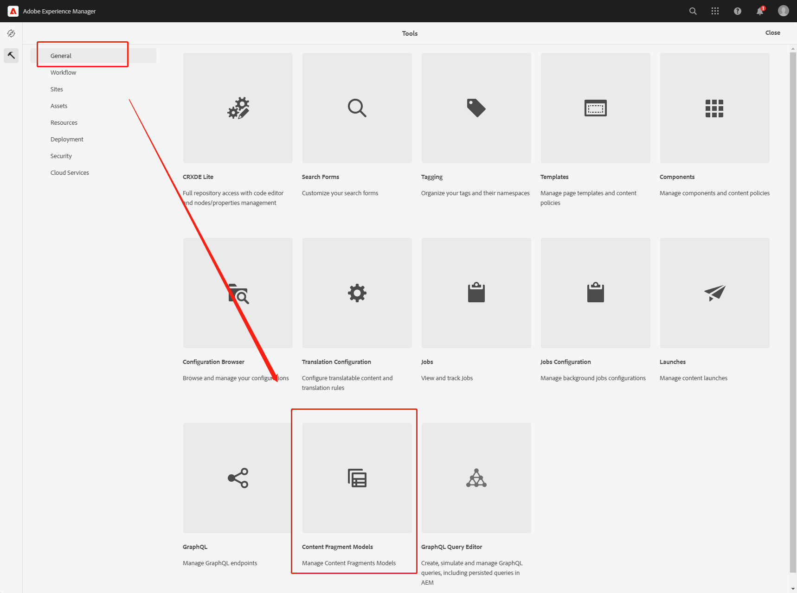

进入WKND文件夹下，点击Create按钮创建一个新的ContentFragment

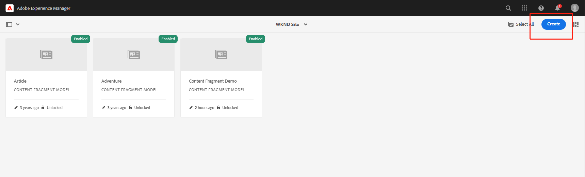

在title处填入名称，保存并打开ContentFragment进行编辑

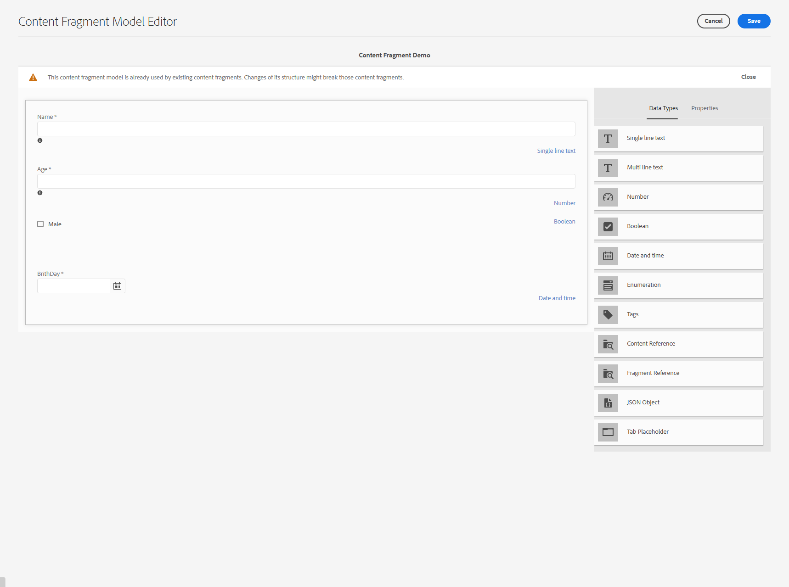

将右侧的数据类型组件拖动到左侧的内容区域中并设置属性，设置完成后点击Save按钮保存

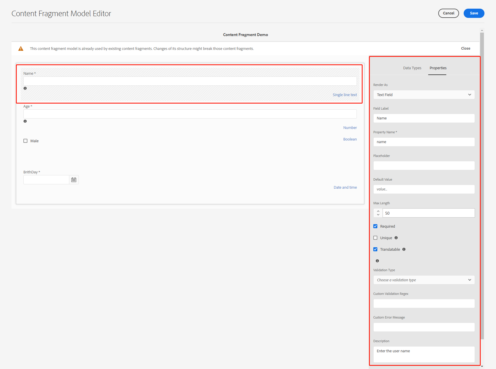

## 在ContentFragment中填充数据

ContentFragment创建完成后，需要填充数据，打开Assets页面

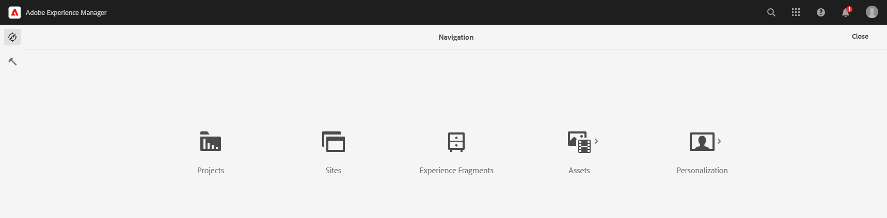

进入Files目录

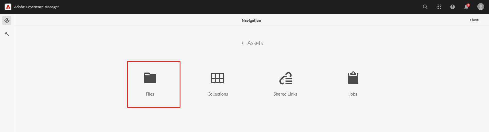

进入WKND Site目录

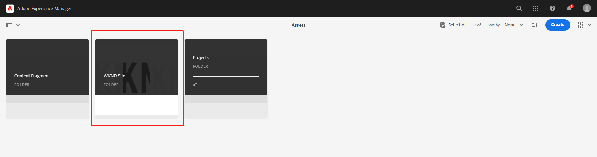

点击Create按钮创建ContentFragment目录

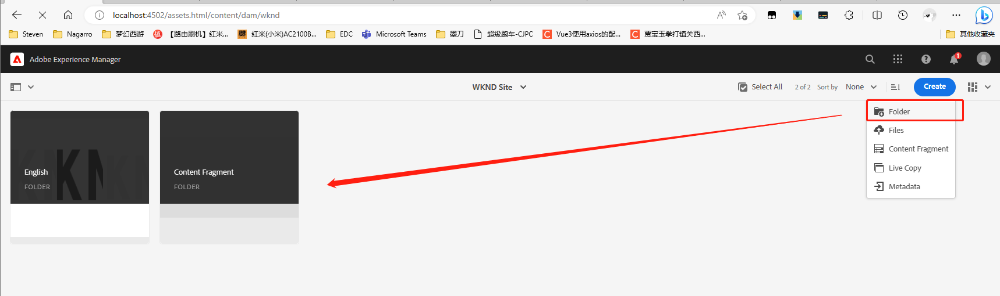

进入ContentFragment目录，点击Create按钮创建ContentFragment资产

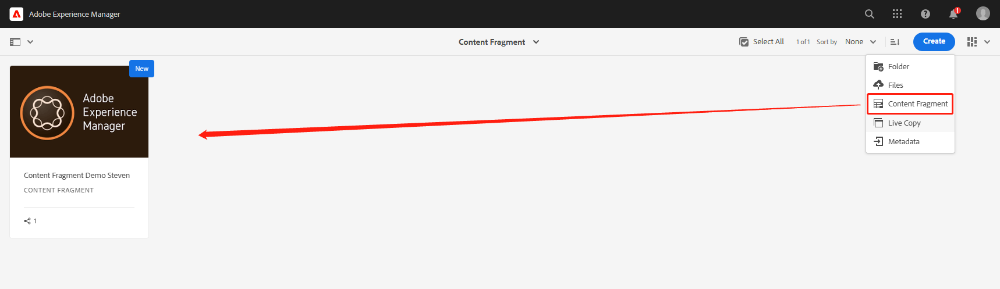

点击新创建好的ContentFragment资产进行数据填充

- 1号红框，标注了不同的变量分支，对不同的分支填充不同的数据，选择不同的分支即可看到不同的数据
- 2号红框，是对之前创建的ContentFragment属性进行填充数据

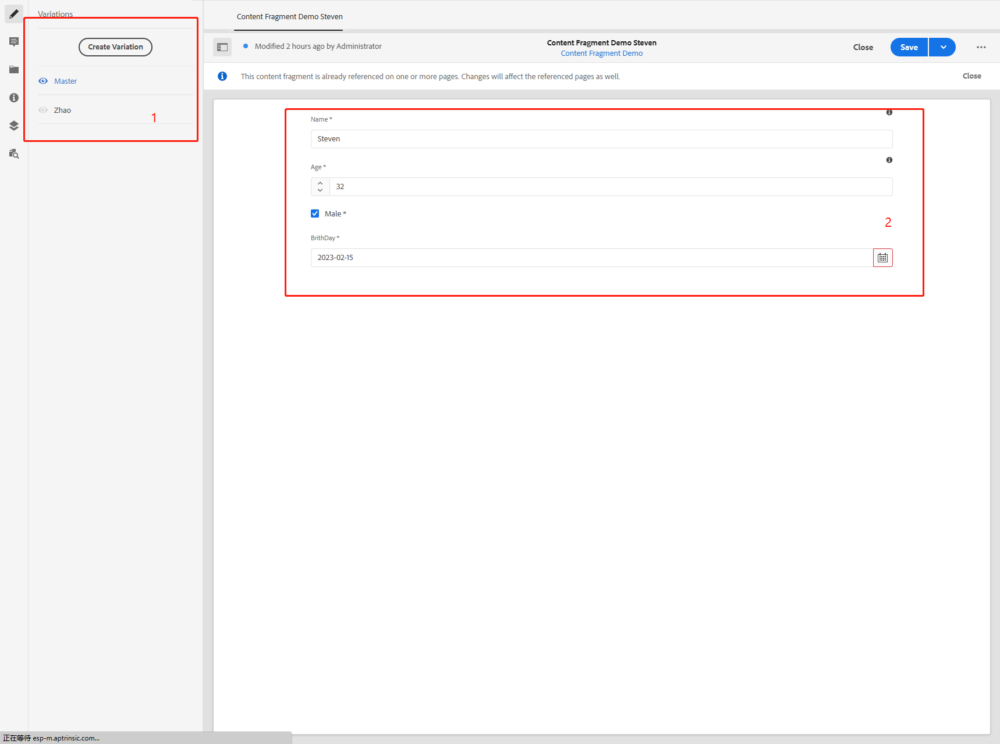

## 在组件中使用ContentFragment

打开CRXDE页面创建一个新的组件contentfragmentdemo

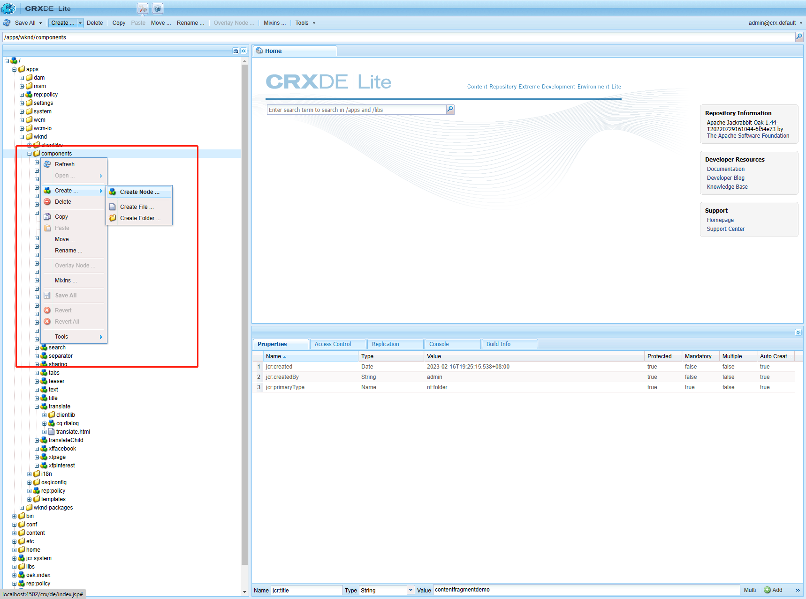

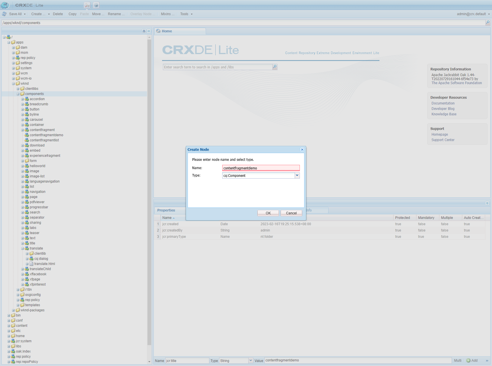

填入组件属性

- componentGroup = Steven Group，组件所属的组
- jcr:title = contentfragmentdemo，组件名称
- sling:resourceSuperType =  core/wcm/components/contentfragment/v1/contentfragment，组件所继承的父组件路径

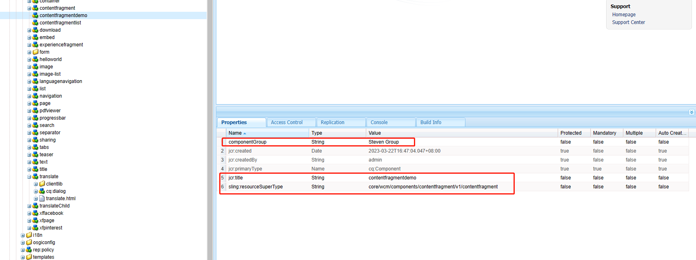

打开Steven页面，通过组名过滤组件，选择contentfragmentdemo组件

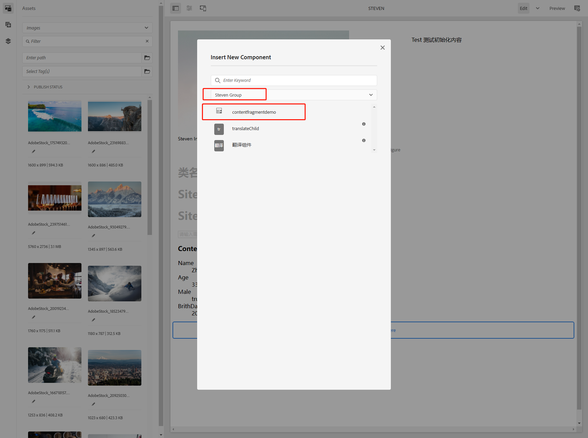

双击组件打开组件对话框，配置ContentFragment路径，asserts目录下创建好的ContentFragment

- Single Text Element，在组件中只显示一个文本属性
- Multiple Elements，显示多个属性信息
- Elements，选择要在组件中展示的属性
- Variation，选择要显示的ContentFragment分支

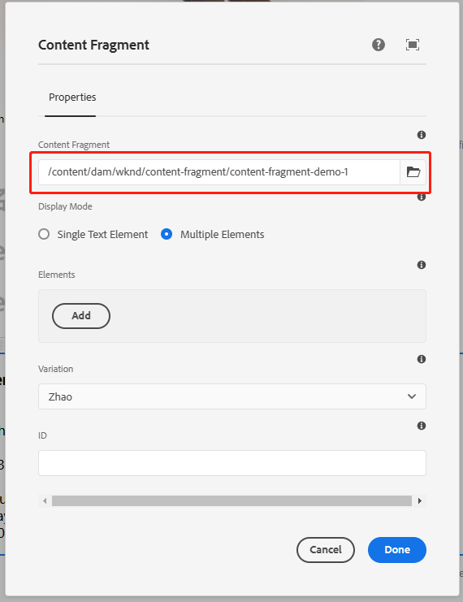

查看效果

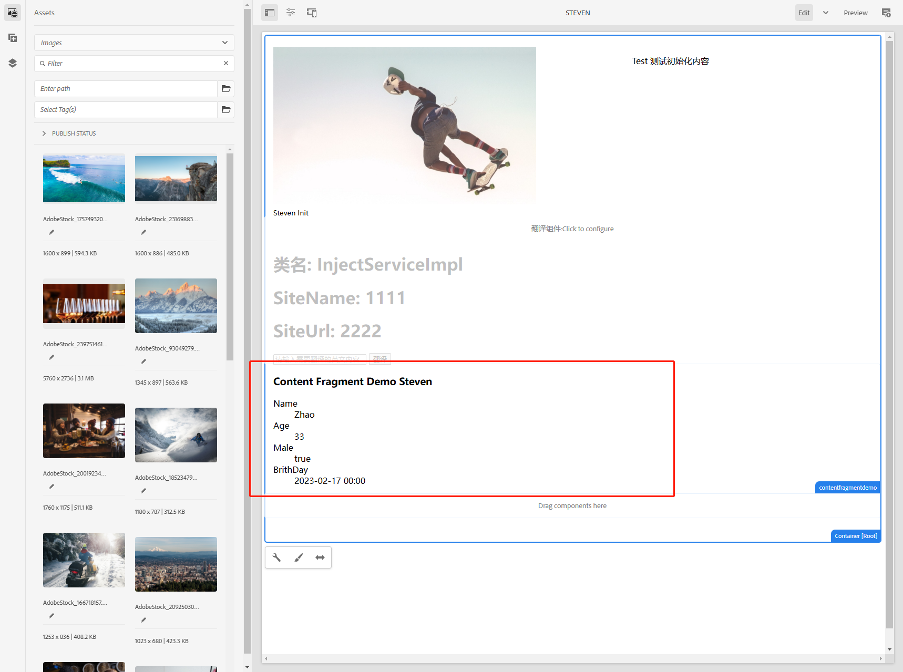

这样就可以把内容片段根据不同的分支显示在不同的页面中。

## 将ContentFragment导出为JSON文件

ContentFragment默认是支持json导出的，访问地址[localhost:4502/api/assets/wknd/content-fragment/content-fragment-demo-1.json](http://localhost:4502/api/assets/wknd/content-fragment/content-fragment-demo-1.json)就可以看到Content Fragment Demo Steven的所有信息

```json
{
  "links": [
    {
      "rel": [
        "self"
      ],
      "href": "http://localhost:4502/api/assets/wknd/content-fragment/content-fragment-demo-1.json"
    },
    {
      "rel": [
        "parent"
      ],
      "href": "http://localhost:4502/api/assets/wknd/content-fragment.json"
    }
  ],
  "class": [
    "assets/asset"
  ],
  "actions": [
    {
      "method": "DELETE",
      "name": "delete",
      "href": "http://localhost:4502/api/assets/wknd/content-fragment/content-fragment-demo-1",
      "title": "Delete"
    },
    {
      "method": "PUT",
      "name": "update-fragment",
      "href": "http://localhost:4502/api/assets/wknd/content-fragment/content-fragment-demo-1",
      "type": "application/json",
      "title": "Update Content Fragment"
    }
  ],
  "properties": {
    "metadata": {
      
    },
    "created": 1679474133606,
    "description": "",
    "title": "Content Fragment Demo Steven",
    "contentFragment": true,
    "createdBy": "admin",
    "elementsOrder": [
      "name",
      "age",
      "male",
      "brithday"
    ],
    "elements": {
      "brithday": {
        "variationsOrder": [
          "zhao"
        ],
        "translatable": false,
        ":type": "calendar",
        "variations": {
          "zhao": {
            ":type": "calendar",
            "dataType": "calendar",
            "description": "",
            "title": "Zhao",
            "multiValue": false,
            "value": 1676592000000
          }
        },
        "dataType": "calendar",
        "title": "BrithDay",
        "multiValue": false,
        "value": 1676419200000
      },
      "name": {
        "variationsOrder": [
          "zhao"
        ],
        "translatable": true,
        ":type": "string",
        "variations": {
          "zhao": {
            ":type": "string",
            "dataType": "string",
            "description": "",
            "title": "Zhao",
            "multiValue": false,
            "value": "Zhao"
          }
        },
        "dataType": "string",
        "title": "Name",
        "multiValue": false,
        "value": "Steven"
      },
      "age": {
        "variationsOrder": [
          "zhao"
        ],
        "translatable": false,
        ":type": "long",
        "variations": {
          "zhao": {
            ":type": "long",
            "dataType": "long",
            "description": "",
            "title": "Zhao",
            "multiValue": false,
            "value": 33
          }
        },
        "dataType": "long",
        "title": "Age",
        "multiValue": false,
        "value": 32
      },
      "male": {
        "variationsOrder": [
          "zhao"
        ],
        "translatable": false,
        ":type": "boolean",
        "variations": {
          "zhao": {
            ":type": "boolean",
            "dataType": "boolean",
            "description": "",
            "title": "Zhao",
            "multiValue": false,
            "value": true
          }
        },
        "dataType": "boolean",
        "title": "Male",
        "multiValue": false,
        "value": true
      }
    },
    "name": "content-fragment-demo-1",
    "modified": 1679474310486,
    "modifiedBy": "admin",
    "cq:model": {
      "path": "/conf/wknd/settings/dam/cfm/models/content-fragment-demo"
    },
    "srn:paging": {
      "total": 0,
      "offset": 0,
      "limit": 20
    }
  }
}
```

## ContentFragment常用操作

### 版本比较

在资产中找到Content Fragment Demo Steven的选项卡并选中，点击左上角视图按钮选择Timeline，左侧就会出现版本记录

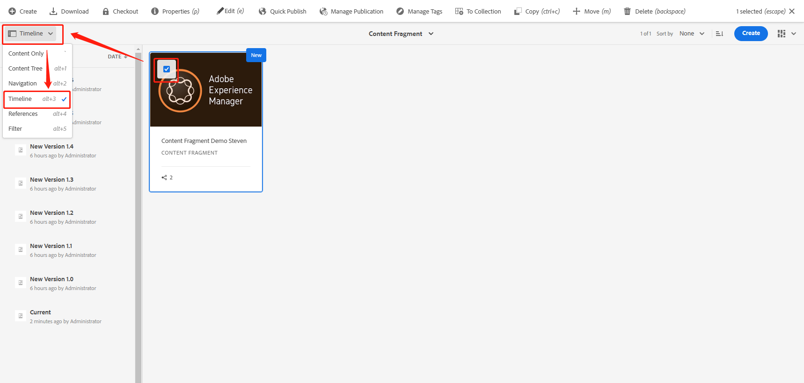

选中其中一个版本，可以填入Label和Comment，还有两个按钮Revert to this Version（回退到这个版本）和Compare to Current（与当前版本进行比较）

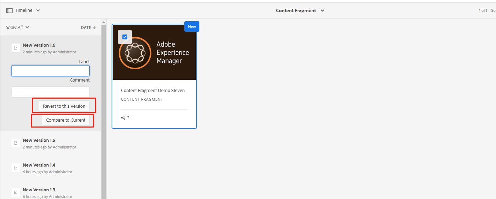

点击Compare按钮后跳转比较页面，比较页面会展示出两个版本的区别

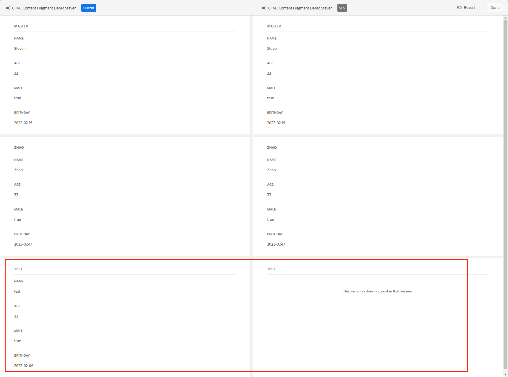