[TOC]

# 20、Workflow In AEM （一）

在项目中经常会写一些监听器来自动触发某些操作，例如：用户下单并付款后，调用短信接口发送短信给用户。在AEM中提供了Workflow来实现这样的操作。

在AEM中的Workflow主要由连个组件构成，一个是Workflow Model，一个是Launcher。

- Workflow Model负责事务流程的设置，有一个或多个事务构成
- Launcher负责整个事务流程的调度和使用

在这一章中介绍如何创建Workflow和Launcher来实现页面版本跟踪。

## 创建Workflow Model

打开AEM的Workflow界面，进入Models页面

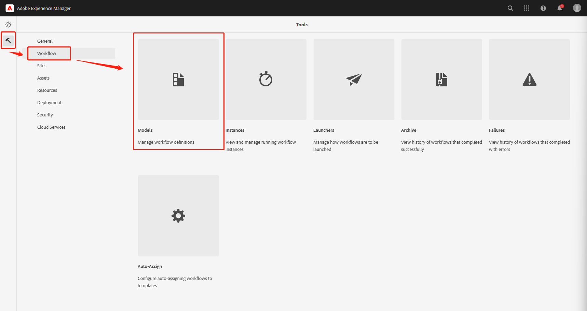

可以看到很多系统自带的Workflow，点击Create按钮，选择Create Model

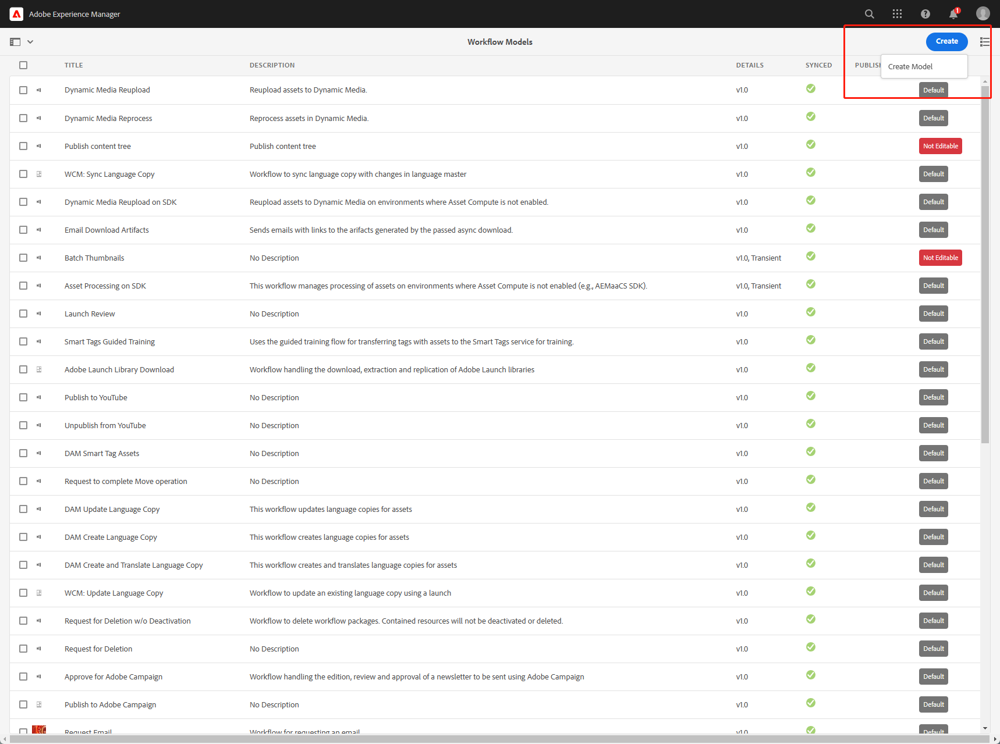

输入title为Page Version，选择Page Version点击Edit按钮

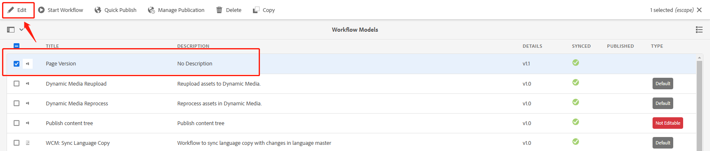

进入编辑页面，看到左侧有很多系统自带的事务可以进行自定义配置

- 左侧为系统自带事务列表
- 右侧为Workflow流程编辑器，可以对Workflow流程进行自定义设置

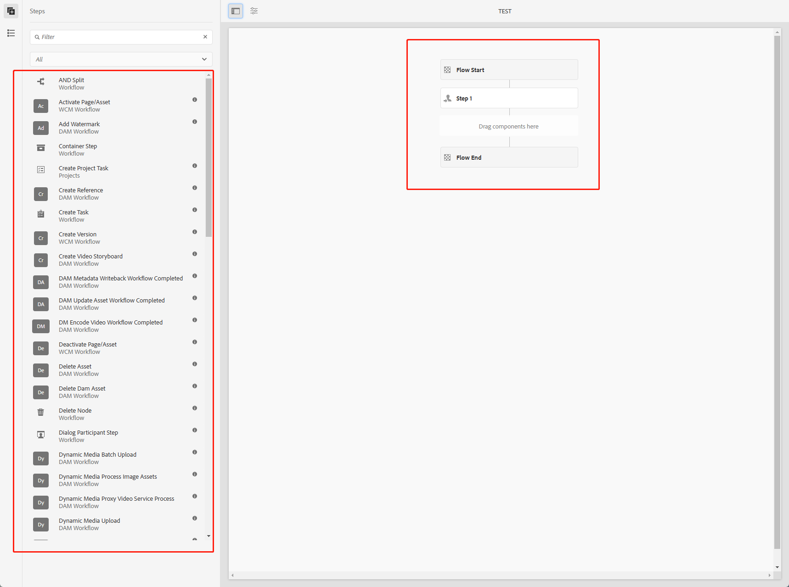

删除Step1

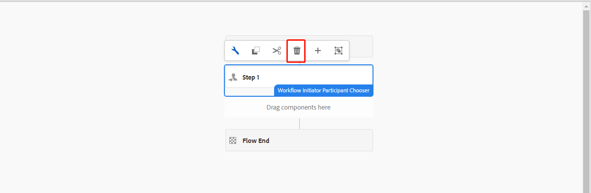

添加Create Version事务，并同步至JCR

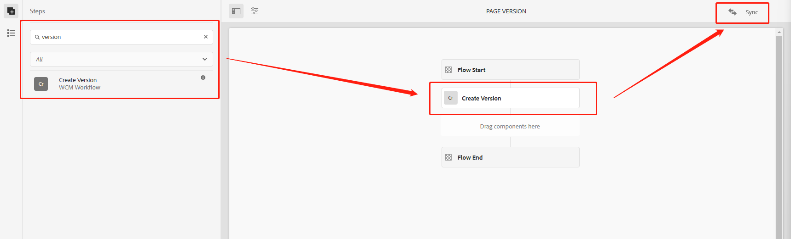

打开CRXDE页面查看，在/conf/global/settings/workflow/models/page-version和/var/workflow/models/page-version目录下分别出现了page-version的Workflow  Model，这样一个简单的Workflow Model就创建好了。

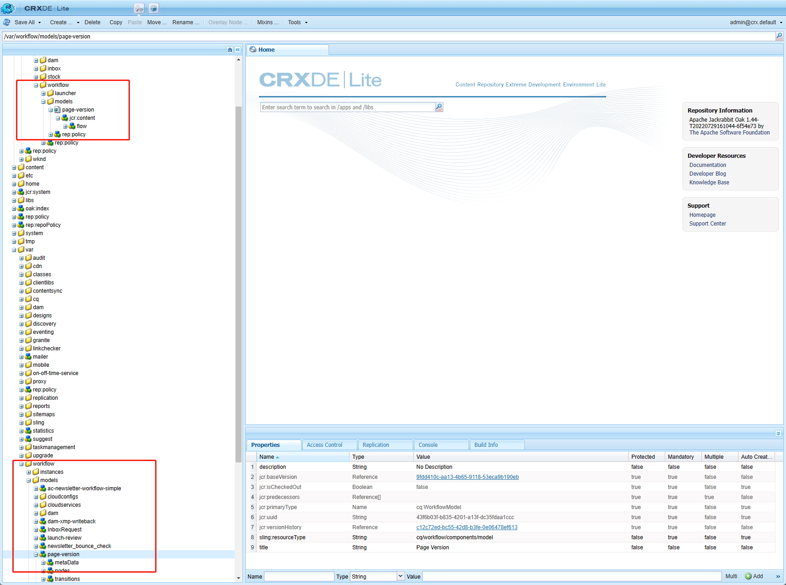

## 手动触发Workflow 

在/content/wknd/us/en路径下创建workflow页面

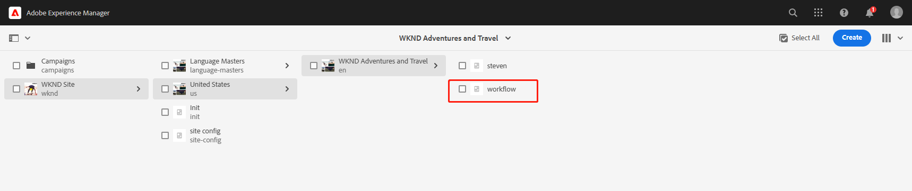

返回Workflow Models列表页，选择Page Version，点击Start Workflow按钮，选择需要执行事务流程的页面路径/content/wknd/us/en/workflow，点击Run按钮

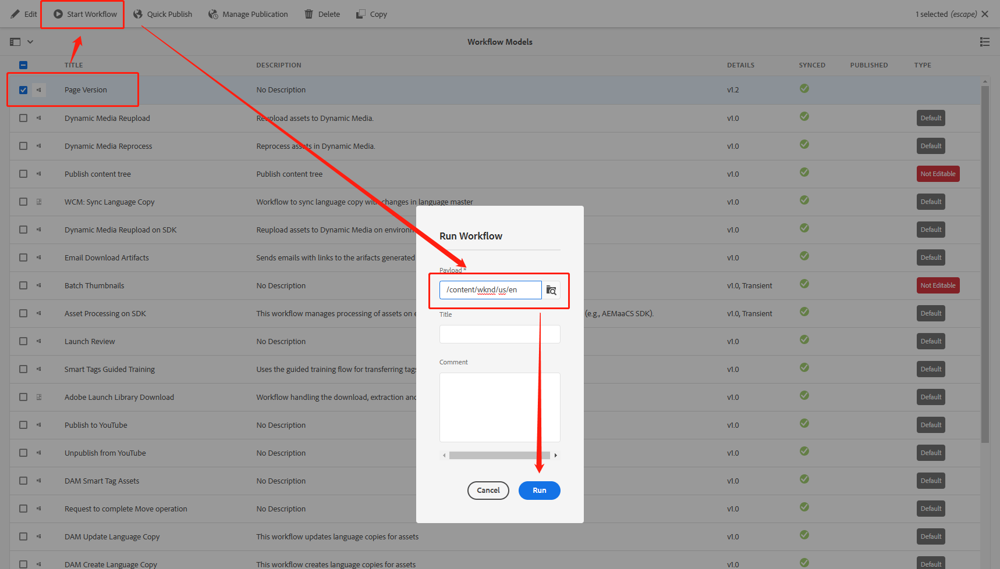

返回刚才创建的workflow页面，选中页面，点击左上角的下拉菜单选择Timeline

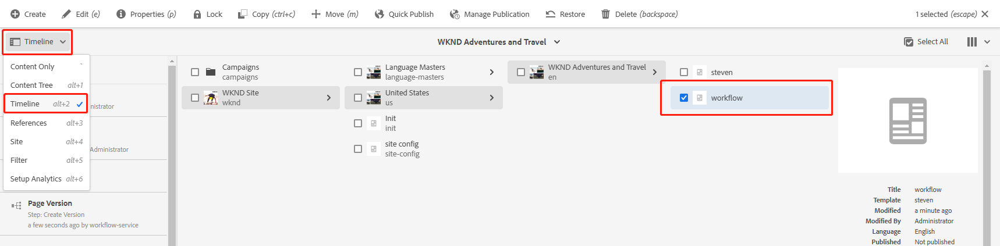

就可以看到页面的历史记录，包含页面创建时间、版本号（New Version 1.0）、由哪个Workflow Model创建（Page Version）以及创建的步骤（steps）

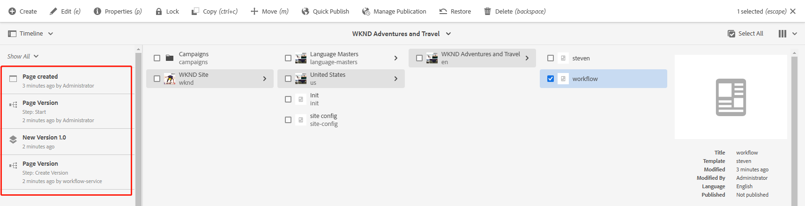

点击Show All下拉按钮，选择Versions

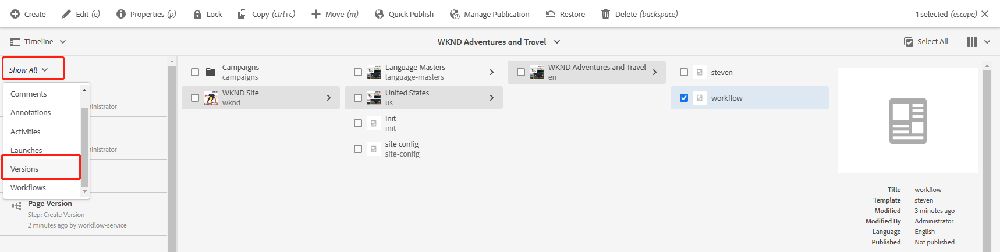

可以看到刚才创建的版本号

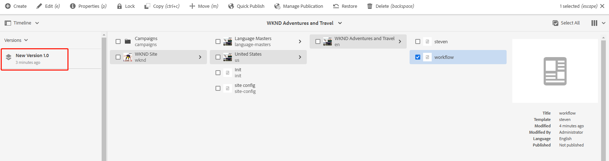

## 创建Launcher

通常情况下，都希望可以在页面发生改变时，自动创建版本，以便追踪和回滚，就需要用到Launcher，进入Launchers页面

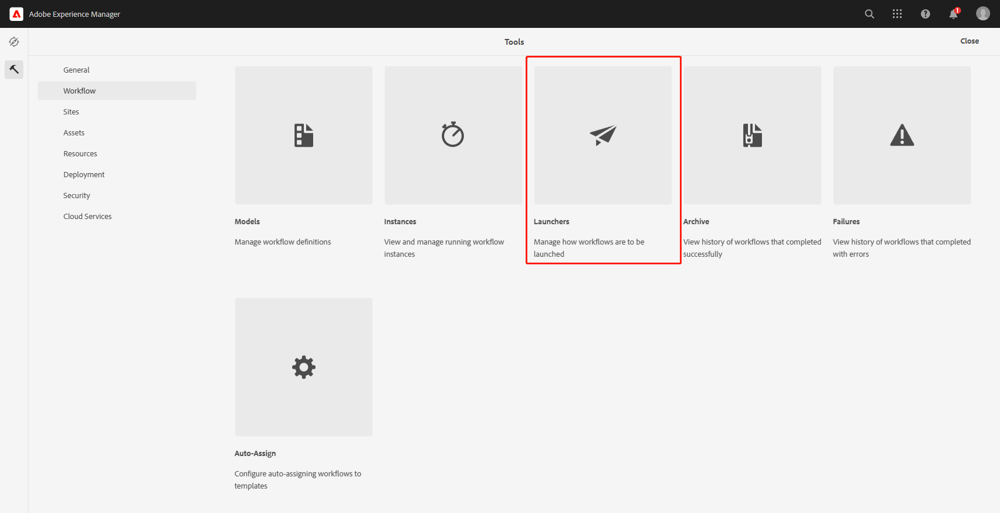

可以看到一些系统自带的Launchers，点击Create按钮进入创建页面

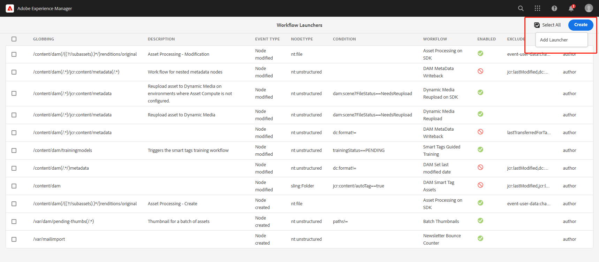

在创建页面需要对Launcher进行属性设置，Launcher以下属性必须要进行修改

1. Event Type
   - Created，在创建操作后触发
   - Modified，在修改操作后触发
   - Removed，在删除操作后触发
2. Nodetype，包含AEM中所有的节点类型，这里监听页面的操作，选择cq:page
3. Path，选择需要监听的路径
4. Run Modes，选择需要在哪些实例上运行
5. Workflow Model，选择需要执行的Model，这里选择刚才创建的Page Version
6. Activate，开启或关闭

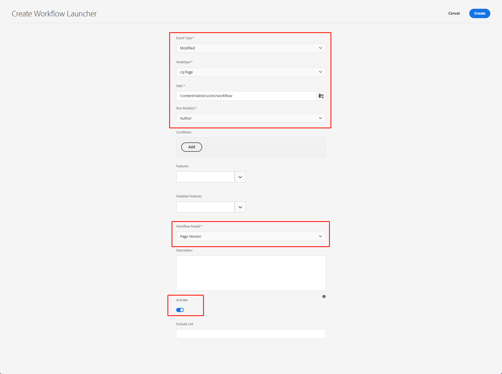

## 自动触发Workflow

点击Create按钮创建完成后，回到workflow页面进行页面编辑，新增了一个Image组件，并填充一张图片

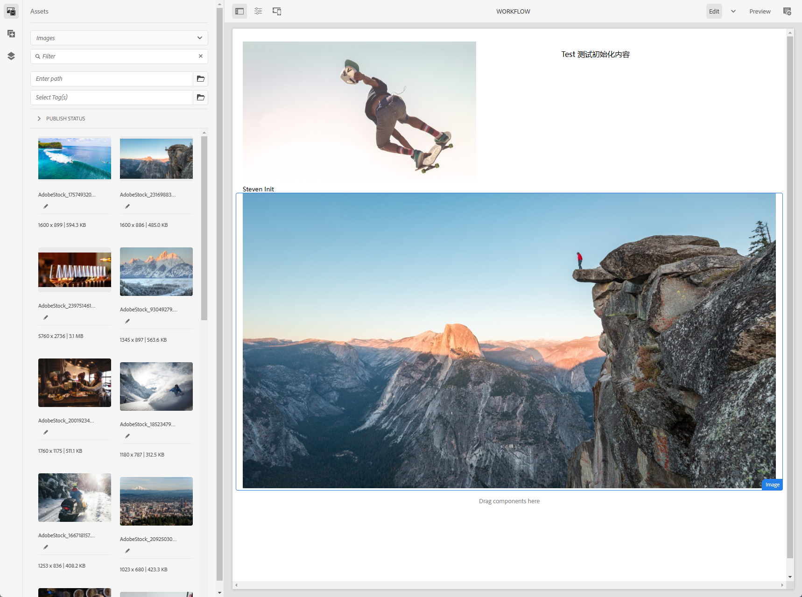

查看页面Versions

- 1.0为手动触发时创建的版本
- 1.1为新增组件时创建的版本
- 1.2为填充图片时创建的版本

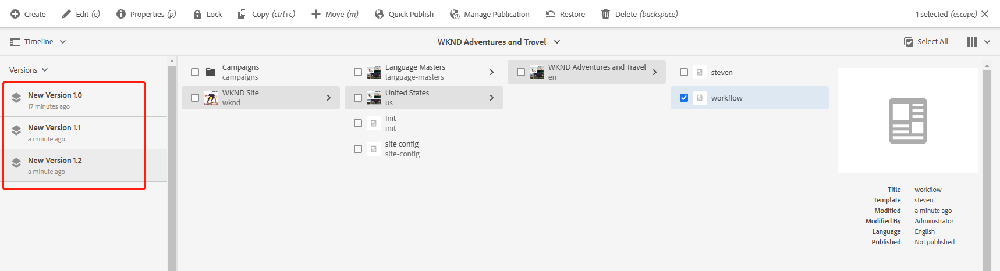

选择1.1版本，点击Revert to this version回退到这个版本

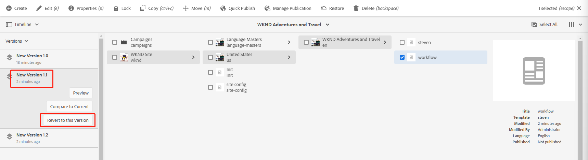

查看页面，页面中只有Image组件，填充的图片已经被回退

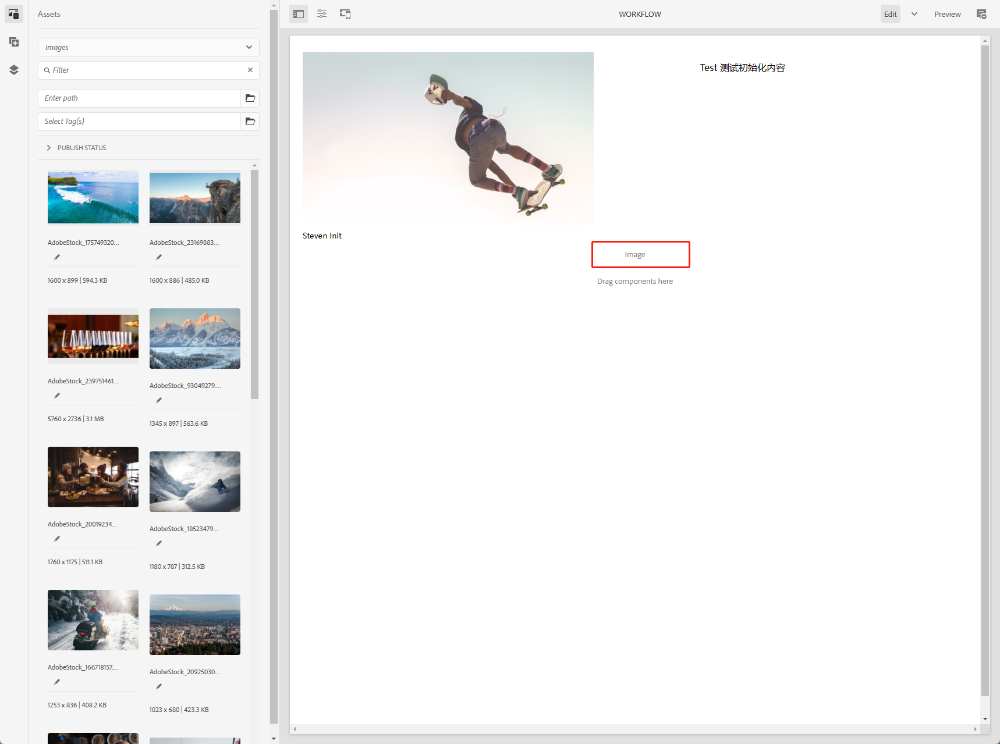

再次查看版本信息，多了一个回退1.1版本的Version

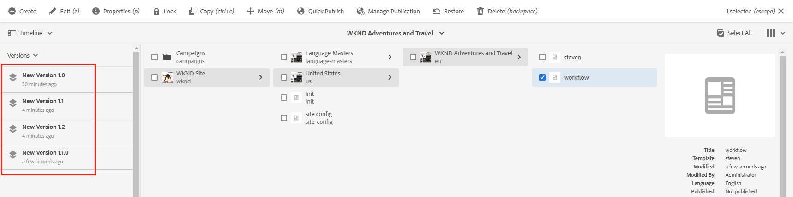

## Workflow历史记录及状态

在Workflow没有正常的执行时，AEM提供了一些记录和状态查询的功能。

- Instances：正在执行WorkflowModel的实例信息
- Archive：Workflow Model执行的历史记录
- Failures：执行失败的Workfl Model的信息

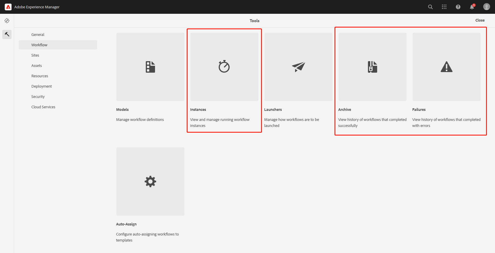

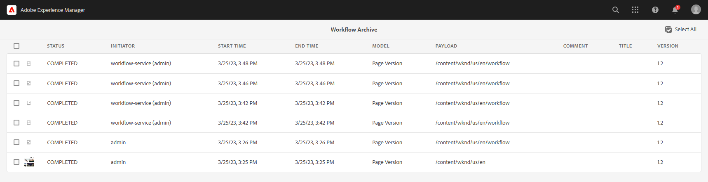