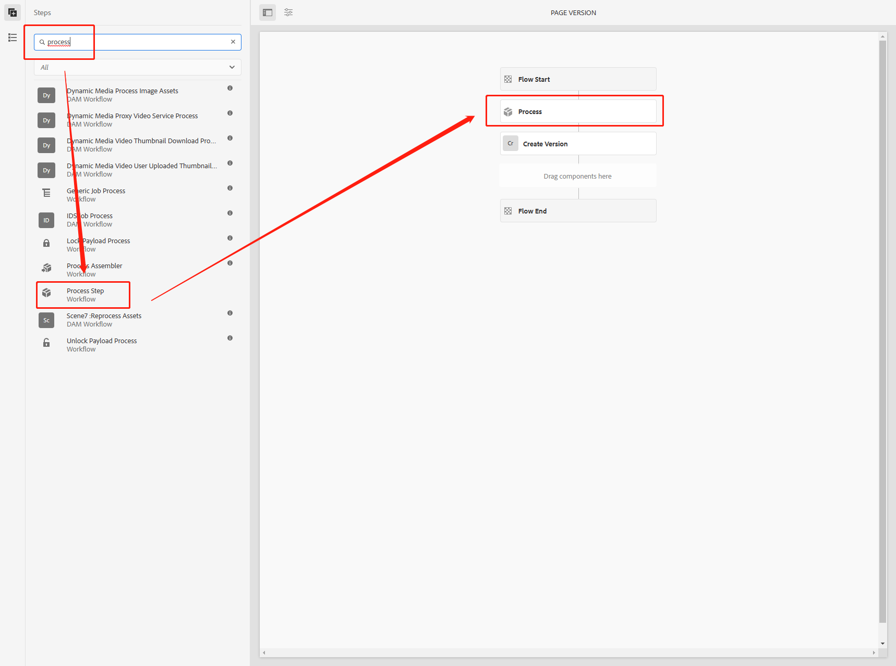
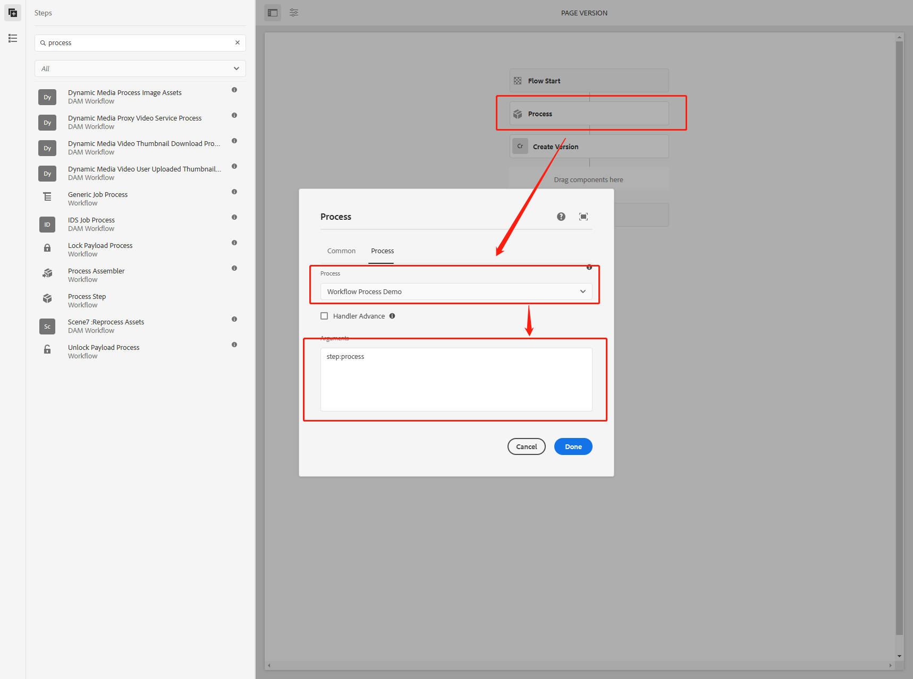
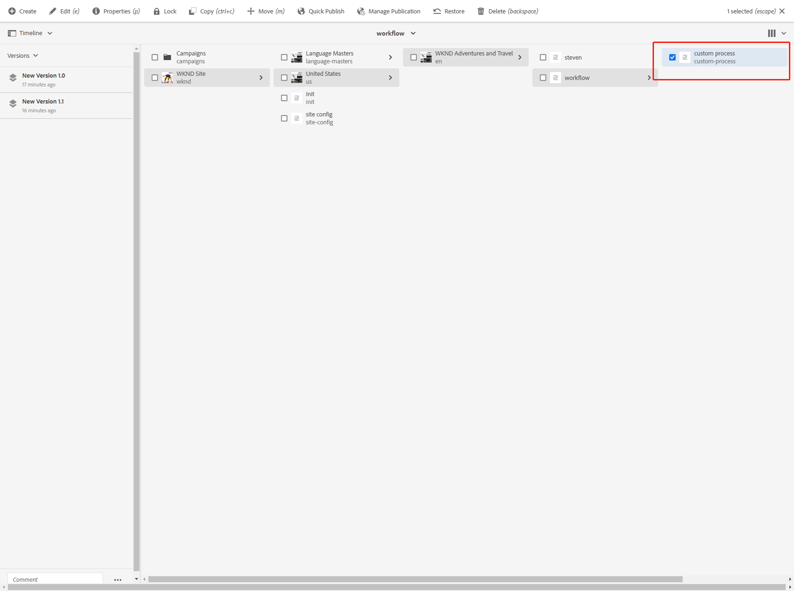
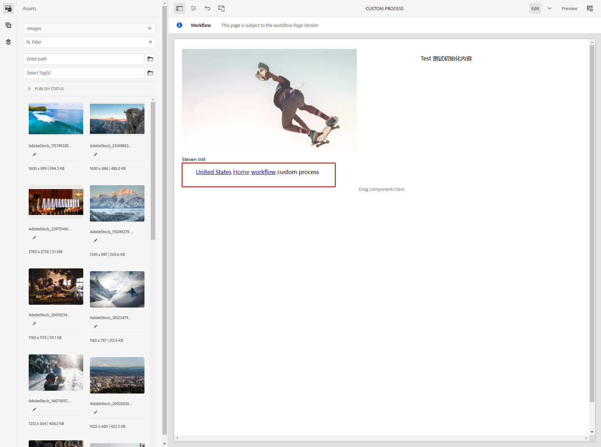
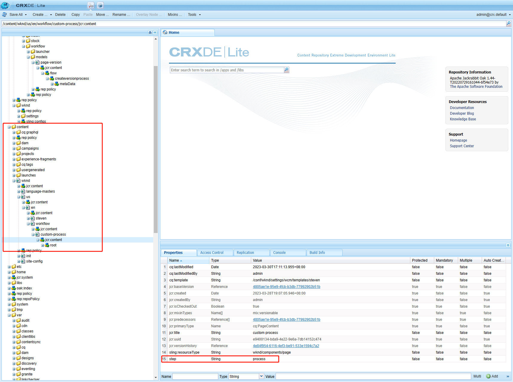

[TOC]

# 21、Workflow In AEM（二）

在AEM中可以编写自定义Workflow步骤，并且可以添加到WorkflowModel中，这样就能在Launcher监听到事件时添加自己的操作。这一章中讲解如何添加自定义Workflow操作。

## 编写自定义Process类

创建WorkflowProcessDemo.java

1. WorkItem：它是通过WorkflowModel的工作流实例传递的单元, 包含工作流数据。实例作用于描述底层工作流步骤的WorkflowNode的引用
2. WorkflowSession：这个类提供了所有用于管理WorkflowModels、工作流实例及其执行的功能(取决于用户的权限)
3. MetaDataMap：用于元数据值的通用访问的值映射

```java
package com.adobe.aem.guides.wknd.core.workflow;

import com.adobe.aem.guides.wknd.core.enums.SystemUserEnum;
import com.day.cq.workflow.WorkflowException;
import com.day.cq.workflow.WorkflowSession;
import com.day.cq.workflow.exec.WorkItem;
import com.day.cq.workflow.exec.WorkflowData;
import com.day.cq.workflow.exec.WorkflowProcess;
import com.day.cq.workflow.metadata.MetaDataMap;
import lombok.extern.slf4j.Slf4j;
import org.apache.sling.api.resource.LoginException;
import org.apache.sling.api.resource.ResourceResolver;
import org.apache.sling.api.resource.ResourceResolverFactory;
import org.osgi.framework.Constants;
import org.osgi.service.component.annotations.Component;
import org.osgi.service.component.annotations.Reference;

import javax.jcr.Node;
import javax.jcr.PathNotFoundException;
import javax.jcr.RepositoryException;
import javax.jcr.Session;
import java.util.Arrays;
import java.util.Objects;

@Slf4j
@Component(service = WorkflowProcess.class, immediate = true, property = {
        "process.label=Workflow Process Demo",
        Constants.SERVICE_VENDOR + "=Workflow Process Demo",
        Constants.SERVICE_DESCRIPTION + "=Workflow Process Demo"
})
public class WorkflowProcessDemo implements WorkflowProcess {

    @Reference
    private ResourceResolverFactory resourceResolverFactory;

    @Override
    public void execute(WorkItem workItem, WorkflowSession workflowSession, MetaDataMap metaDataMap) throws WorkflowException {
        WorkflowData workflowData = workItem.getWorkflowData();
        if (workflowData.getPayloadType().equals("JCR_PATH")) {
            try {
                ResourceResolver resourceResolver = SystemUserEnum.USER_STEVEN.getResourceResolver(resourceResolverFactory);
                Session session = resourceResolver.adaptTo(Session.class);
                String path = workflowData.getPayload().toString() + "/jcr:content";
                log.info("path is {}", path);
                Node node = (Node) session.getItem(path);
                log.info("node is {}", node);
                String[] split = metaDataMap.get("PROCESS_ARGS", "Default").split(",");
                log.info("metaDataMap is {}", metaDataMap);
                log.info("split is {}", Arrays.toString(split));
                for (String arg : split) {
                    String[] strings = arg.split(":");
                    String key = strings[0];
                    log.info("key is {}", key);
                    String value = strings[1];
                    log.info("value is {}", value);
                    if (Objects.nonNull(node)) {
                        node.setProperty(key, value);
                    }
                }
                session.save();
            } catch (LoginException e) {
                log.error(e.getMessage(), e);
            } catch (PathNotFoundException e) {
                log.error(e.getMessage(), e);
            } catch (RepositoryException e) {
                log.error(e.getMessage(), e);
            }
        }
    }
}
```

在这个类中，我们获取在下一步中输入的Arguments数据step:process，然后将拆分，step作为key，process作为value，并将其保存在页面的jcr:content节点中

## 在WorkflowModel中添加自定义操作

打开Workflow Model页面，找到之前创建的Page Version并打开编辑页面，在搜索框中搜索process找到Process Step，并将其添加到Workflow流程中



编辑Process步骤，双击打开Process编辑对话框，在Process页签中找到刚才创建的Workflow Process Demo，在Arguments输入想要获取的数据集合，点击Done保存数据，**点击右上角Sync按钮进行同步**



## 查看效果

创建custome process页面



打开页面做任意更改，添加任意一个组件



打开CRXDE中的页面节点查看数据已经保存

