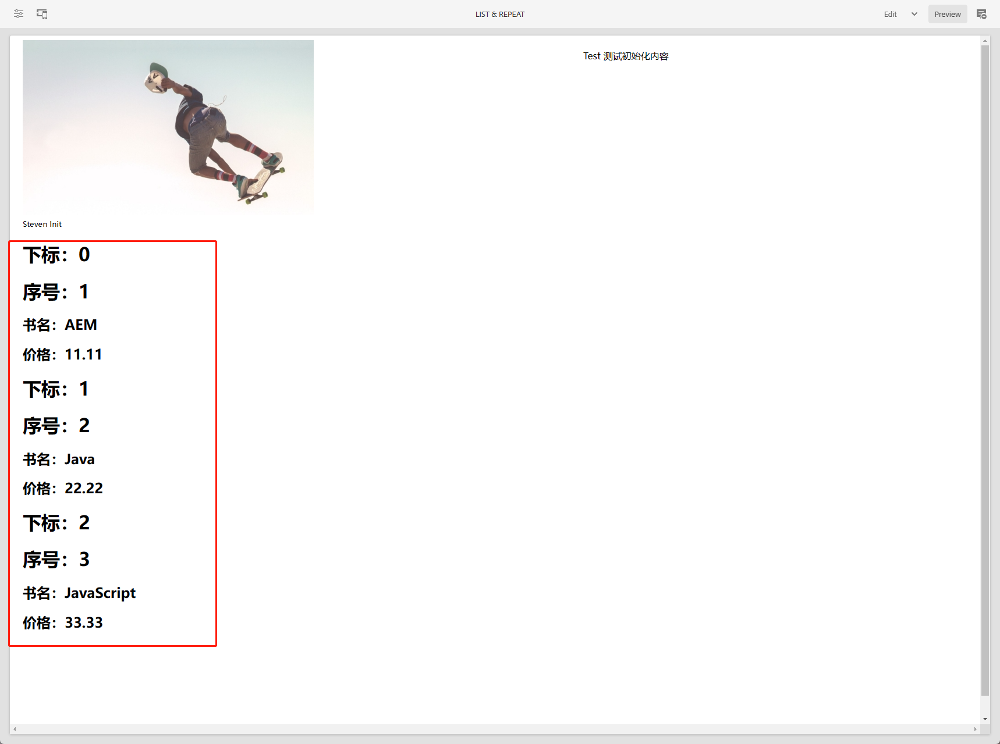
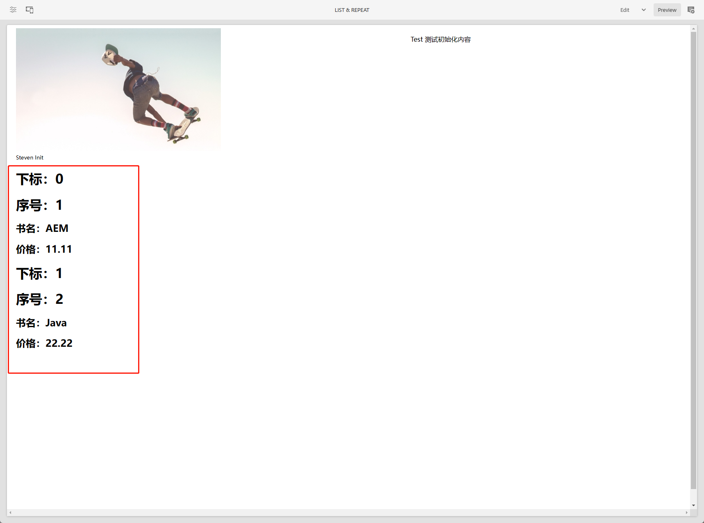
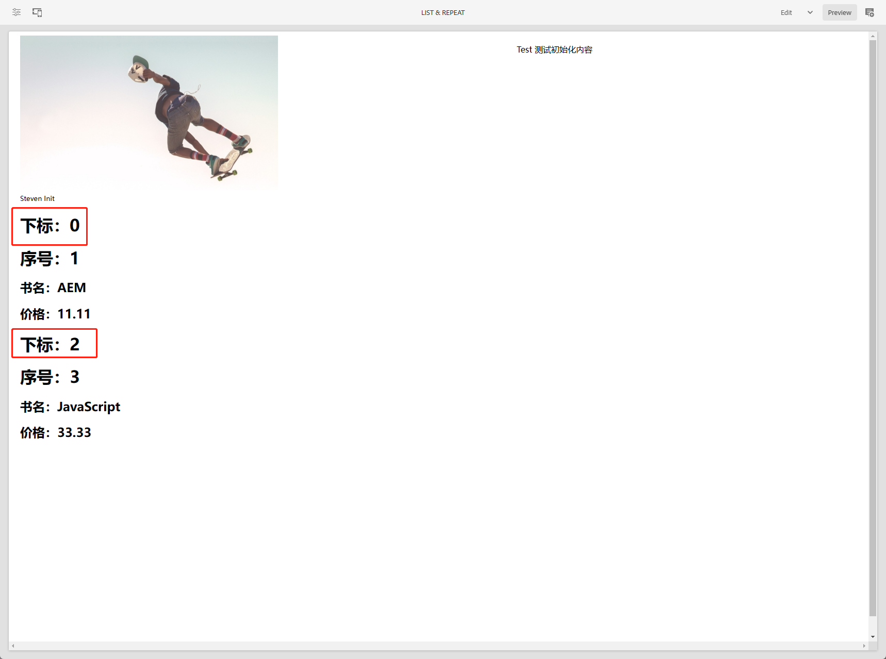
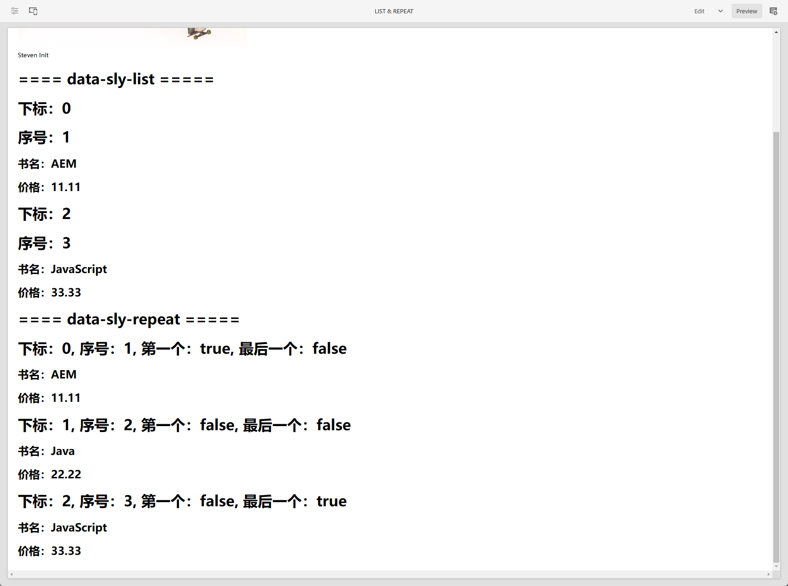

[TOC]

# 22、HTL Sightly （一）data-sly-list & data-sly-repeat

在HTL模板语言中，有大量的API可供使用，在这一章中主要来讲解如何在HTL页面中使用data-sly-list和data-sly-repeat来展示数据列表。

## data-sly-list

使用data-sly-list来展现一个数据列表，创建HTLSightly.java接口和HTLSightlyImpl.java实现类，与之前章节中讲到的SlingModel创建方式一致

```java
package com.adobe.aem.guides.wknd.core.models;

import com.adobe.aem.guides.wknd.core.models.dto.Book;

import java.util.List;

public interface HTLSightly {

    List<Book> getBooks();
}
```

```java
package com.adobe.aem.guides.wknd.core.models.impl;

import com.adobe.aem.guides.wknd.core.models.HTLSightly;
import com.adobe.aem.guides.wknd.core.models.dto.Book;
import com.adobe.cq.export.json.ExporterConstants;
import lombok.extern.slf4j.Slf4j;
import org.apache.sling.api.SlingHttpServletRequest;
import org.apache.sling.api.resource.Resource;
import org.apache.sling.models.annotations.DefaultInjectionStrategy;
import org.apache.sling.models.annotations.Exporter;
import org.apache.sling.models.annotations.Model;

import java.util.ArrayList;
import java.util.List;

@Slf4j
@Model(
        adaptables = {SlingHttpServletRequest.class, Resource.class},
        adapters = {HTLSightly.class},
        resourceType = {HTLSightlyImpl.RESOURCE_TYPE},
        defaultInjectionStrategy = DefaultInjectionStrategy.OPTIONAL
)
@Exporter(name = ExporterConstants.SLING_MODEL_EXPORTER_NAME, extensions = ExporterConstants.SLING_MODEL_EXTENSION)
public class HTLSightlyImpl implements HTLSightly {

    public final static String RESOURCE_TYPE = "wknd-guides/components/htlsightly";

    @Override
    public List<Book> getBooks() {
        List<Book> books = new ArrayList<>();
        books.add(Book.builder().name("AEM").price(11.11).build());
        books.add(Book.builder().name("Java").price(22.22).build());
        books.add(Book.builder().name("JavaScript").price(33.33).build());
        return books;
    }
}
```

创建实体类Book.java

```java
package com.adobe.aem.guides.wknd.core.models.dto;

import lombok.AllArgsConstructor;
import lombok.Builder;
import lombok.Data;
import lombok.NoArgsConstructor;
import lombok.experimental.Accessors;

@Data
@AllArgsConstructor
@NoArgsConstructor
@Builder
@Accessors(chain = true)
public class Book {

    private String name;

    private double price;

}
```

对话框中的ID没有实际作用，在后期可以通过手动维护ID类达到在页面上获取为一组件元素的功能

```xml
<?xml version="1.0" encoding="UTF-8"?>
<jcr:root xmlns:sling="http://sling.apache.org/jcr/sling/1.0" xmlns:granite="http://www.adobe.com/jcr/granite/1.0" xmlns:cq="http://www.day.com/jcr/cq/1.0" xmlns:jcr="http://www.jcp.org/jcr/1.0" xmlns:nt="http://www.jcp.org/jcr/nt/1.0"
    jcr:primaryType="nt:unstructured"
    jcr:title="list and repeat"
    sling:resourceType="cq/gui/components/authoring/dialog">
    <content
        jcr:primaryType="nt:unstructured"
        sling:resourceType="granite/ui/components/coral/foundation/container">
        <items jcr:primaryType="nt:unstructured">
            <tabs
                jcr:primaryType="nt:unstructured"
                sling:resourceType="granite/ui/components/coral/foundation/tabs"
                maximized="{Boolean}false">
                <items jcr:primaryType="nt:unstructured">
                    <properties
                        jcr:primaryType="nt:unstructured"
                        jcr:title="Properties"
                        sling:resourceType="granite/ui/components/coral/foundation/container"
                        margin="{Boolean}true">
                        <items jcr:primaryType="nt:unstructured">
                            <columns
                                jcr:primaryType="nt:unstructured"
                                sling:resourceType="granite/ui/components/coral/foundation/fixedcolumns"
                                margin="{Boolean}true">
                                <items jcr:primaryType="nt:unstructured">
                                    <column
                                        jcr:primaryType="nt:unstructured"
                                        sling:resourceType="granite/ui/components/coral/foundation/container">
                                        <items jcr:primaryType="nt:unstructured">
                                            <id
                                                jcr:primaryType="nt:unstructured"
                                                sling:resourceType="granite/ui/components/coral/foundation/form/textfield"
                                                fieldLabel="ID"
                                                name="./id"/>
                                        </items>
                                    </column>
                                </items>
                            </columns>
                        </items>
                    </properties>
                </items>
            </tabs>
        </items>
    </content>
</jcr:root>
```

组件配置信息

```xml
<?xml version="1.0" encoding="UTF-8"?>
<jcr:root 
    xmlns:sling="http://sling.apache.org/jcr/sling/1.0"
    xmlns:jcr="http://www.jcp.org/jcr/1.0"
    jcr:primaryType="cq:Component"
    jcr:title="list and repeat"
    jcr:description="list and repeat"
    componentGroup="Steven Group" />
```

组件页面信息

- data-sly-list.book：data-sly-list为遍历集合数据的API，book为集合中的单个元素名称，可自定义
- bookList.index：当使用data-sly-list来遍历集合数据时，默认会创建一个\*List，\*为元素名称，index可以获取到下标值
- bookList.count：可以获取到下标+1
- bookList.first：是否为第一个数据
- bookList.middle：是否为中间的数据
- bookList.last：是否为最后一个数据
- bookList.odd：是否为奇数个数据

```html
<div class="cq-placeholder cmp-title" data-emptytext="${component.title}:Click to configure" data-sly-unwrap="${!wcmmode.edit}"></div>

<sly data-sly-use.model="com.adobe.aem.guides.wknd.core.models.HTLSightly">
    <div data-sly-list.book="${model.books}">
        <h1>下标：${bookList.index}</h1>
        <h1>序号：${bookList.count}</h1>
        <h2>书名：${book.name}</h2>
        <h2>价格：${book.price}</h2>
    </div>
</sly>
```

创建页面新增list repeat组件，效果如下



### 显示列表中的一部分数据

如果只想显示列表中的一部分该如何做呢？可以使用@符号增加操作变量，修改代码如下，下标从0开始，到1结束，就是显示前两个内容

```html
<div data-sly-list.book="${model.books @ begin = 0, end = 1}">
```

刷新页面，只看到了前两条数据



如果只想显示偶数下标的数据，可以添加step参数，代码如下

```html
<div data-sly-list.book="${model.books @ begin = 0, step=2, end = 2}">
```



## data-sly-repeat

data-sly-repeat与data-sly-list使用方式一样，修改如下代码

```html
<div class="cq-placeholder cmp-title" data-emptytext="${component.title}:Click to configure" data-sly-unwrap="${!wcmmode.edit}"></div>

<sly data-sly-use.model="com.adobe.aem.guides.wknd.core.models.HTLSightly">
    <h1>==== data-sly-list =====</h1>
    <div  class="list" data-sly-list.book="${model.books @ begin = 0, step=2, end = 2}">
        <h1>下标：${bookList.index}</h1>
        <h1>序号：${bookList.count}</h1>
        <h2>书名：${book.name}</h2>
        <h2>价格：${book.price}</h2>
    </div>

    <h1>==== data-sly-repeat =====</h1>
    <div class="repeat" data-sly-repeat.book="${model.books}">
        <h1>下标：${bookList.index}, 序号：${bookList.count}, 第一个：${bookList.first}, 最后一个：${bookList.last}</h1>
        <h2>书名：${book.name}</h2>
        <h2>价格：${book.price}</h2>
    </div>
</sly>
```

查看页面显示效果



## data-sly-repeat与data-sly-list的区别

data-sly-repeat与data-sly-list显示效果是一样的，那么它们有什么区别？

查看页面源码会发现，两者在页面的渲染方式不同。

- data-sly-list：会把所有的元素和属性都放在class为list的div元素中
- data-sly-repeat：会把class为repeat的div元素复制一份，再把元素内容渲染在div中

