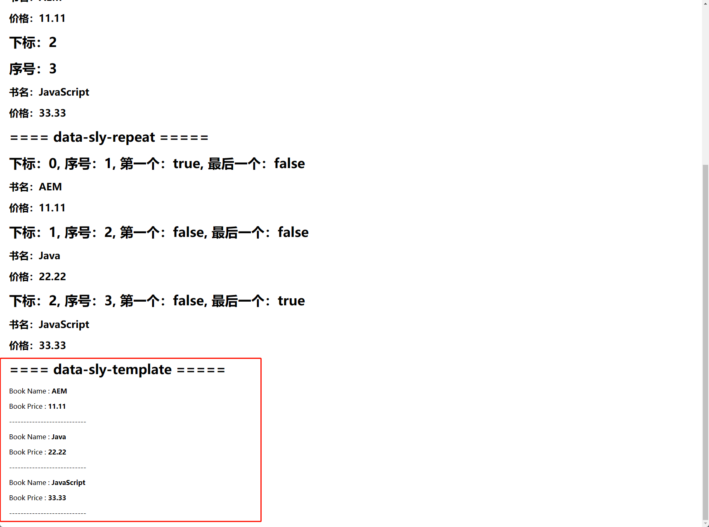

[TOC]

# 23、HTL Sightly （二）data-sly-template & data-sly-call

data-sly-template语句可以将一些特定的组件展示方式作为一个模板来使用，这样可以使得页面结构简洁清晰。

## data-sly-template

在htlsightly组件目录下创建模板文件booksTemplate.html

- data-sly-template.templateBooks：将模板元素定义为templateBooks

- @ books：表示需要传入books参数

```html
<div data-sly-template.templateBooks="${@ books}">
    <div data-sly-list.book="${books}">
        <p>Book Name : <b>${book.name}</b></p>
        <p>Book Price : <b>${book.price}</b></p>
        <p>---------------------------</p>
    </div>
</div>
```

在htlsightly组件中引入模板，从倒数第五行开始为引入template语法

- data-sly-use.booksTemplate：使用模板元素booksTemplate

- @ books：将model中的books集合以参数形式传递给模板中的templateBooks元素

```html
<div class="cq-placeholder cmp-title" data-emptytext="${component.title}:Click to configure" data-sly-unwrap="${!wcmmode.edit}"></div>

<sly data-sly-use.model="com.adobe.aem.guides.wknd.core.models.HTLSightly">
    <h1>==== data-sly-list =====</h1>
    <div  class="list" data-sly-list.book="${model.books @ begin = 0, step=2, end = 2}">
        <h1>下标：${bookList.index}</h1>
        <h1>序号：${bookList.count}</h1>
        <h2>书名：${book.name}</h2>
        <h2>价格：${book.price}</h2>
    </div>

    <h1>==== data-sly-repeat =====</h1>
    <div class="repeat" data-sly-repeat.book="${model.books}">
        <h1>下标：${bookList.index}, 序号：${bookList.count}, 第一个：${bookList.first}, 最后一个：${bookList.last}</h1>
        <h2>书名：${book.name}</h2>
        <h2>价格：${book.price}</h2>
    </div>

    <h1>==== data-sly-template =====</h1>
    <div data-sly-use.booksTemplate="booksTemplate.html">
        <sly data-sly-call="${booksTemplate.templateBooks @ books=model.books}"></sly>
    </div>
</sly>
```

查看效果



## data-sly-call

在上面的代码中，可以看到在使用模板时需要通过data-sly-call来调用模板中的元素booksTemplate.templateBooks，并将model中的Books集合传递给templateBooks元素

```html
<h1>==== data-sly-template =====</h1>
<div data-sly-use.booksTemplate="booksTemplate.html">
    <sly data-sly-call="${booksTemplate.templateBooks @ books=model.books}"></sly>
</div>
```

