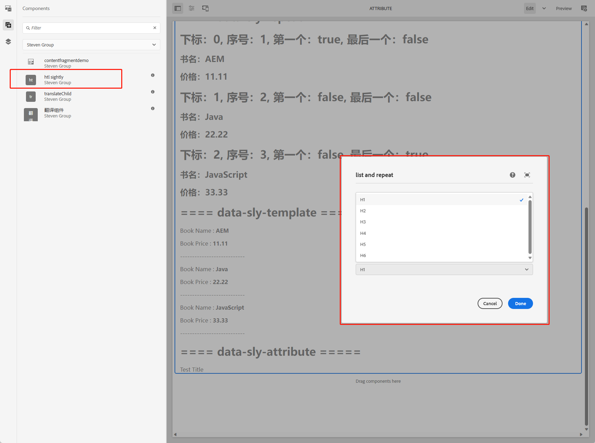

[TOC]

# 24、HTL Sightly（三）data-sly-element & data-sly-attribute

这一章讲解如何在HTL中使用data-sly-element和data-sly-attribute标签来实现动态HTML元素和动态元素属性。

## data-sly-element 

### 创建对话框中的元素选择器

打开htlsightly组件的对话框配置文件.content.xml，在ID节点下新增Title和TitleSize

```xml
<title
    jcr:primaryType="nt:unstructured"
    sling:resourceType="granite/ui/components/coral/foundation/form/textfield"
    fieldLabel="Title"
    name="./title"/>
<titlesize
    jcr:primaryType="nt:unstructured"
    sling:resourceType="granite/ui/components/coral/foundation/form/select"
    fieldDescription="Please select Title size"
    fieldLabel="Title Size"
    name="./titleSize">
    <items jcr:primaryType="nt:unstructured">
        <h1
            jcr:primaryType="nt:unstructured"
            text="H1"
            value="h1"/>
        <h2
            jcr:primaryType="nt:unstructured"
            text="H2"
            value="h2"/>
        <h3
            jcr:primaryType="nt:unstructured"
            text="H3"
            value="h3"/>
        <h4
            jcr:primaryType="nt:unstructured"
            text="H4"
            value="h4"/>
        <h5
            jcr:primaryType="nt:unstructured"
            text="H5"
            value="h5"/>
        <h6
            jcr:primaryType="nt:unstructured"
            text="H6"
            value="h6"/>
    </items>
</titlesize>
```

组件效果如下：


元素选择器效果如下：



### SlingModel的修改

打开之前创建的HTLSightlyImpl.java类，增加属性获取，也可以在HTL中直接使用properties获取，新增了title和titleSize属性

```java
package com.adobe.aem.guides.wknd.core.models.impl;

import com.adobe.aem.guides.wknd.core.models.HTLSightly;
import com.adobe.aem.guides.wknd.core.models.dto.Book;
import com.adobe.cq.export.json.ExporterConstants;
import lombok.Getter;
import lombok.extern.slf4j.Slf4j;
import org.apache.sling.api.SlingHttpServletRequest;
import org.apache.sling.api.resource.Resource;
import org.apache.sling.models.annotations.Default;
import org.apache.sling.models.annotations.DefaultInjectionStrategy;
import org.apache.sling.models.annotations.Exporter;
import org.apache.sling.models.annotations.Model;
import org.apache.sling.models.annotations.injectorspecific.InjectionStrategy;
import org.apache.sling.models.annotations.injectorspecific.ValueMapValue;

import java.util.ArrayList;
import java.util.HashMap;
import java.util.List;
import java.util.Map;

@Slf4j
@Model(
        adaptables = {SlingHttpServletRequest.class, Resource.class},
        adapters = {HTLSightly.class},
        resourceType = {HTLSightlyImpl.RESOURCE_TYPE},
        defaultInjectionStrategy = DefaultInjectionStrategy.OPTIONAL
)
@Exporter(name = ExporterConstants.SLING_MODEL_EXPORTER_NAME, extensions = ExporterConstants.SLING_MODEL_EXTENSION)
public class HTLSightlyImpl implements HTLSightly {

    public final static String RESOURCE_TYPE = "wknd-guides/components/htlsightly";

    @Getter
    @ValueMapValue(injectionStrategy = InjectionStrategy.OPTIONAL)
    @Default(values = "h1")
    private String titleSize;

    @Getter
    @ValueMapValue(injectionStrategy = InjectionStrategy.OPTIONAL)
    private String title;

    @Override
    public List<Book> getBooks() {
        List<Book> books = new ArrayList<>();
        books.add(Book.builder().name("AEM").price(11.11).build());
        books.add(Book.builder().name("Java").price(22.22).build());
        books.add(Book.builder().name("JavaScript").price(33.33).build());
        return books;
    }
}
```

### HTL中使用data-sly-element

打开htlsightly.html，新增如下代码

```html
<h1>==== data-sly-element & data-sly-attribute =====</h1>
<div data-sly-element="${model.titleSize}" data-sly-test="${model.title}">${model.title}</div>
```

查看效果如下：


可以看到代码中的div已被替换为h1标签，如果在组件对话框中选择h2，则Title元素为h2

**NOTE: 代码中必须要使用div标签，不能使用sly标签，否则不生效。**

## data-sly-attribute

data-sly-attribute标签可以实现HTML元素的属性动态化获取。

修改html代码：

```html
<h1>==== data-sly-element & data-sly-attribute =====</h1>
<div data-sly-element="${model.titleSize}" data-sly-test="${model.title}" data-sly-attribute.id="id">${model.title}</div>
<div data-sly-test="${model.title}" data-sly-attribute.class="class">${model.title}</div>
<div data-sly-test="${model.title}" data-sly-attribute="${model.attributes}">${model.title}</div>
```

在中新增属性attributes和get方法

```java
private Map<String, String> attributes;

public Map<String, String> getAttributes() {
    attributes = new HashMap<>();
    attributes.put("id", "testId");
    attributes.put("class", "testClass");
    return attributes;
}
```

查看效果：


- 第一行中，新增了id="id"
- 第二行中，新增了class="class"
- 第三行中，使用了SlingModel中的attributes变量来获取多个元素属性，id="testId", class="testClass"

在data-sly-attribute标签后，可以使用html中自带的元素也可以使用自定义元素。
