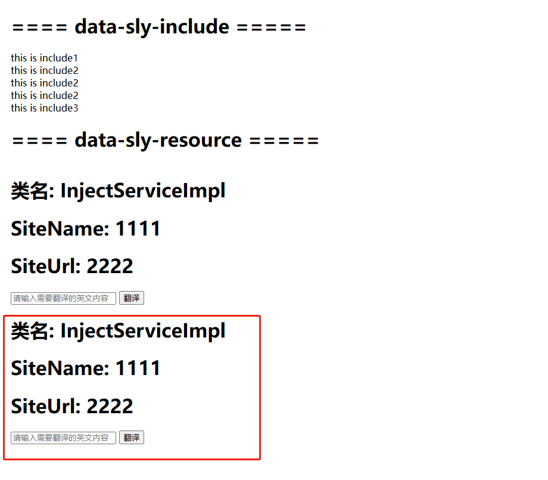

[TOC]

# 25、HTL Sightly（四）data-sly-include & data-sly-resource

这一章讲解如何在HTL中使用data-sly-include和data-sly-resource标签进行HTML片段封装。

## data-sly-include

### 基础用法

编辑htlsightly.html，新增如下代码

```html
<h1>==== data-sly-include & data-sly-resource =====</h1>
<div data-sly-include="include1.html"></div>
```

在htlsightly.html同级目录下创建include1.html文件

```html
<div>this is include1</div>
```

查看效果


可以看到include1.html内容已经输出，修改代码如下

```html
<div class="include1" data-sly-include="include1.html">include1 content</div>
```

再次查看效果


**可以看到include1.html内容已经输出，但是include1 content内容并没有输出，所以data-sly-include标签只会输出要包含的文件内容**

### 表达式用法

修改代码如下

```html
<div data-sly-include="${'include2.html' @ prependPath='include'}"></div>
<div data-sly-include="${'include' @ appendPath='include2.html'}"></div>
<div data-sly-include="${@ file='include3.html'}"></div>
<div data-sly-include="${'include3.html' @ prependPath='/prependPath', appendPath='/appendPath'}"></div>
```

显示效果


1. prependPath是将目录拼接在文件名之前，等同于include/include2.html
2. appendPath是将文件名拼接在目录之后，等同于include/include2.html
3. @ file与${''}同等效果
4. 同时使用appendPath和prependPath永远都不会生效

## data-sly-resource

data-sly-resource标签可以将任意resource引入到当前html中

### 引入页面（不推荐使用）

修改代码如下

```html
<h1>==== data-sly-resource =====</h1>
<div data-sly-resource="${'/content/wknd/us/en/steven'}"></div>
```

查看效果，将/content/wknd/us/en/steven页面内容全部引入


### 引入组件

修改代码

```html
<div data-sly-resource="${'/content/wknd/us/en/steven/jcr:content/root/container/translate'}"></div>
```

查看效果，translate组件已经被引入


data-sly-resource标签也支持表达式prependPath和appendPath。还可以使用resourceType强制指定资源类型，@符号前的名称可自定义

```html
<div data-sly-resource="${'translate' @ resourceType='wknd/components/translate'}"></div>
```

查看效果



data-sly-resource可以引入JCR中的任意资源节点，所以常用在基础页面结构中，添加Header和Footer使所有页面用有统一的页面组件内容。