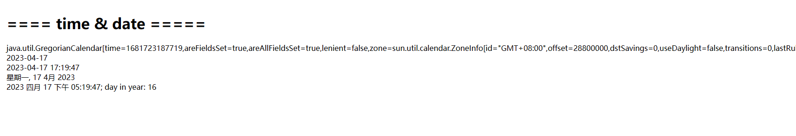

[TOC]

# 26、HTL Sightly（五）Format&Time & Date

在这一节中介绍如何使用format来格式化日期和时间。

在之前创建的htlsightly组件页面中，添加如下代码：

```html
<h1>==== time & date =====</h1>
${properties.jcr:created}
<div>${'yyyy-MM-dd' @ format=properties.jcr:created}</div>
<div>${'yyyy-MM-dd HH:mm:ss' @ format=properties.jcr:created, timezone='GMT+8'}</div>
<div>${'EEEE, d MMM y' @ format=properties.jcr:created, timezone='GMT+8', locale='zh'}</div>
<div>${'yyyy MMMM dd a hh:mm:ss; \'day in year\': w' @ format=properties.jcr:created, timezone='GMT+8', locale='zh'}</div>
```

查看效果



- 第一行中输出了组件htlsightly的创建时间，是一个时间对象，包含很多所有的时间信息

- 第二行中使用了yyyy-MM-dd表达式来格式化时间显示，内容为2023-4-17
- 第三行中使用了yyyy-MM-dd HH:mm:ss表达式来格式化时间，并设置了时区为GMT+8
- 第四行中使用EEEE, d MMM y表达式格式化时间，显示内容为“星期一, 17 4月 2023”，加上了星期的显示
- 第五种中使用了复杂的自定义表达式yyyy MMMM dd a hh:mm:ss; \'day in year\': w'格式化时间内容，a表示上午还是下午，w表示在一年中的第几天

时间和日期格式化的所有支持类型如下：

- `y` - Year. Variants: `yy`, `yyyy`
- `M` - Month in year. Variants: `MM`, `MMM`, `MMMM`
- `w` - Week in year. Variants: `ww`
- `D` - Day in year. Variants: `DD`, `DDD`
- `d` - Day in month. Variants: `dd`
- `E` - Day name in week. Variants: `EEEE`
- `a` - Am/pm marker
- `H` - Hour in day (0-23). Variants: `HH`
- `h` - Hour in am/pm. Variants: `hh`
- `m` - Minute in hour. Variants: `mm`
- `s` - Second in minute. Variants: `ss`
- `S` - Millisecond. Variants: `SSS`
- `z` - General time zone
- `Z` - RFC 822 time zone
- `X` - ISO 8601 time zone. Variants: `XX`, `XXX`

------

Format表达式可以用于格式化字符串、日期和数字。表达式中必须提供格式化模式字符串，格式选项将包含要使用的值。

格式化的类型可以基于下面四种规则:

1. 数据类型，数据不为空的情况下，可格式化的类型为字符串、日期和数字
2. 模式中的占位符(例如:{0})会触发字符串格式化
3. 当类型是日期或数字时，需要指定格式化选项对象的类型
4. 默认情况下，按字符串格式化数据

------

## 示例：

### 字符串

字符串格式化还可以与i18n选项结合使用，以便在字符串在字典中运行后替换占位符。

```html
${'Asset {0} out of {1}' @ format=[properties.current, properties.total]}
```

效果：

```shell
Asset 3 out of 5
```

------

### 数字

数字格式支持本地化。如果还指定了国际化(i18n)，则它将应用于格式化模式，并将区域设置传递给格式化。

```shell
${'#.00' @ format=myNumber, type='number', locale='ch'}
```

- type: 强制化格式类型
- locale：区域选择，根据不同的国家区域显示对应的语言内容

格式化模式同时支持正号和负号，由分号分隔。每个子模式可以有一个前缀、一个数字部分和一个后缀。否定子模式只能改变前缀(或/和)后缀。

数字类型支持以下字符:

- `0` - digit, shows as 0 if absent
- `#` - digit, does not show if absent
- `.` - decimal separator
- `-` - minus sign
- `,` - grouping separator
- `E` - separator between mantissa and exponent
- `;` - sub-pattern boundary
- `%` - multiply by 100 and show as percentage

```shell
${'#,###.00' @ format=1000}
${'#.###;-#.###' @ format=obj.number} # 3.14
```

效果：

```shell
1,000.00
-3.14
```
