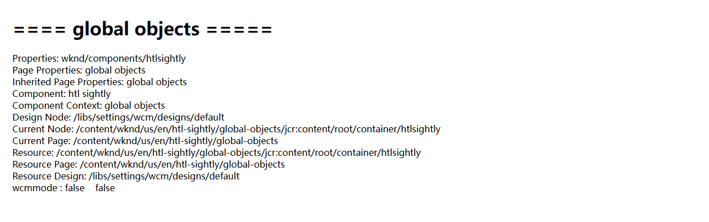

[TOC]

# 27、HTL Sightly（六）Global Objects

在之前的章节中，有时会用到properties对象，可以获取到当前组件的属性和内容。在这一节中，介绍一些HTL常用的对象及使用方法。

## Enumerable Objects

创建页面/content/wknd/us/en/htl-sightly/global-objects，添加htlsightly组件

修改组件页面代码

```html
<h1>==== global objects =====</h1>
<div>Properties: ${properties.sling:resourceType}</div>
<div>Page Properties: ${pageProperties.jcr:title}</div>
<div>Inherited Page Properties: ${inheritedPageProperties.jcr:title}</div>
```

### properties

properties对象可以获取到组件节点的信息内容，在JCR中的路径为/content/wknd/us/en/htl-sightly/global-objects/jcr:content/root/container/htlsightly


### pageProperties

pageProperties对象可以获取到组件所在页面的信息内容，在JCR中的路径为/content/wknd/us/en/htl-sightly/global-objects/jcr:content


### inheritedPageProperties

inheritedPageProperties对象可以获取到组件从父级节点继承来的属性，例如（jcr:title），在JCR中打开页面信息/content/wknd/us/en/htl-sightly/global-objects/jcr:content，并删除jcr:title属性，刷新页面可以看到inheritedPageProperties拿到的值为global-objects页面的父级页面属性htl sightly，如果在htl-sightly页面中也不存在，则继续向父级页面获取jcr:title属性


## Java Objects

修改组件代码

```html
<div>Component: ${component.title}</div>
<div>Component Context: ${componentContext.page.title}</div>
<div>Design Node: ${currentDesign.path}</div>
<div>Current Node: ${currentNode.path}</div>
<div>Current Page: ${currentPage.path}</div>
<div>Resource: ${resource.path}</div>
<div>Resource Page: ${resourcePage.path}</div>
<div>Resource Design: ${resourceDesign.path}</div>
<div>wcmmode : ${wcmmode.edit} &nbsp;&nbsp; ${wcmmode.preview}</div>
```

效果如下



### component

获取组件内部信息，component.title可以获取到组件的名称

### componentContext

获取组件所在页面的内容，componentContext.page.title可以获取到组件所在页面的名称

### resource

获取组件资源的信息，与组件节点内容一致，resource.path可以获取到组件的路径

### resourcePage

获取组件所在页面的信息，与组件所在页面内容一致，resourcePage.path可以获取到组件所在页面的路径

### currentDesign

如果此页面上使用了指定的设计信息（模板、策略等），会获取到这些指定信息，如果没有使用，则获取到默认的设计信息路径

### currentNode

与resource一致

### currentPage

获取当前打开的页面信息，currentPage.path可以获取到当前页面的路径

### resourceDesign

获取设计信息的资源内容

### wcmmode

表示当前页面的模式，在Edit页面中，wcmmode.edit为true，点击Preview按钮后，wcmmode.preview会为true，在view as publish模式下，二者都为false
