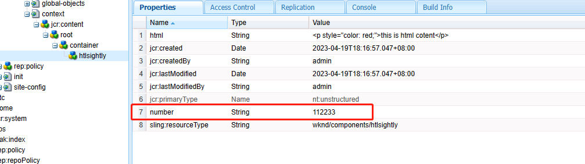

[TOC]

# 28、HTL Sightly（七）Context

项目中有时需要将前端的样式或内容保存在JCR中并显示在HTL中，就需要用到context关键字。context关键字会依据传入的参数类型进行不同的操作。

## styleToken

将样式代码显示在HTL中，新增页面代码

```html
<h1>==== context =====</h1>
<div style="color: ${'red'};">
    <p>Style Token not working</p>
</div>
<div style="color: ${'red' @ context='styleToken'};">
    <p>Style Token working</p>
</div>
```

显示效果


## styleString

将样式代码显示在HTL中，给div元素增加一个红色的上边框，新增页面代码

```html
<div style="border-top: ${'2px solid red' @ context='styleToken'};">
    <p>Style Token not working</p>
</div>
<div style="border-top: ${'2px solid red' @ context='styleString'};">
    <p>Style String working</p>
</div>
```

显示效果


**NOTE：可以看到styleToken和styleString有时显示效果一致，区别在于，如果样式内容中包含空格、逗号等特殊字符时，styleToken就不再生效，所以推荐所有的样式内容都用styleString类型**

## scriptToken

scriptToken可以将脚本代码显示在HTL模板中，添加如下代码

```html
<div><button onclick="location.href='${'https://www.baidu.com'}'">打开百度</button></div>
<div><button onclick="location.href='${'https://www.baidu.com' @ context='scriptToken'}'">打开百度</button></div>
```

显示效果，分别点击两个按钮不生效


因为链接内容中包含特殊字符，所以scriptToken也不生效

## scriptString

scriptString也可以将脚本代码显示在HTL模板中，添加如下代码

```html
<div><button onclick="location.href='${'https://www.baidu.com' @ context='scriptString'}'">打开百度</button></div>
```

查看结果，点击按钮可以跳转到百度


## html

在htlsightly组件中添加属性html和值


新增代码

```html
<h2>==== html ====</h2>
<div>${properties.html}</div>
<div>${properties.html @ context='html'}</div>
```

查看效果，第一行会把所有的内容输出，第二行会将html代码嵌入到页面中


## number

在htlsightly组件中添加属性number和值，类型为String



新增代码

```html
<h2>==== number ====</h2>
<div>${properties.number}</div>
<div>${properties.number @ context='number'}</div>
<div>${'abcdef' @ context='number'}</div>
```

查看效果，第一行和第二行都将字符串形式转为number，第三行由于`abcdef`不能转为数字，则显示默认值0


## 其他

context关键字还支持许多其他的类型，如下：

```html
${properties.jcr:title @ context='html'}         <!--/* Use this in case you want to output HTML - Removes markup that may contain XSS risks */-->
${properties.jcr:title @ context='text'}          <!--/* Use this for simple HTML content - Encodes all HTML */-->
${properties.jcr:title @ context='elementName'}   <!--/* Allows only element names that are white-listed, outputs 'div' otherwise */-->
${properties.jcr:title @ context='attributeName'} <!--/* Outputs nothing if the value doesn't correspond to the HTML attribute name syntax - doesn't allow 'style' and 'on*' attributes */-->
${properties.jcr:title @ context='attribute'}     <!--/* Applies HTML attribute escaping */-->
${properties.jcr:title @ context='uri'}           <!--/* Outputs nothing if the value contains XSS risks */-->
${properties.jcr:title @ context='scriptToken'}   <!--/* Outputs nothing if the value doesn't correspond to an Identifier, String literal or Numeric literal JavaScript token */-->
${properties.jcr:title @ context='scriptString'}  <!--/* Applies JavaScript string escaping */-->
${properties.jcr:title @ context='scriptComment'} <!--/* Context for Javascript block comments. Outputs nothing if value is trying to break out of the comment context */-->
${properties.jcr:title @ context='scriptRegExp'}  <!--/* Applies JavaScript regular expression escaping */-->
${properties.jcr:title @ context='styleToken'}    <!--/* Outputs nothing if the value doesn't correspond to the CSS token syntax */-->
${properties.jcr:title @ context='styleString'}   <!--/* Applies CSS string escaping */-->
${properties.jcr:title @ context='styleComment'}  <!--/* Context for CSS comments. Outputs nothing if value is trying to break out of the comment context */-->
${properties.jcr:title @ context='comment'}       <!--/* Applies HTML comment escaping */-->
${properties.jcr:title @ context='number'}        <!--/* Outputs zero if the value is not a number */-->
${properties.jcr:title @ context='unsafe'}        <!--/* Use this at your own risk, this disables XSS protection completely */-->
```

注意：`context='elementName'`只允许以下元素:

```html
section, nav, article, aside, h1, h2, h3, h4, h5, h6, header, footer, address, main, p, pre, blockquote, ol, li, dl, dt, dd, figure, figcaption, div, a, em, strong, small, s, cite, q, dfn, abbr, data, time, code, var, samp, kbd, sub, sup, i, b, u, mark, ruby, rt, rp, bdi, bdo, span, br, wbr, ins, del, table, caption, colgroup, col, tbody, thead, tfoot, tr, td, th
```

