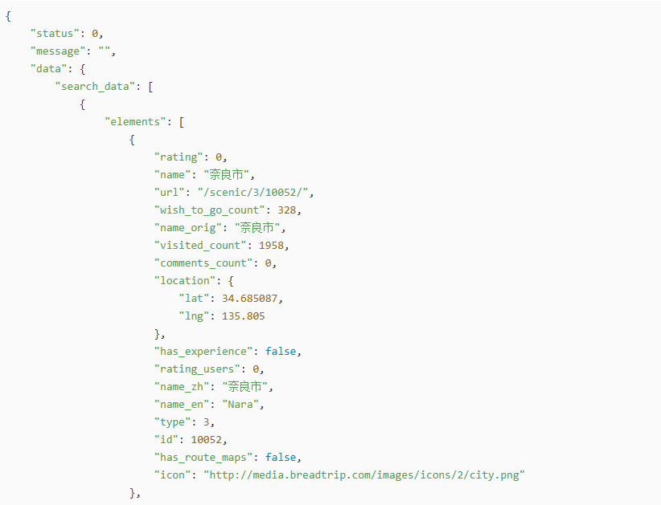

[TOC]

# 29、HTL Sightly（八）data-sly-set

在AEM的组件开发中，最常用的就是SlingModel，在SlingModel中可以做任何事情（获取、分析、处理）数据等。在很多情况下，会存在数据结构非常复杂，层级非常深，这时在HTL中显示某些数据时变量就会非常长，并且不易维护。这时就可以使用data-sly-set来将数据结构进行拆分。

## data-sly-set

在HTLSightly.java接口和实现类中新增如下代码

新增接口方法

```java
Book getBook();
```

新增方法实现

```java
@Override
public Book getBook() {
    return Book.builder().name("React").price(44.44).build();
}
```

在HTL中新增显示内容

```html
<h1>==== data-sly-set =====</h1>
<div>Book Name: ${model.book.name}</div>
<div>Book Price: ${model.book.price}</div>
```

查看显示效果


在第一步中使用的直接调用属性来显示内容，这只适用于数据层级较少的情况。在层级较多的情况下，HTL变量就变得不易维护，比如下面的数据结构，稍微有些复杂（实际情况远比这样的结构还要复杂）



在这种情况下，就需要使用data-sly-set来进行结构拆分

在HTL中新增如下代码

```html
<div data-sly-set.book="${model.book}">
    <div>Book Name: ${book.name}</div>
    <div>Book Price: ${book.price}</div>
</div>
```

查看显示效果


显示结果一致，但从结构上来说，代码更易维护也更直观。