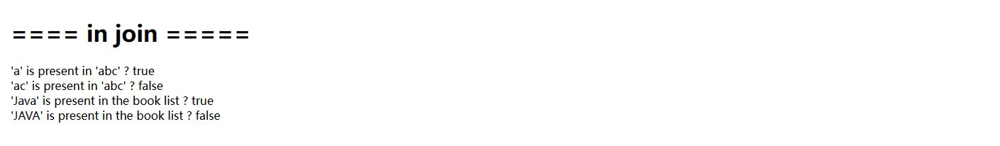
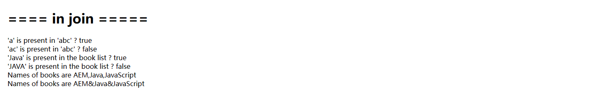

[TOC]

# 30、HTL Sightly（九）Operator In & Join

通常一个SlingModel对应一个前端显示页面，在某些特殊情况下，需要不同的组件对相同的数据进行不同的展示，还要对数据做一定的校验和处理，那就需要在HTL中使用一些操作符。

- in：校验in前的数据是否存在于in后的数据
- join：与Java中的join一样，可以把数组、列表中的数据用一个字符串联起来

## In

组件SlingModel代码

```java
@Override
public List<Book> getBooks() {
    List<Book> books = new ArrayList<>();
    books.add(Book.builder().name("AEM").price(11.11).build());
    books.add(Book.builder().name("Java").price(22.22).build());
    books.add(Book.builder().name("JavaScript").price(33.33).build());
    return books;
}

public List<String> getBookNames() {
    return getBooks().stream().map(Book::getName).collect(Collectors.toList());
}
```

组件页面代码

```html
<h1>==== in join =====</h1>
<div>'a' is present in 'abc' ? ${'a' in 'abc'}</div>
<div>'ac' is present in 'abc' ? ${'ac' in 'abc'}</div>
<div>'Java' is present in the book list ? ${'Java' in model.bookNames}</div>
<div>'JAVA' is present in the book list ? ${'JAVA' in model.bookNames}</div>
```

查看效果



1. 字符a在字符串abc中，显示结果为true
2. 字符ac作为一个整体在abc中不存在，显示结果为false
3. Java在书籍名称列表中存在，显示结果为true
4. JAVA在书籍名称列表中不存在，显示结果为false

**NOTE: in操作符对大小写敏感**

## Join

组件页面代码

```html
<div>Names of books are ${model.bookNames @ join=','}</div>
<div>Names of books are ${model.bookNames @ join='&'}</div>
```

显示效果



第五行结果显示用逗号将书籍名称串联

第六行结果显示用&符将书籍名称串联
