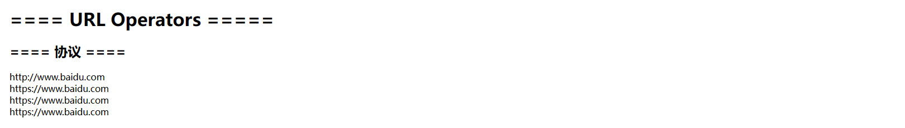
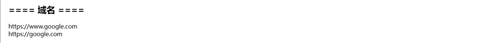
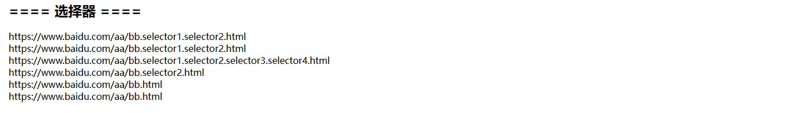
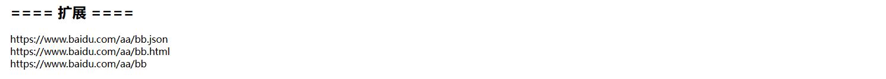
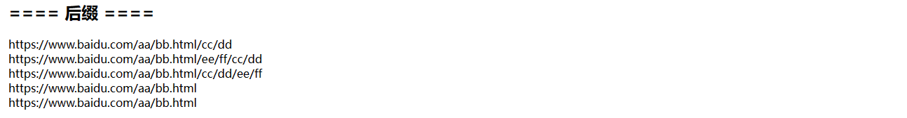
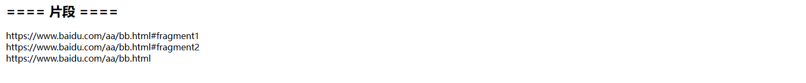

[TOC]

# 31、HTL Sightly（10）URL Operators 

在HTL模板中经常需要展示一些页面的URL，例如：从首页跳转到某个特定页面。通常需要对URL进行一些处理，常用的处理操作如下：

- scheme：修改URL协议
- domain：修改URL域名
- selectors：修改URL选择器
- extension：修改URL扩展
- suffix：修改URL后缀
- fragment：修改URL片段

## scheme

新增代码：

```html
<h2>==== 协议 ====</h2>
<div>${'//www.baidu.com' @ scheme='http'}</div>
<div>${'http://www.baidu.com' @ scheme='https'}</div>
<div>${'https://www.baidu.com' @ scheme=' '}</div>
<div>${'https://www.baidu.com' @ scheme}</div>
```

查看效果



第一行和第二行分别用http和https替换了当前URL的协议部分，第三行和第四行在传空或不传时，保持原样

## domain

新增代码

```html
<h2>==== 域名 ====</h2>
<div>${'https://www.baidu.com' @ domain='www.google.com'}</div>
<div>${'https://www.baidu.com' @ domain='google.com'}</div>
```

查看效果



domain关键字可以用传入的参数替换掉域名的整体部分

## selectors

代码

```html
<h2>==== 选择器 ====</h2>
<div>${'https://www.baidu.com/aa/bb.html' @ selectors='selector1.selector2'}</div>
<div>${'https://www.baidu.com/aa/bb.html' @ selectors=['selector1','selector2']}</div>
<div>${'https://www.baidu.com/aa/bb.selector1.selector2.html' @ addSelectors=['selector3','selector4']}</div>
<div>${'https://www.baidu.com/aa/bb.selector1.selector2.html' @ removeSelectors='selector1'}</div>
<div>${'https://www.baidu.com/aa/bb.selector1.selector2.html' @ selectors=''}</div>
<div>${'https://www.baidu.com/aa/bb.selector1.selector2.html' @ selectors}</div>
```

查看效果



- selectors关键字可以添加选择器，支持字符串、数组类型
- addSelectors与selectors功能一致
- removeSelectors可以移除某个指定的选择器
- selectors为空或不传时，移除所有的selector

## extension

代码

```html
<h2>==== 扩展 ====</h2>
<div>${'https://www.baidu.com/aa/bb.html' @ extension='json'}</div>
<div>${'https://www.baidu.com/aa/bb' @ extension='html'}</div>
<div>${'https://www.baidu.com/aa/bb.html' @ extension}</div>
```

查看效果



- extension关键字可以替换或增加URL地址的后缀内容

## suffix

代码

```html
<h2>==== 后缀 ====</h2>
<div>${'https://www.baidu.com/aa/bb.html' @ suffix='cc/dd'}</div>
<div>${'https://www.baidu.com/aa/bb.html/cc/dd' @ prependSuffix='ee/ff'}</div>
<div>${'https://www.baidu.com/aa/bb.html/cc/dd' @ appendSuffix='ee/ff'}</div>
<div>${'https://www.baidu.com/aa/bb.html/cc/dd' @ suffix=''}</div>
<div>${'https://www.baidu.com/aa/bb.html/cc/dd' @ suffix}</div>
```

查看效果



- suffix可以将字符串内容拼接在URL之后
- prependSuffix：如果已经存在后缀内容，则将需要添加的内容添加到后缀内容之前
- appendSuffix：如果已经存在后缀内容，则将需要添加的内容添加到后缀内容之后
- suffix为空或不传时，则移除所有的后缀内容

## fragment

代码

```html
<h2>==== 片段 ====</h2>
<div>${'https://www.baidu.com/aa/bb.html' @ fragment='fragment1'}</div>
<div>${'https://www.baidu.com/aa/bb.html#fragment1' @ fragment='fragment2'}</div>
<div>${'https://www.baidu.com/aa/bb.html#fragment1' @ fragment}</div>
```

查看效果



fragment可以将需要追加的片段进行追加、替换、移除

