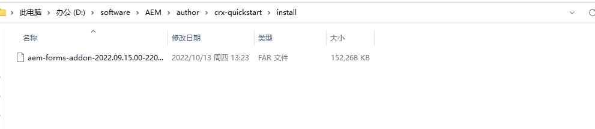

[TOC]

# 34、Adaptive Forms（2）Software Install

在AEM6.5或cloud版本中默认是没有Forms功能的需要去下载对应的插件。在这一章中还需要安装MySQL8.

## MySQL8安装

MySQL8的安装可以查看我这一篇博文[在Windows中安装MySQL8](https://blog.csdn.net/stiven46/article/details/128932387)

### 安装mysql-connector-java

安装了mysql8后，需要在AEM中连接mysql实例，则需要安装mysql-connector-java，在mvn库中下载mysql-connector-j-8.0.31.jar文件

并将mysql-connector-j-8.0.31.jar安装到AEM实例中，打开[Adobe Experience Manager Web Console - Bundles](http://localhost:4502/system/console/bundles)页面

搜索mysql，可以看到mysql-connector-j-8.0.31.jar已安装完成

## Forms安装

打开[AEM下载页面]([Software Distribution (adobe.com)](https://experience.adobe.com/#/downloads/content/software-distribution/en/aemcloud.html?fulltext=SDK*&orderby=@jcr%3Acontent%2Fjcr%3AlastModified&orderby.sort=desc&layout=list&p.offset=0&p.limit=16))

在左上角输入forms add-on搜索插件，下载对应版本即可，下载内容如下

将第一个far文件复制到AEM的author实例中，默认没有`crx-quickstart/install`目录，需要手动创建

重启author实例，可以看到在AEM首页中多了Forms选项

这样Forms所需要的软件和插件就安装完成了。