[TOC]

# 35、Adaptive Forms（3）Data Model

在使用Mysql数据之前还需要在AEM中创建DataModel映射数据库的数据结构。也需要将AEM连接到Mysql数据库。

## 配置JDBC

打开配置页面[Adobe Experience Manager Web Console - Configuration](http://localhost:4502/system/console/configMgr)，搜索jdbc，找到Day Commons JDBC Connectons Pool配置，默认只有这一条父级配置，点击并编辑，填入下图信息，保存即可看到新增的一条配置信息

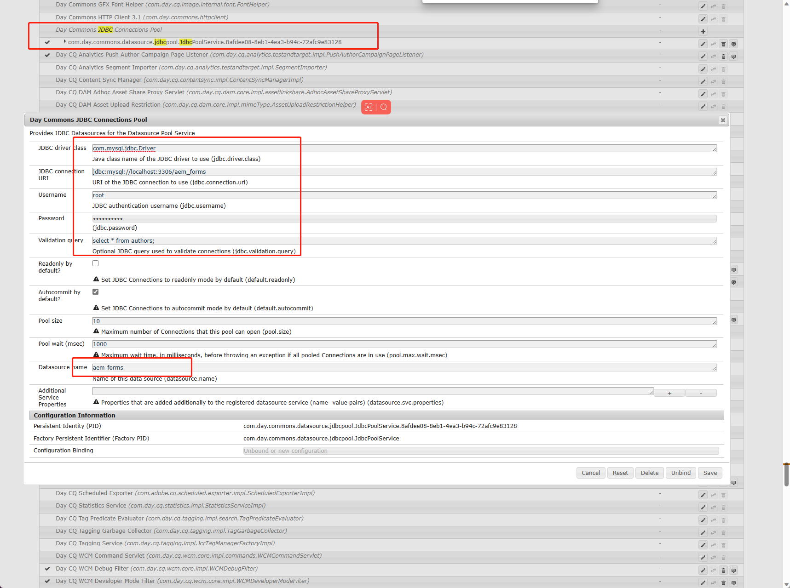

## 安装mysql-connector-j.jar

打开bundles页面[Adobe Experience Manager Web Console - Bundles](http://localhost:4502/system/console/bundles)，点击install/update按钮上传jar包即可，需要勾选第一个和第二个选项，jar包上传成功后会自动启动和刷新

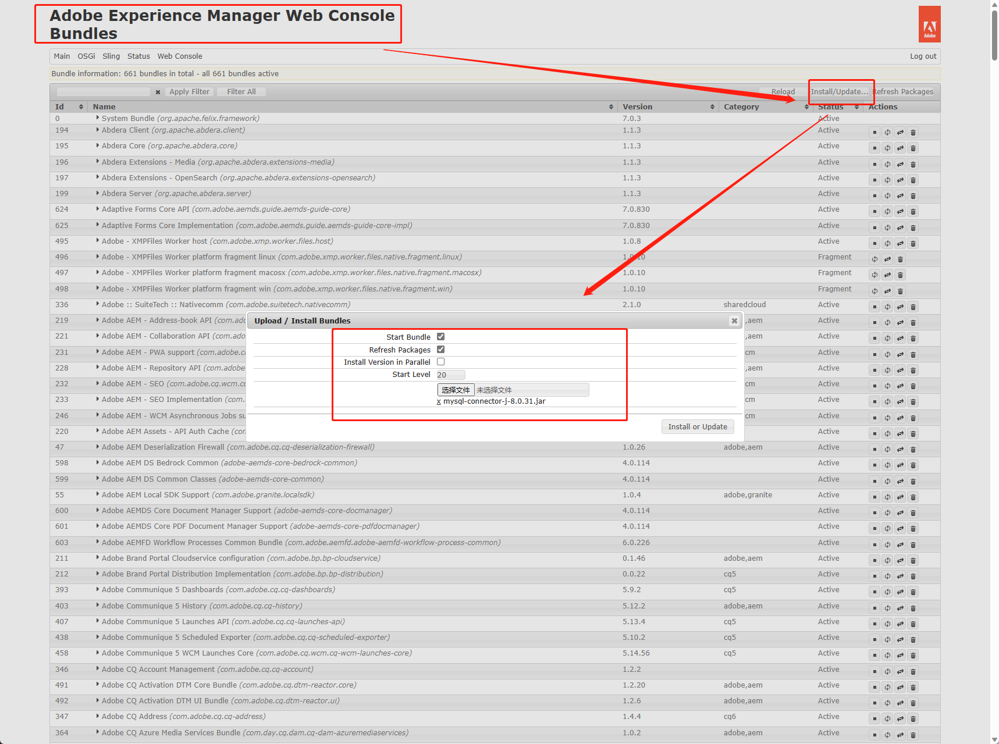

## 在数据库中创建数据

数据库脚本

```sql
CREATE DATABASE `aem_forms` CHARACTER SET 'utf8mb4' COLLATE 'utf8mb4_bin';

CREATE TABLE `aem_forms`.`authors`(
	id BIGINT(20) NOT NULL AUTO_INCREMENT,
	name VARCHAR(255) NOT NULL,
	email VARCHAR(255),
	gender VARCHAR(255),
	PRIMARY KEY (id)
);

INSERT INTO `aem_forms`.`authors` (`name`, `email`, `gender`) VALUES ('steven', 'aem@steven.com', 'female');
```

## 创建Data Model

在上一章中已经安装了Forms插件，打开AEM的Forms页面[AEM Forms](http://localhost:4502/aem/forms.html/content/dam/formsanddocuments-fdm)，就可以看到Forms的入口

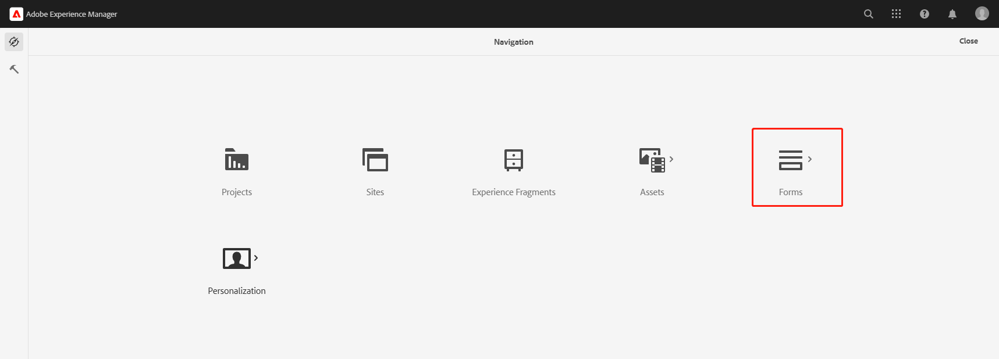

点击Forms进入页面可以看到下面的选项，点击Data Integrations进入数据集成页面

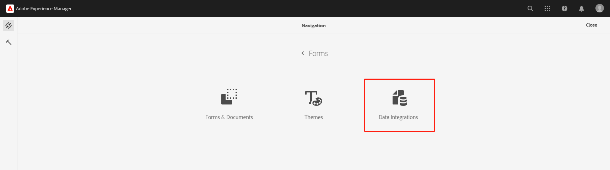

点击create按钮，选择Form Data Model选项

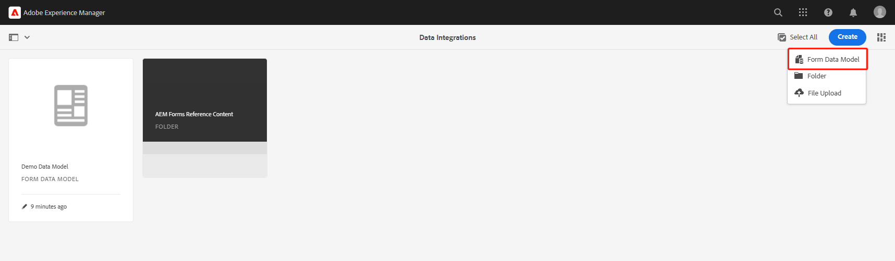

输入信息，在Data Source Configuration选项中选择global目录即可

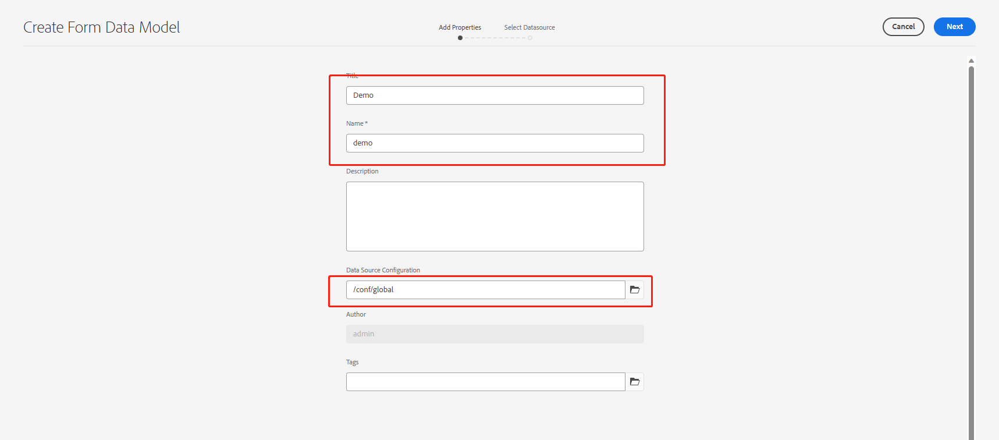

点击Next按钮，就可以看到上一步中创建的aem-forms数据库

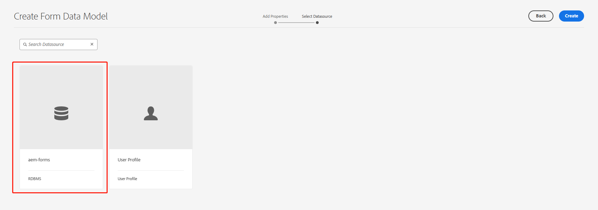

选中aem-forms，点击create按钮，进入编辑页面，就可以看到刚才创建的数据库aem_forms和表authors

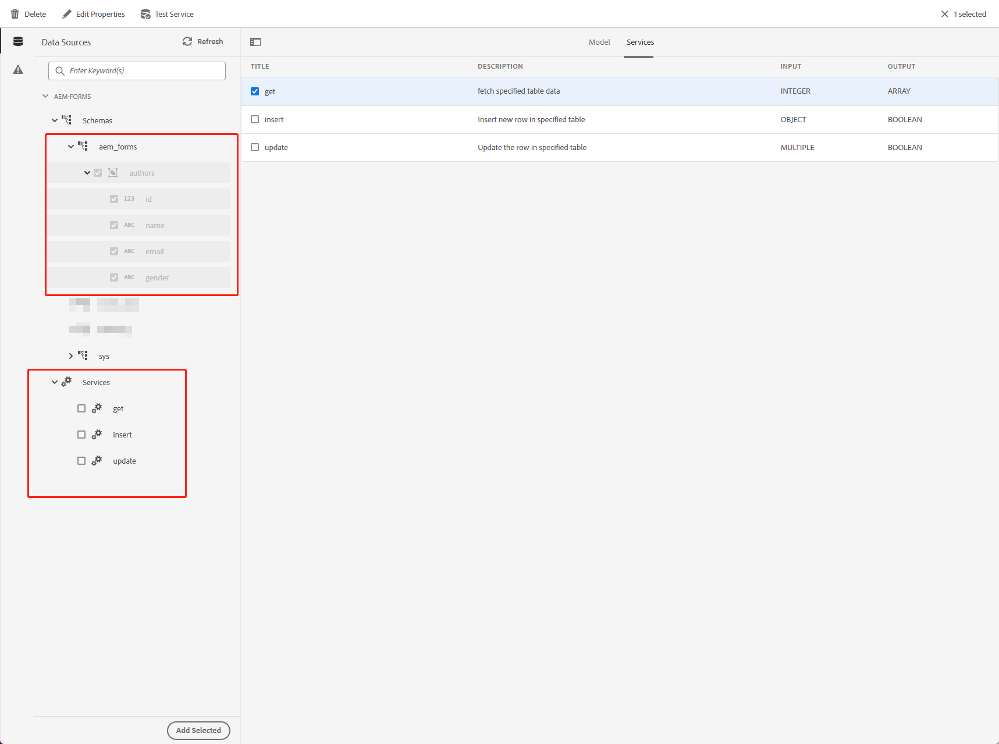

选中表authors和services中的所有选项，点击右上角save按钮，这是会报错因为没有为services填充数据格式，选中service并编辑内容

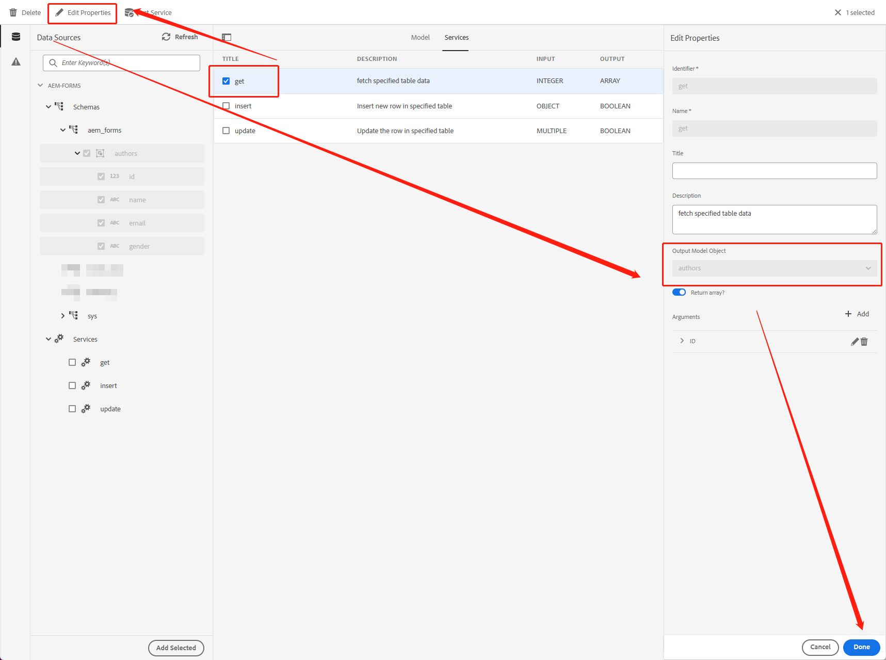

设置完成后，可以对service进行测试

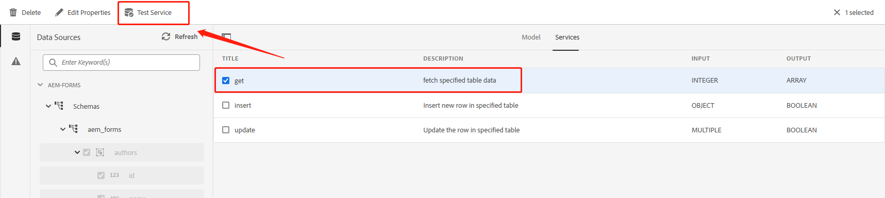

点击Test Service按钮进行测试，在Input框中输入ID为1，点击test按钮就可以得到数据库中的数据

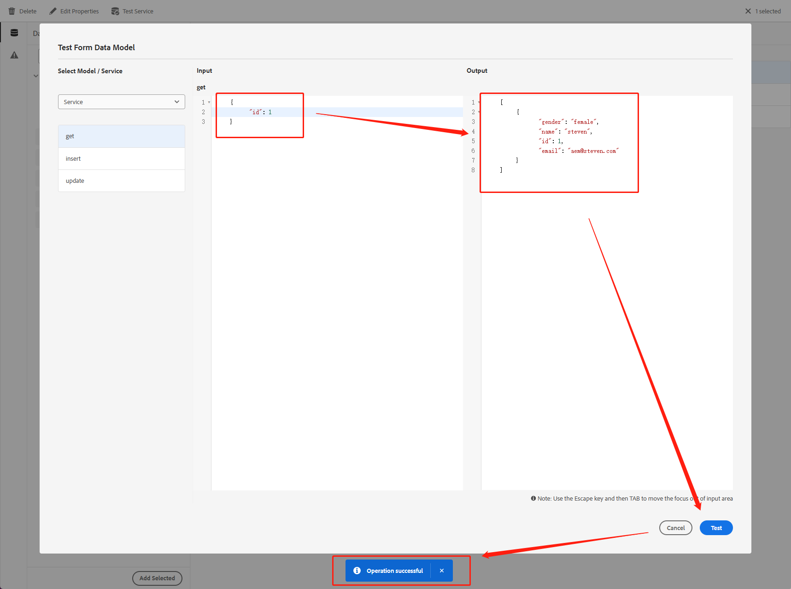

这样Data Model就创建好了。