[TOC]

# 36、Adaptive Forms（4）Create Adapt Form

DataModel创建好后，就可以进行数据的获取和存储。

## Data Model服务配置

要让Data Model生效，还需要进行Services的配置。打开Data Model页面，将model和service绑定，选中Model后点及Edit Properties按钮，在右侧编辑栏中对ReadService和WriteService进行编辑，在ReadService中将Binding To选项更改为Literal，Binding Value中输入id

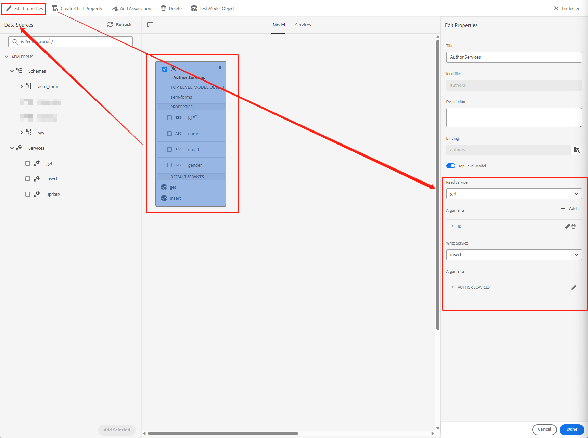

## 创建Adapt Form Template

进入Template管理页面

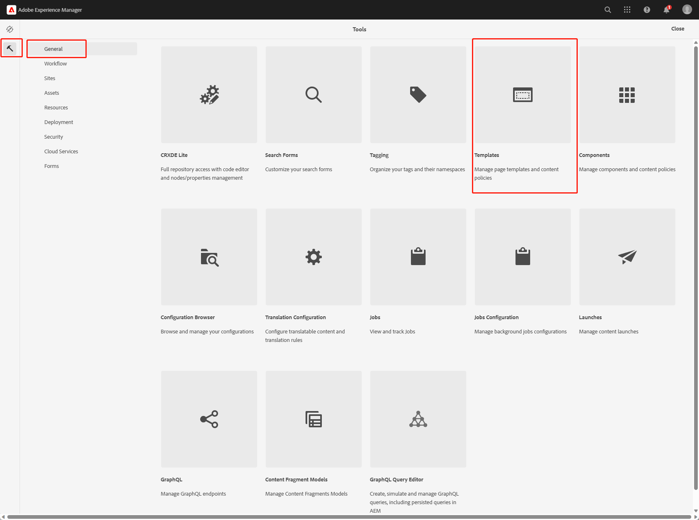

点击Create按钮，选中Adaptive Form标准模板

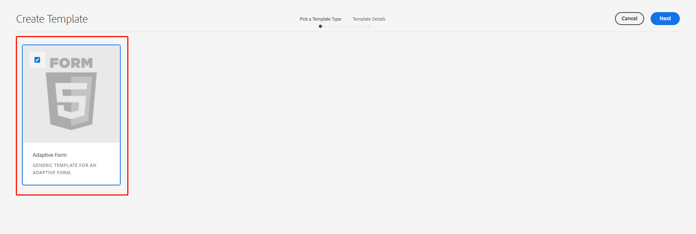

输入模板名称后，进行编辑

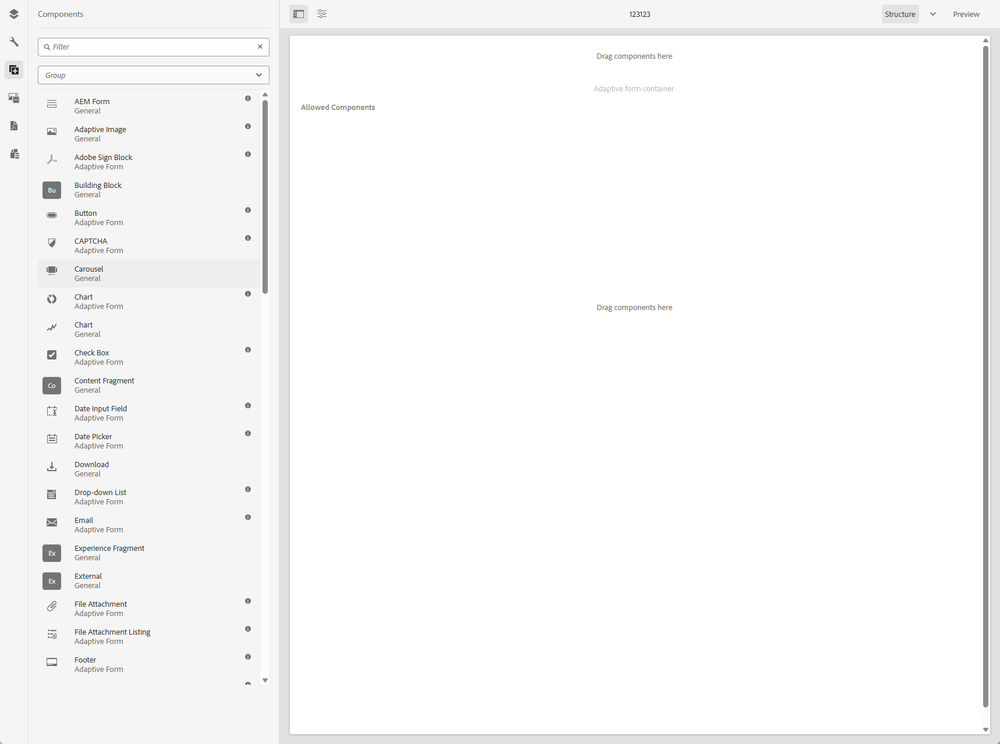

将左侧的组件拖入到右侧编辑栏中，生成如下编辑信息

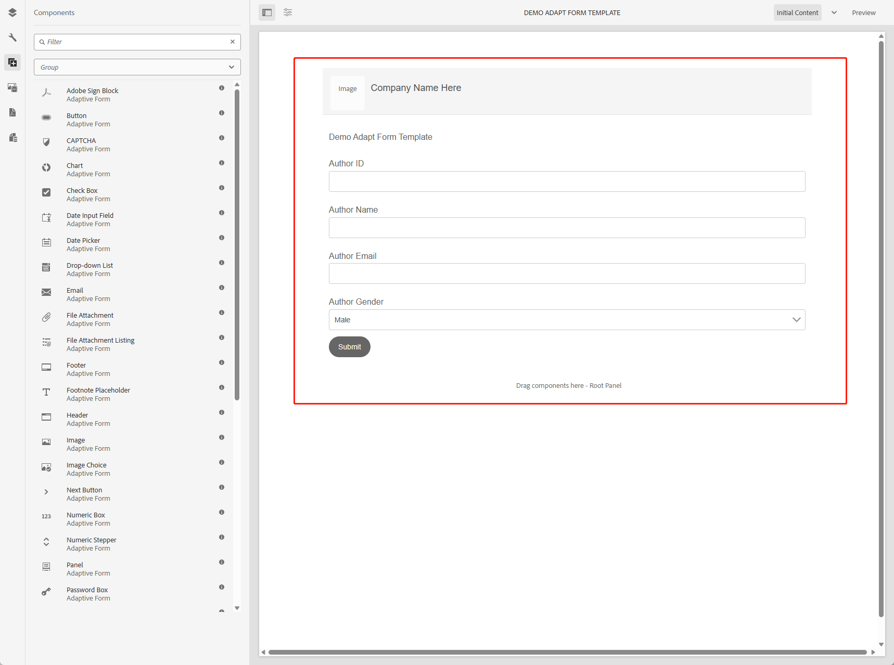

选中Adapt Form组件，点击右侧的设置按钮

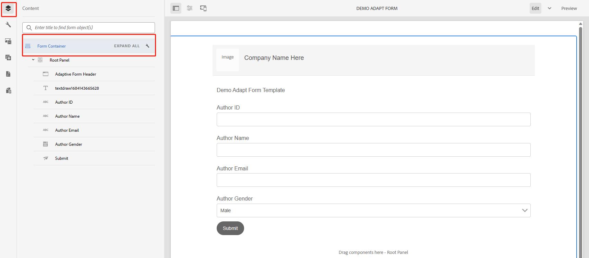

在Data Model中选中Form Data Model和之前创建的Data Model

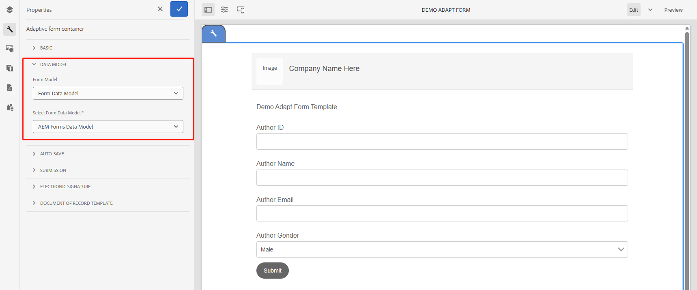

在Submission选项中，配置Submit Action和Data Model To submit，点击对勾保存

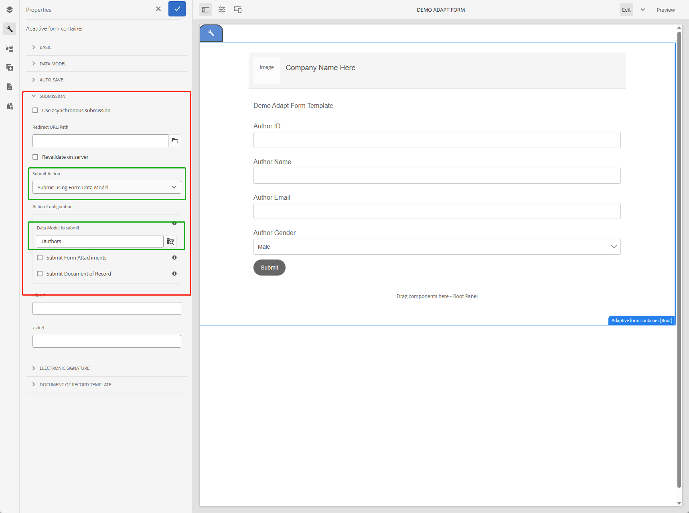

再对所有的属性进行配置（id、name、email、gender）

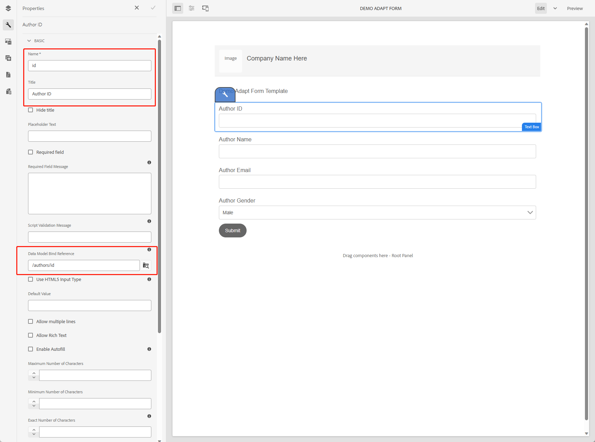

## 创建Adapt Form

进入Forms配置页面

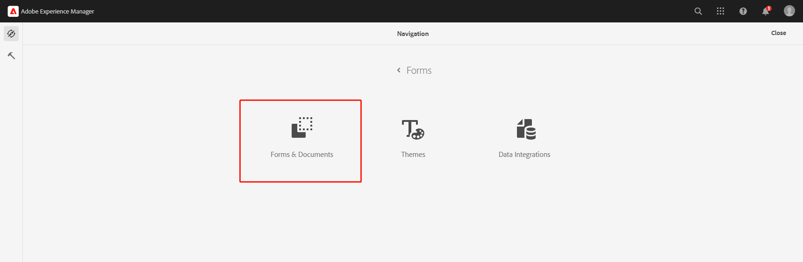

进入Forms选项卡，点击Create按钮，创建Adapt Form

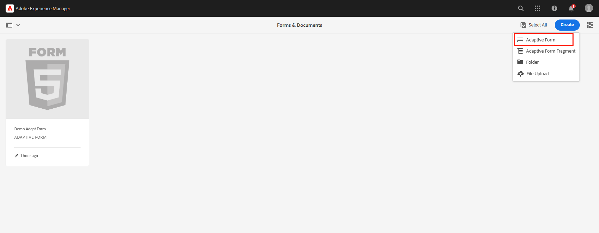

进入模板选择页面，选择刚创建好的模板

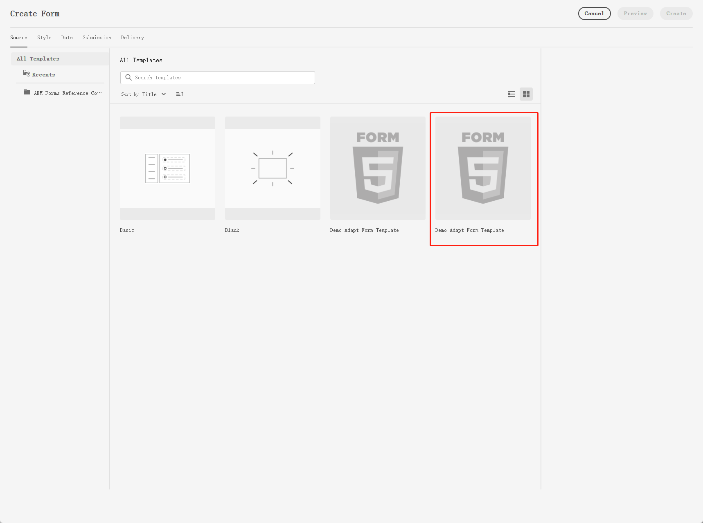

就可以看到生成的Form内容

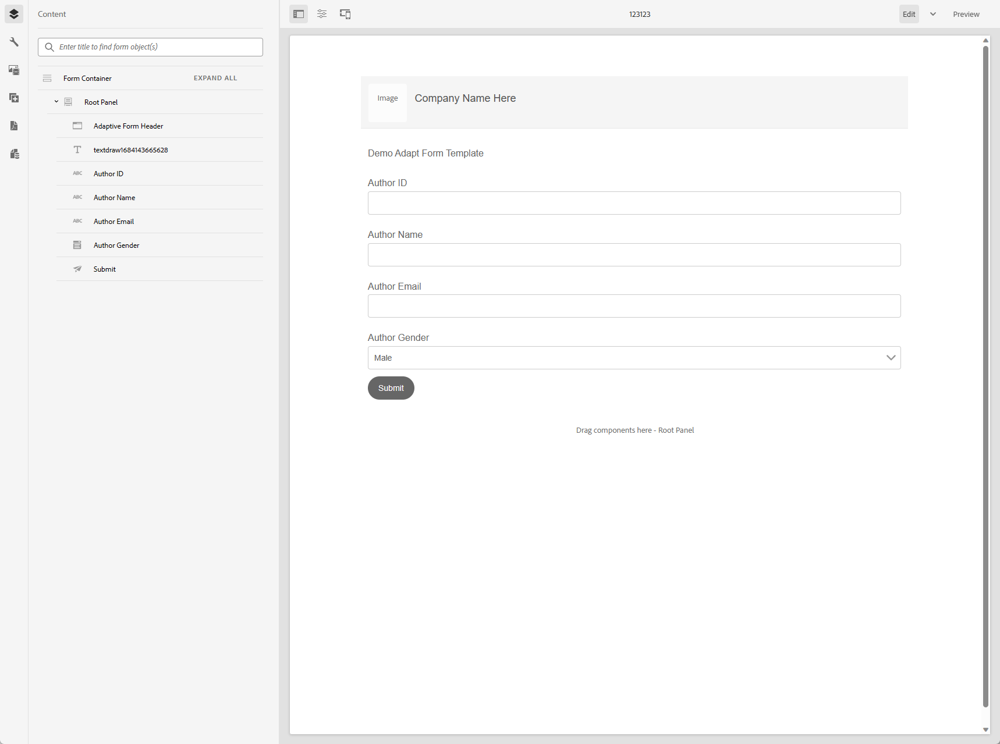

输入内容进行测试

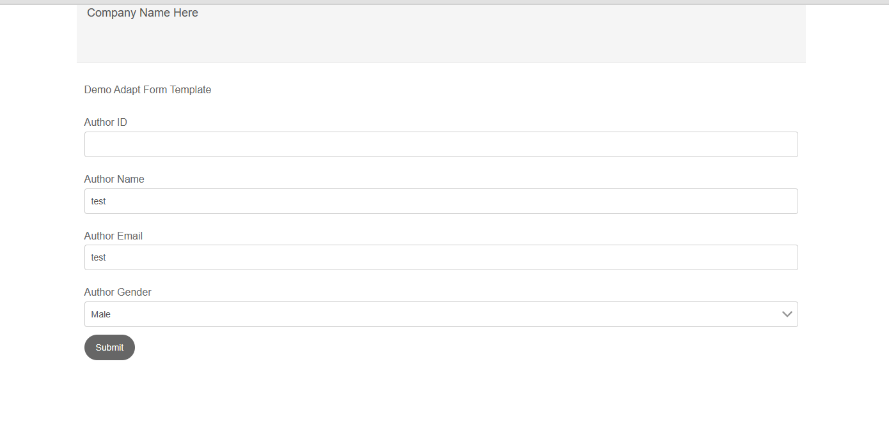

点击submit按钮后会跳转到信息提示页面

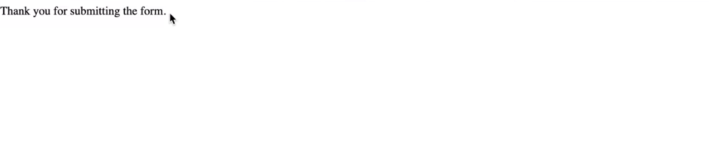

查看数据库数据，可以看到已经插入成功

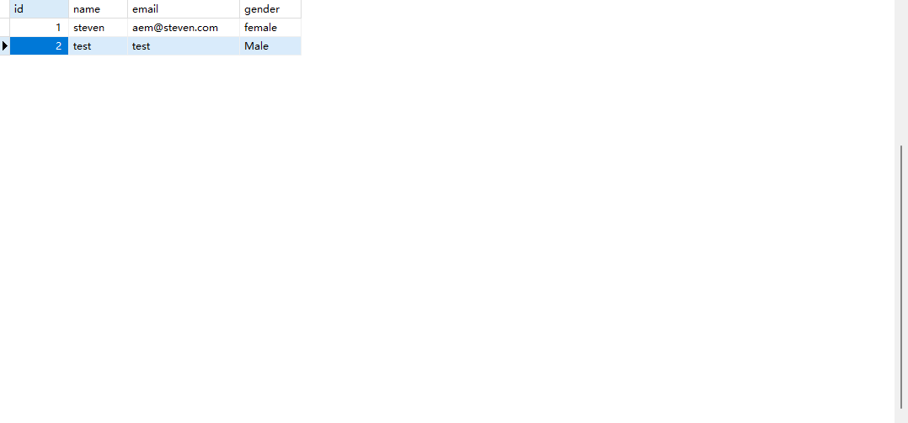

