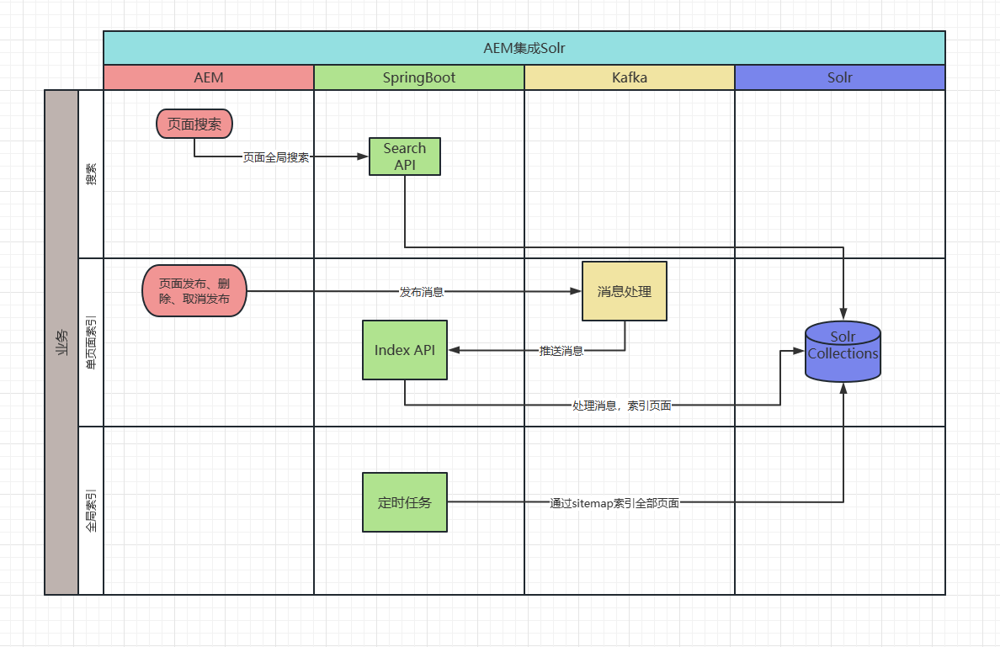
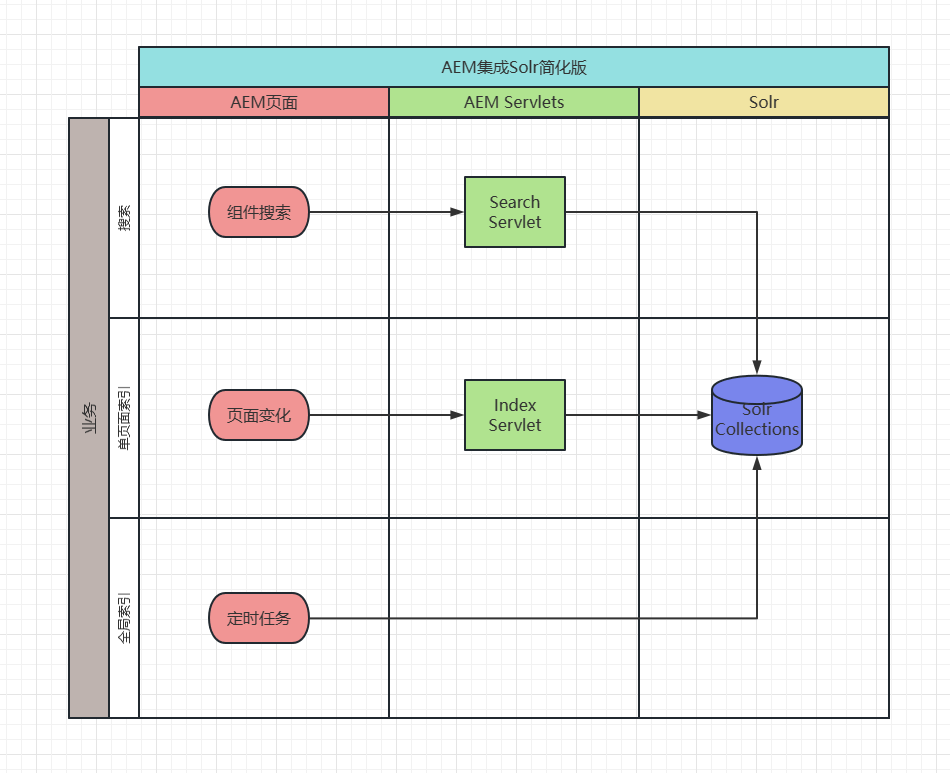

[TOC]

# 37、Solr Integration（1）AEM & Solr

最近在做全局搜索，通过Solr、Kafka、SpringBoot来实现内容搜索、关键字搜索等功能。

## 项目业务流程

1. 搜索：AEM中实现了全局搜索组件，输入内容后调用SearchAPI获取数据
2. 单页面索引：在AEM中发布、删除、取消发布某个页面后，会触发自定义的Listener向Kafka发送消息，在SpringBoot中订阅此消息，接收到消息后，通过Index API将页面内容索引到Solr的Collection中
3. 全局索引：在AEM中添加了robots.txt文件配置哪些路径下的页面可以索引，在SpringBoot中配置了sitemap相关内容，定时任务会根据sitemap中的内容定时索引站点页面，并将内容数据存入Solr的Collection中

## 简化业务流程

将SpringBoot中的接口、定时任务维护在AEM中，由AEM直接驱动Solr API进行操作。
