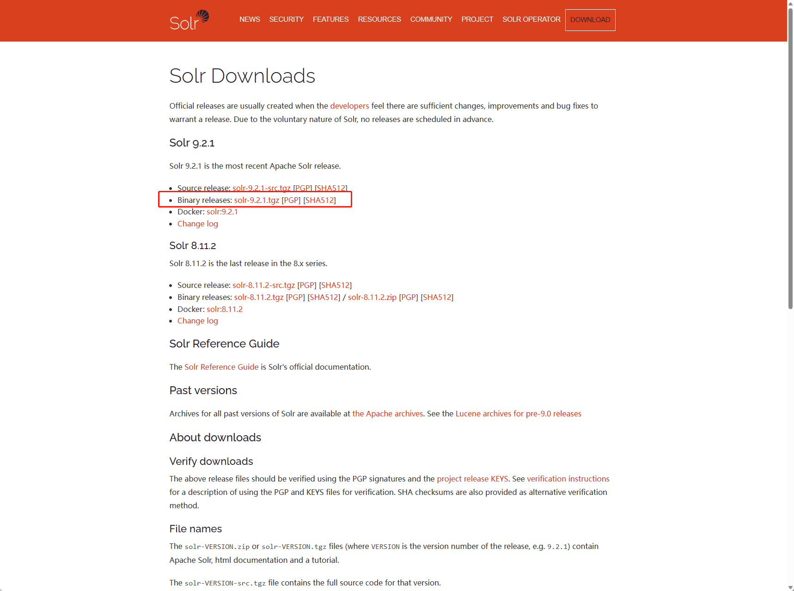
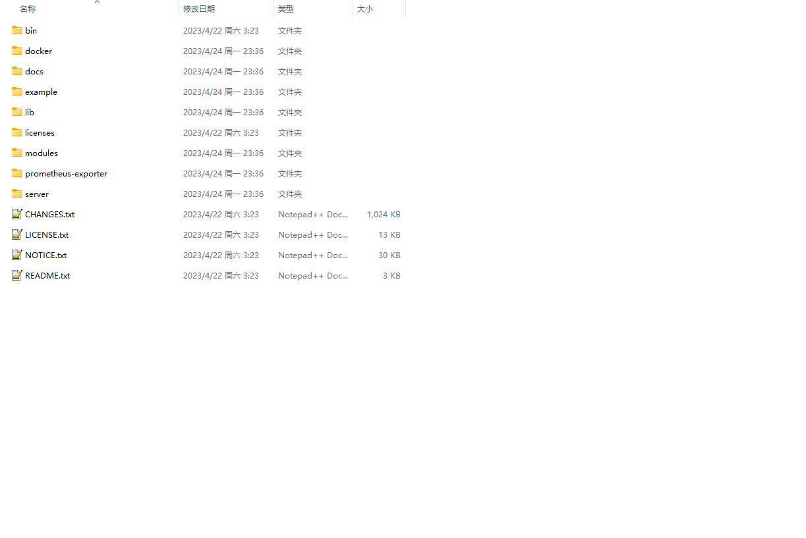
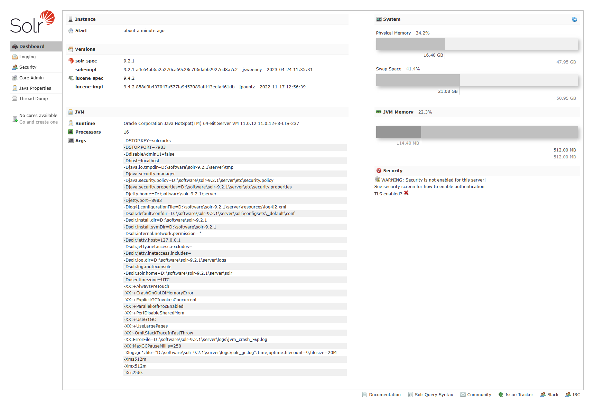
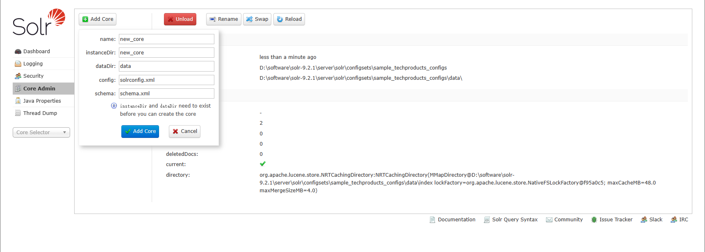
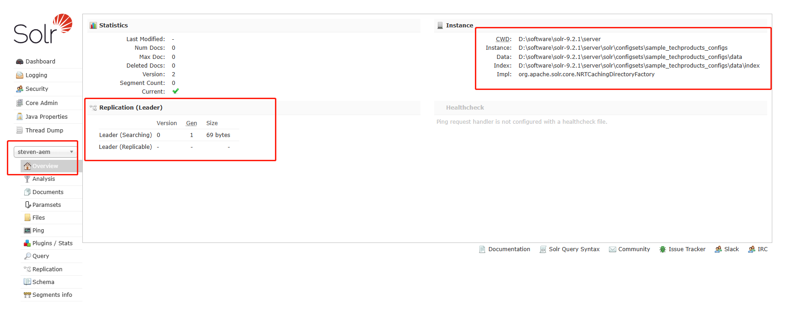
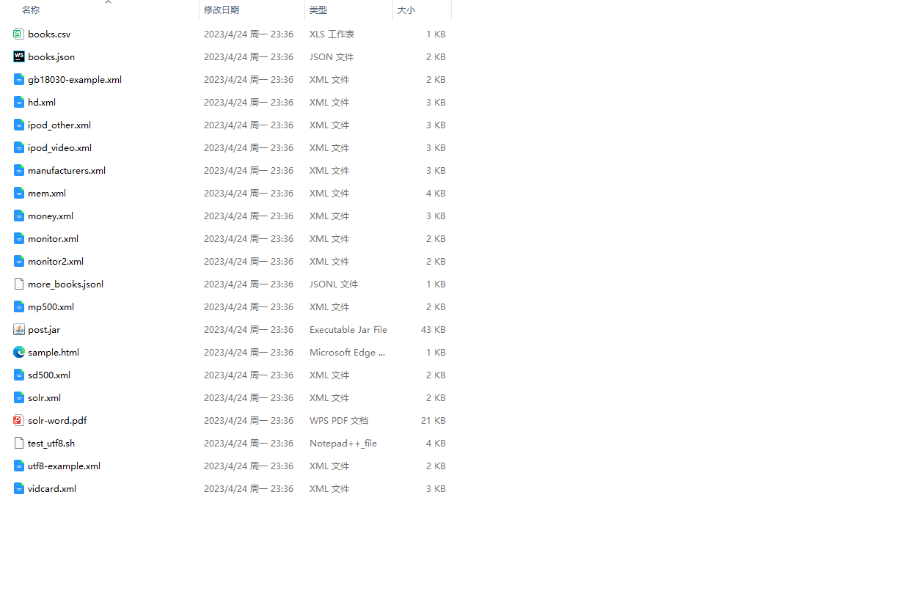
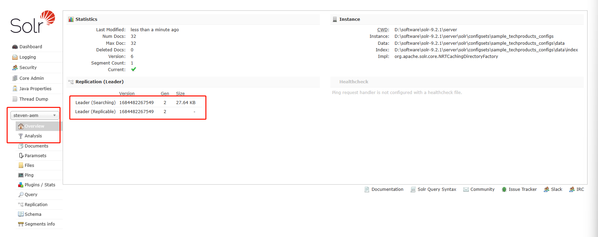
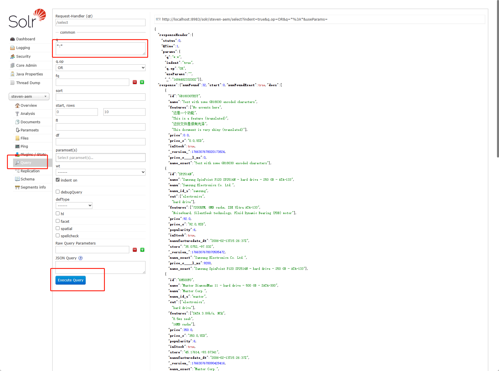
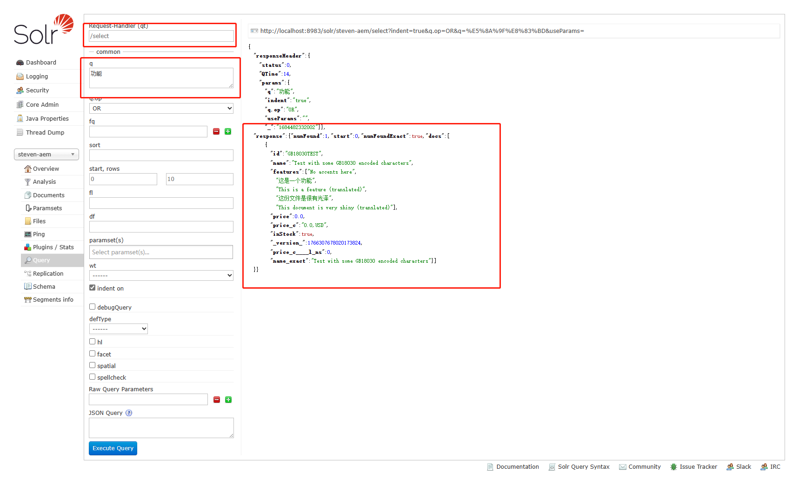

[TOC]

# 38、Solr Integration（2）Install Solr

## 下载

进入Solr下载页面[Solr Downloads - Apache Solr](https://solr.apache.org/downloads.html)



下载需要的版本，这里下载最新版9.2.1，下载完成解压zip包得到9.2.1版本的Solr目录



## 启动

进入bin目录，并打开CMD


输入启动命令，端口默认为8983

```shell
PS D:\software\solr-9.2.1\bin> ./solr start
Waiting up to 30 seconds to see Solr running on port 8983
Started Solr server on port 8983. Happy searching!
```

在浏览器打开Solr管理界面，可以看到Solr的信息，刚启动的Solr服务里没有core需要创建一个Core



## 创建Core

点击左侧No cores available按钮，新增core



填入自定name，instanceDir填入D:\software\solr-9.2.1\server\solr\configsets\sample_techproducts_configs路径，dataDir填入D:\software\solr-9.2.1\server\solr\configsets\sample_techproducts_configs\data\，点击Add Core按钮，新的core就创建成功了

点击左侧Core Selector下拉列表，选择刚才创建的aem-core可以看到基础信息



## 填充数据

进入Solr的example目录下D:\software\solr-9.2.1\example\exampledocs，可以看到很多内容，包含csv、json、xml、pdf等等



用post.jar将这些数据导入至steven-aem集合中

```shell
java -jar -Dc=steven-aem post.jar *.csv
java -jar -Dc=steven-aem post.jar *.json
java -jar -Dc=steven-aem post.jar *.xml
```

可以看到导入成功的信息提示

```shell
PS D:\software\solr-9.2.1\example\exampledocs> java -jar -Dc=steven-aem post.jar *.csv
SimplePostTool version 5.0.0
Posting files to [base] url http://localhost:8983/solr/steven-aem/update using content-type application/xml...
POSTing file books.csv to [base]
SimplePostTool: WARNING: Solr returned an error #400 (Bad Request) for url: http://localhost:8983/solr/steven-aem/update
SimplePostTool: WARNING: Response: <?xml version="1.0" encoding="UTF-8"?>
<response>

<lst name="responseHeader">
  <int name="status">400</int>
  <int name="QTime">29</int>
</lst>
<lst name="error">
  <lst name="metadata">
    <str name="error-class">org.apache.solr.common.SolrException</str>
    <str name="root-error-class">com.ctc.wstx.exc.WstxUnexpectedCharException</str>
  </lst>
  <str name="msg">Unexpected character 'i' (code 105) in prolog; expected '&lt;'
 at [row,col {unknown-source}]: [1,1]</str>
  <int name="code">400</int>
</lst>
</response>
SimplePostTool: WARNING: IOException while reading response: java.io.IOException: Server returned HTTP response code: 400 for URL: http://localhost:8983/solr/steven-aem/update
1 files indexed.
COMMITting Solr index changes to http://localhost:8983/solr/steven-aem/update...
Time spent: 0:00:00.093
```

## 搜索测试

回到浏览器的Solr页面，刷新页面可以看到已经有数据存入



点击Query按钮，进入搜索页面，再点击Execute Query按钮查询所有数据，可以看到右侧数据栏内显示出所有的数据



在q内容框中输入要搜索的内容，输入功能，可以看到右侧只出现了一条包含`功能` 的数据



